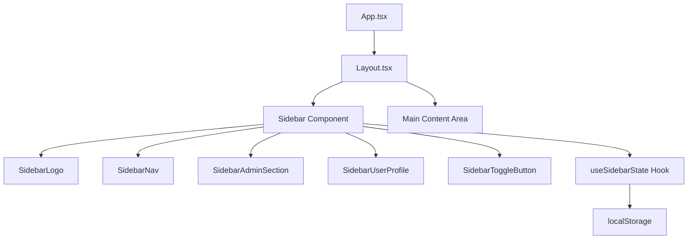
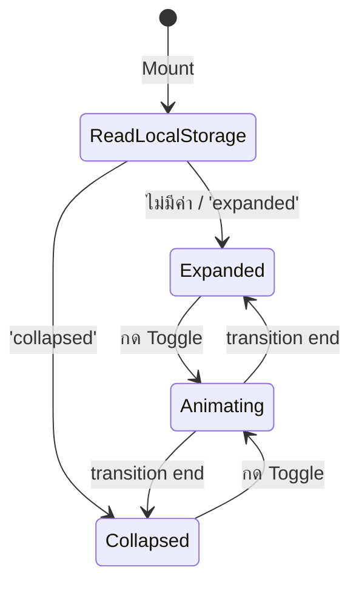

# Design Document: Collapsible Sidebar

## Overview

ฟีเจอร์นี้แทนที่ Top Navbar ในปัจจุบันด้วย Sidebar แนวตั้งทางด้านซ้ายที่สามารถ collapse/expand ได้ โดยจะปรับ Layout.tsx ที่มีอยู่ให้ใช้โครงสร้าง Sidebar แทน พร้อมแอนิเมชัน CSS transition ที่ลื่นไหล การจดจำสถานะผ่าน localStorage และ responsive behavior สำหรับหน้าจอขนาดเล็ก

### การตัดสินใจทางเทคนิคหลัก

1. **แทนที่ Layout.tsx โดยตรง** — ไม่สร้าง component แยกใหม่ แต่ refactor Layout.tsx ให้ใช้ Sidebar แทน Top Navbar เพื่อรักษา routing structure เดิม
2. **Custom hook `useSidebarState`** — แยก logic การจัดการ state, localStorage, และ animation lock ออกมาเป็น hook เพื่อให้ทดสอบได้ง่าย
3. **Tailwind CSS transitions** — ใช้ `transition-all duration-300` สำหรับ animation ซึ่งตรงกับ constraint ไม่เกิน 300ms
4. **CSS `translateX` สำหรับ mobile overlay** — ใช้ transform แทน width animation เพื่อประสิทธิภาพบนมือถือ

## Architecture

### โครงสร้างระดับสูง



### Component Tree

```
Layout (refactored)
├── Sidebar
│   ├── SidebarLogo — โลโก้ WMS (แสดง/ซ่อนข้อความตาม state)
│   ├── SidebarNav — รายการเมนูหลัก
│   │   └── SidebarNavItem × N — แต่ละรายการเมนู
│   ├── SidebarAdminSection — เมนู admin (conditional render)
│   │   └── SidebarNavItem × N
│   ├── SidebarUserProfile — ข้อมูลผู้ใช้ + logout
│   └── SidebarToggleButton — ปุ่ม collapse/expand
├── MobileMenuButton — ปุ่มเปิดเมนูบน mobile (< 768px)
├── MobileOverlay — backdrop สำหรับ mobile sidebar
└── MainContent — <Outlet /> wrapper
```

### State Flow



## Components and Interfaces

### 1. useSidebarState Hook

```typescript
interface UseSidebarStateReturn {
  isExpanded: boolean;
  isAnimating: boolean;
  isMobileOpen: boolean;
  toggle: () => void;
  openMobile: () => void;
  closeMobile: () => void;
}

function useSidebarState(): UseSidebarStateReturn;
```

**Responsibilities:**
- อ่าน/เขียนสถานะ `sidebar-state` จาก localStorage
- จัดการ state `isExpanded` (boolean)
- ป้องกันการกด toggle ซ้ำระหว่าง animation ด้วย `isAnimating` flag
- จัดการ mobile overlay state แยกจาก desktop state
- ค่าเริ่มต้น: `isExpanded = true` เมื่อไม่มีค่าใน localStorage

**Logic:**
```typescript
const STORAGE_KEY = 'sidebar-state';
const ANIMATION_DURATION = 300; // ms

function useSidebarState(): UseSidebarStateReturn {
  // อ่านค่าจาก localStorage ทันทีเพื่อหลีกเลี่ยง flash
  const [isExpanded, setIsExpanded] = useState<boolean>(() => {
    try {
      const stored = localStorage.getItem(STORAGE_KEY);
      return stored === 'collapsed' ? false : true;
    } catch {
      return true; // fallback เมื่อ localStorage ไม่พร้อมใช้งาน
    }
  });
  const [isAnimating, setIsAnimating] = useState(false);
  const [isMobileOpen, setIsMobileOpen] = useState(false);

  const toggle = useCallback(() => {
    if (isAnimating) return; // ป้องกัน rapid click
    setIsAnimating(true);
    setIsExpanded(prev => {
      const next = !prev;
      try {
        localStorage.setItem(STORAGE_KEY, next ? 'expanded' : 'collapsed');
      } catch {
        // ถ้า localStorage ไม่พร้อม ยังคงเปลี่ยน state ได้
      }
      return next;
    });
    setTimeout(() => setIsAnimating(false), ANIMATION_DURATION);
  }, [isAnimating]);

  const openMobile = useCallback(() => setIsMobileOpen(true), []);
  const closeMobile = useCallback(() => setIsMobileOpen(false), []);

  return { isExpanded, isAnimating, isMobileOpen, toggle, openMobile, closeMobile };
}
```

### 2. Sidebar Component

```typescript
interface SidebarProps {
  isExpanded: boolean;
  isAnimating: boolean;
  onToggle: () => void;
  user: User | null;
  onLogout: () => void;
  isLoggingOut: boolean;
  isMobileOpen: boolean;
  onMobileClose: () => void;
}
```

**Responsibilities:**
- Render sidebar container ด้วย fixed position, full height
- จัดการ width transition (256px ↔ 64px) ด้วย Tailwind classes
- Compose sub-components (Logo, Nav, Admin, UserProfile, Toggle)
- Desktop: แสดงตลอดเวลา ด้วย width transition
- Mobile (< 768px): ซ่อน off-screen, แสดงเป็น overlay เมื่อ isMobileOpen = true

**CSS Structure:**
```tsx
<aside
  className={`
    fixed top-0 left-0 h-screen z-50
    bg-white border-r border-gray-200 shadow-sm
    flex flex-col
    transition-all duration-300 ease-in-out
    ${isExpanded ? 'w-64' : 'w-16'}
    // Mobile: hidden by default, shown as overlay
    max-md:${isMobileOpen ? 'translate-x-0' : '-translate-x-full'}
    md:translate-x-0
  `}
>
```

### 3. SidebarNavItem Component

```typescript
interface SidebarNavItemProps {
  to: string;
  label: string;
  icon: React.ReactNode;
  isExpanded: boolean;
  isActive: boolean;
}
```

**Responsibilities:**
- Render `<Link>` ด้วยไอคอนและข้อความ (ซ่อนข้อความเมื่อ collapsed)
- แสดง active state: `bg-blue-50 text-blue-700` (active) vs `text-gray-600 hover:bg-gray-100` (inactive)
- แสดง tooltip เมื่อ collapsed และ hover/focus (ใช้ Tooltip component)
- ตัดข้อความที่เกิน 20 ตัวอักษรด้วย CSS `truncate` + `max-w` หรือ utility function

### 4. SidebarUserProfile Component

```typescript
interface SidebarUserProfileProps {
  user: User | null;
  isExpanded: boolean;
  onLogout: () => void;
  isLoggingOut: boolean;
}
```

**Responsibilities:**
- Expanded: แสดง avatar (ตัวอักษรแรก firstName), ชื่อผู้ใช้ (ตัดที่ 18 ตัวอักษร), role, ปุ่ม logout
- Collapsed: แสดง avatar + ปุ่ม logout icon, tooltip แสดงชื่อและ role เมื่อ hover
- Disable ปุ่ม logout ระหว่างดำเนินการ (isLoggingOut)

### 5. SidebarToggleButton Component

```typescript
interface SidebarToggleButtonProps {
  isExpanded: boolean;
  onClick: () => void;
}
```

**Responsibilities:**
- แสดง chevron icon: `ChevronLeft` เมื่อ expanded, `ChevronRight` เมื่อ collapsed
- `aria-label`: "ย่อเมนู" เมื่อ expanded, "ขยายเมนู" เมื่อ collapsed
- อยู่ที่ด้านล่างสุดของ sidebar (ใช้ `mt-auto` ใน flex container)

### 6. Tooltip Component

```typescript
interface TooltipProps {
  content: string;
  children: React.ReactNode;
  enabled?: boolean; // default: true
}
```

**Responsibilities:**
- แสดง tooltip ที่ด้านขวาของ element เมื่อ hover/focus
- ใช้ relative positioning กับ absolute tooltip (ไม่ใช้ portal)
- แสดงด้วย opacity transition ภายใน 300ms
- ซ่อนเมื่อ pointer/focus ออก
- `enabled` ควบคุมว่า tooltip ทำงานหรือไม่ (ปิดเมื่อ expanded)

### 7. Layout Integration (Refactored Layout.tsx)

```typescript
export default function Layout() {
  const { user, logout } = useAuth();
  const navigate = useNavigate();
  const { isExpanded, isAnimating, isMobileOpen, toggle, openMobile, closeMobile } = useSidebarState();
  const [isLoggingOut, setIsLoggingOut] = useState(false);

  const handleLogout = async () => {
    setIsLoggingOut(true);
    try {
      const success = await logout();
      navigate('/login', {
        replace: true,
        state: success ? undefined : { warning: 'การออกจากระบบอาจไม่สมบูรณ์...' },
      });
    } finally {
      setIsLoggingOut(false);
    }
  };

  return (
    <div className="min-h-screen bg-gray-50">
      {/* Mobile menu button - visible < md */}
      <button
        className="fixed top-4 left-4 z-40 md:hidden ..."
        onClick={openMobile}
        aria-label="เปิดเมนู"
      >
        <HamburgerIcon />
      </button>

      {/* Mobile overlay backdrop */}
      {isMobileOpen && (
        <div
          className="fixed inset-0 bg-black/50 z-40 md:hidden"
          onClick={closeMobile}
        />
      )}

      {/* Sidebar */}
      <Sidebar
        isExpanded={isExpanded}
        isAnimating={isAnimating}
        onToggle={toggle}
        user={user}
        onLogout={handleLogout}
        isLoggingOut={isLoggingOut}
        isMobileOpen={isMobileOpen}
        onMobileClose={closeMobile}
      />

      {/* Main content - adjusts margin based on sidebar state */}
      <main
        className={`
          transition-all duration-300
          ${isExpanded ? 'md:ml-64' : 'md:ml-16'}
          pt-16 md:pt-0
        `}
      >
        <div className="px-4 sm:px-6 lg:px-8 py-8">
          <Outlet />
        </div>
      </main>
    </div>
  );
}
```

### Utility Function: truncateText

```typescript
/**
 * ตัดข้อความที่เกิน maxLength ด้วย '...'
 * ถ้าข้อความสั้นกว่าหรือเท่ากับ maxLength คืนค่าเดิม
 */
function truncateText(text: string, maxLength: number): string {
  if (text.length <= maxLength) return text;
  return text.slice(0, maxLength) + '...';
}
```

### Utility Function: isRouteActive

```typescript
/**
 * ตรวจสอบว่า route path ตรงกับ menu item path หรือไม่
 * ใช้ prefix matching สำหรับ nested routes
 * ยกเว้น /dashboard ใช้ exact match
 */
function isRouteActive(currentPath: string, menuPath: string): boolean {
  if (menuPath === '/dashboard') {
    return currentPath === '/dashboard';
  }
  return currentPath.startsWith(menuPath);
}
```

## Data Models

### Sidebar State (localStorage)

| Key | Type | ค่าที่เป็นไปได้ | ค่าเริ่มต้น |
|-----|------|----------------|-------------|
| `sidebar-state` | string | `'expanded'` \| `'collapsed'` | ไม่มี (ถือว่า expanded) |

### Navigation Item Model

```typescript
interface NavItem {
  to: string;       // route path
  label: string;    // ข้อความเมนู (ภาษาไทย)
  icon: ReactNode;  // SVG icon component
}
```

### รายการเมนูหลัก (navItems)

| Path | Label | Icon |
|------|-------|------|
| /dashboard | แดชบอร์ด | Dashboard grid |
| /products | จัดการสินค้า | Box/cube |
| /categories | หมวดหมู่ | Tag |
| /stock/balances | สต็อก | Inbox |
| /stock/movements | ประวัติสต็อก | Clock |
| /reports | รายงาน | Document |

### รายการเมนู Admin (adminItems)

| Path | Label | Icon |
|------|-------|------|
| /users | จัดการผู้ใช้ | Users |
| /stock/adjustments/new | ปรับยอดสต็อก | Adjustments |

### Sidebar Dimensions

| State | Width | Tailwind Class |
|-------|-------|----------------|
| Expanded | 256px | `w-64` |
| Collapsed | 64px | `w-16` |

### Breakpoints

| Breakpoint | พฤติกรรม |
|-----------|----------|
| ≥ 768px (md) | Desktop mode — sidebar fixed, main content ใช้ margin-left |
| < 768px | Mobile mode — sidebar ซ่อน off-screen, แสดงเป็น overlay เมื่อกดปุ่มเปิดเมนู |

## Correctness Properties

*A property is a characteristic or behavior that should hold true across all valid executions of a system — essentially, a formal statement about what the system should do. Properties serve as the bridge between human-readable specifications and machine-verifiable correctness guarantees.*

### Property 1: Sidebar state persistence round-trip

*For any* sidebar state value ('expanded' or 'collapsed') ที่ถูกบันทึกลง localStorage, เมื่ออ่านค่ากลับมาด้วย `useSidebarState` hook, ค่า `isExpanded` ที่ได้ SHALL ตรงกับ state ที่บันทึกไว้ (expanded → true, collapsed → false)

**Validates: Requirements 5.1, 5.2**

### Property 2: Invalid localStorage fallback to expanded

*For any* arbitrary string value (รวมถึง empty string, null, undefined, ตัวเลข, JSON, หรือค่าอื่น ๆ ที่ไม่ใช่ 'expanded' หรือ 'collapsed') ที่อยู่ใน localStorage key 'sidebar-state', ระบบ SHALL ให้ค่า `isExpanded = true` เสมอ

**Validates: Requirements 5.3, 2.5**

### Property 3: Toggle state inversion

*For any* ค่า boolean ของ isExpanded ปัจจุบัน (true หรือ false), เมื่อเรียก toggle function หนึ่งครั้งขณะที่ isAnimating === false, ค่า isExpanded ใหม่ SHALL เป็นค่า negation ของค่าก่อนหน้า (true → false, false → true) และค่าที่บันทึกลง localStorage SHALL สอดคล้องกับ state ใหม่

**Validates: Requirements 4.1, 4.2, 5.1**

### Property 4: Admin menu visibility determined by role

*For any* user object ที่มี role เป็น 'admin', Admin_Menu_Section SHALL ถูก render ใน DOM. และ *for any* user ที่มี role ไม่ใช่ 'admin' (รวมถึง user เป็น null หรือ undefined), Admin_Menu_Section SHALL ไม่ปรากฏใน DOM

**Validates: Requirements 7.1, 7.2, 7.4**

### Property 5: Active menu item uniqueness and correctness

*For any* current route path และชุดของ menu items, จำนวน menu items ที่มี active state SHALL เป็น 0 (ถ้าไม่มี item ตรงกับ route) หรือ 1 (ถ้ามี item ที่ path เป็น prefix ของ route) เท่านั้น และ item ที่ active ต้องมี path ที่เป็น longest prefix match กับ current route

**Validates: Requirements 6.1, 6.4, 6.5**

### Property 6: Animation lock idempotence

*For any* state ของ sidebar, ถ้า isAnimating === true, การเรียก toggle function จำนวนกี่ครั้งก็ตาม SHALL ไม่เปลี่ยนแปลงค่า isExpanded และ localStorage (idempotent — f(x) = f(f(x)) ภายใต้ animation lock)

**Validates: Requirements 4.6**

### Property 7: Text truncation with threshold

*For any* string ที่มีความยาวเกินค่า threshold ที่กำหนด (20 ตัวอักษรสำหรับ menu label, 18 ตัวอักษรสำหรับ username), ฟังก์ชัน truncate SHALL คืนค่า string ที่มีความยาวไม่เกิน threshold + ellipsis characters, และ *for any* string ที่มีความยาวไม่เกิน threshold, ฟังก์ชัน SHALL คืนค่า string ดั้งเดิมโดยไม่เปลี่ยนแปลง

**Validates: Requirements 2.1, 2.4**

## Error Handling

### กรณี localStorage ไม่พร้อมใช้งาน

- ถ้า `localStorage.getItem` throw error (เช่น private browsing mode บางเบราว์เซอร์): fallback เป็น expanded state
- ถ้า `localStorage.setItem` throw error: sidebar ยังทำงานปกติใน session ปัจจุบัน แต่สถานะจะไม่ถูกจดจำข้ามเซสชัน
- ใช้ try-catch ครอบ localStorage operations ทั้งหมด

### กรณี User Data เป็น null/undefined

- ถ้า `user` เป็น null: ไม่แสดง Admin_Menu_Section, แสดง avatar เป็น 'U' (fallback character)
- ถ้า `user.firstName` เป็น empty string: แสดง avatar เป็นตัวอักษรแรกของ email หรือ 'U'

### กรณี Logout ล้มเหลว

- ปุ่ม logout จะ disable ระหว่างดำเนินการ (ป้องกันกดซ้ำ)
- ถ้า logout API ล้มเหลว: ระบบยังคง clear local state และ redirect ไป login page (behavior เดิมจาก AuthContext)
- ปุ่ม logout จะ re-enable ถ้า navigate ไม่ถูกเรียก (ใช้ finally block)

### กรณี Route ไม่ตรงกับ Menu Item ใดเลย

- ไม่มี menu item ถูก highlight (ไม่มี active state)
- Sidebar ยังแสดงผลปกติ

### กรณี Rapid Toggle Click

- `isAnimating` flag ป้องกันการเปลี่ยนสถานะซ้ำภายใน 300ms
- Toggle button ยังคง clickable แต่ handler จะ early return โดยไม่ทำอะไร

### กรณี Mobile Overlay

- กดที่ backdrop หรือเลือกเมนูจะปิด overlay
- ปุ่ม ESC (keyboard) ไม่จำเป็นต้องรองรับใน scope นี้

## Testing Strategy

### Unit Tests (vitest + @testing-library/react)

Unit tests เน้นที่ specific examples และ edge cases:

1. **useSidebarState hook**
   - ค่าเริ่มต้นเมื่อ localStorage ว่าง → expanded
   - อ่านค่า 'collapsed' จาก localStorage ได้ถูกต้อง
   - toggle บันทึกค่าลง localStorage
   - animation lock ทำงานถูกต้อง
   - mobile state ไม่กระทบ desktop state

2. **Sidebar rendering**
   - Expanded state แสดง width 256px (w-64)
   - Collapsed state แสดง width 64px (w-16)
   - ข้อความเมนูซ่อนเมื่อ collapsed
   - Tooltip แสดงเมื่อ hover บน collapsed item

3. **Role-based visibility**
   - Admin user เห็น admin section พร้อม divider
   - Non-admin user ไม่เห็น admin section (ไม่อยู่ใน DOM)
   - User เป็น null ไม่แสดง admin section

4. **Active menu highlighting**
   - Current route ตรงกับ menu item → highlight
   - Nested route match (prefix) → highlight parent
   - /dashboard ใช้ exact match เท่านั้น
   - ไม่ตรงกับ item ใด → ไม่ highlight

5. **User profile**
   - Expanded: แสดงชื่อ, role, avatar, ปุ่ม logout
   - Collapsed: แสดงเฉพาะ avatar + logout icon
   - Logout button disabled ระหว่าง loading
   - ชื่อยาวเกิน 18 ตัวอักษรถูกตัดด้วย ellipsis

6. **Responsive behavior**
   - < 768px: sidebar ซ่อน, แสดงปุ่มเปิดเมนู (hamburger)
   - กดปุ่ม → sidebar แสดง overlay + backdrop
   - กด backdrop → sidebar ปิด

7. **Accessibility**
   - Sidebar ใช้ `<nav>` element พร้อม aria-label
   - Toggle button มี dynamic aria-label
   - Menu items focusable ด้วย keyboard
   - Focus indicator มองเห็นได้ชัดเจน

### Property-Based Tests (fast-check + vitest)

Property tests ใช้ `fast-check` library ที่มีอยู่แล้วใน devDependencies:

- ทุก property test ต้องรันอย่างน้อย **100 iterations**
- แต่ละ test ต้องมี comment อ้างอิง property จาก design document
- Tag format: **Feature: collapsible-sidebar, Property {number}: {property_text}**

Property tests ที่จะ implement:

1. **Property 1 (Round-trip):** สำหรับทุกค่า state ที่ valid ('expanded'/'collapsed'), write ลง localStorage แล้ว read กลับด้วย hook initializer ได้ค่า isExpanded ที่ถูกต้อง
2. **Property 2 (Fallback):** สำหรับทุก arbitrary string ที่ไม่ใช่ 'collapsed', hook initializer ให้ค่า isExpanded = true
3. **Property 3 (Toggle inversion):** สำหรับทุก boolean state เริ่มต้น (เมื่อ isAnimating=false), toggle ให้ค่าตรงข้าม
4. **Property 4 (Admin visibility):** สำหรับทุก user role combination, admin section แสดง/ซ่อนถูกต้องตาม role
5. **Property 5 (Active item uniqueness):** สำหรับทุก route + menu items, มีไม่เกิน 1 item ที่ active
6. **Property 6 (Animation lock):** สำหรับทุก state + จำนวน toggle calls ขณะ animating, state ไม่เปลี่ยน
7. **Property 7 (Truncation):** สำหรับทุก string + threshold, ผลลัพธ์ truncation ถูกต้อง

### Integration Tests

- ทดสอบ navigation flow: คลิกเมนู → route เปลี่ยน → active item อัปเดต
- ทดสอบ logout flow: คลิก logout → redirect ไป login
- ทดสอบ sidebar state persistence: toggle → refresh → state คงอยู่

### ไฟล์ทดสอบ

```
frontend/src/
├── hooks/
│   ├── useSidebarState.ts
│   └── useSidebarState.test.ts          ← unit + property tests สำหรับ hook
├── components/
│   ├── Sidebar/
│   │   ├── index.tsx                    ← Sidebar main component
│   │   ├── Sidebar.test.tsx             ← unit tests สำหรับ rendering
│   │   ├── Sidebar.property.test.tsx    ← property tests สำหรับ component logic
│   │   ├── SidebarNavItem.tsx
│   │   ├── SidebarLogo.tsx
│   │   ├── SidebarUserProfile.tsx
│   │   ├── SidebarToggleButton.tsx
│   │   ├── SidebarAdminSection.tsx
│   │   └── Tooltip.tsx
│   └── Layout.tsx                       ← refactored
├── utils/
│   ├── truncateText.ts                  ← utility function
│   ├── truncateText.test.ts             ← property test สำหรับ truncation
│   ├── isRouteActive.ts                 ← route matching utility
│   └── isRouteActive.test.ts            ← property test สำหรับ route matching
```
