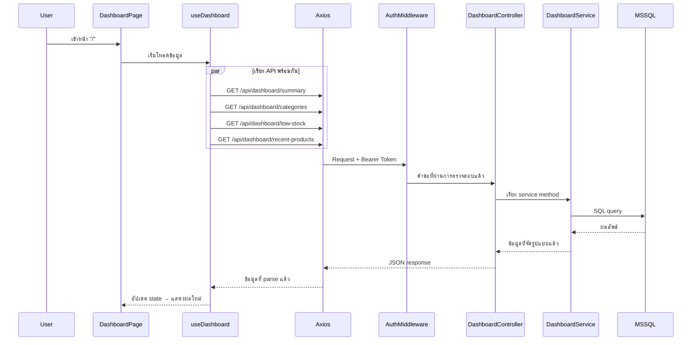
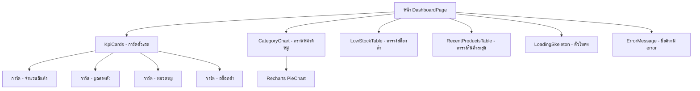

# การออกแบบทางเทคนิค: Dashboard

## Overview

ฟีเจอร์ Dashboard สำหรับระบบจัดการคลังสินค้า ประกอบด้วย Backend API endpoints ที่ดึงข้อมูลสรุปจากฐานข้อมูล MS SQL Server และ Frontend UI ที่แสดงผล KPI cards, กราฟกระจายสินค้าตามหมวดหมู่, ตารางสินค้าสต็อกต่ำ, และตารางสินค้าล่าสุด

**การตัดสินใจออกแบบ:**
1. **แยก API เป็นหลาย endpoints** แทนที่จะใช้ endpoint เดียว — เพื่อให้แต่ละส่วนจัดการ error แยกกัน (หาก endpoint หนึ่งล้มเหลว ส่วนอื่นยังแสดงผลได้) และสามารถเรียก API พร้อมกันจาก frontend ได้
2. **Tailwind CSS** สำหรับจัดแต่ง UI (ไม่ใช้ Ant Design เนื่องจากโปรเจกต์ใช้ Tailwind อยู่แล้ว) — ใช้ custom components ด้วย Tailwind classes แทน
3. **Recharts** สำหรับไลบรารีกราฟ — เป็นไลบรารีที่ออกแบบมาสำหรับ React โดยเฉพาะ, เบา, รองรับ pie/donut chart ที่ต้องการ
4. **รูปแบบ Service layer** เหมือนกับ ProductService ที่มีอยู่ — ใช้ `getPool()` + parameterized queries

## Architecture

```mermaid
graph TB
    subgraph หน้าบ้าน [Frontend]
        DP[หน้า Dashboard]
        DP --> HC[useDashboard Hook]
        HC --> API[api.ts - Axios]
    end

    subgraph หลังบ้าน [Backend]
        API -->|GET /api/dashboard/summary| DC[DashboardController]
        API -->|GET /api/dashboard/categories| DC
        API -->|GET /api/dashboard/low-stock| DC
        API -->|GET /api/dashboard/recent-products| DC
        DC --> DS[DashboardService]
        DS --> DB[(MS SQL Server)]
    end

    subgraph การยืนยันตัวตน [Auth]
        API -->|Bearer Token| AM[Auth Middleware]
        AM --> DC
    end
```

### ลำดับการทำงาน (Data Flow)



## Components and Interfaces

### API Endpoints ฝั่งหลังบ้าน

| Method | Path | คำอธิบาย |
|--------|------|----------|
| GET | `/api/dashboard/summary` | ข้อมูลสรุป KPI (จำนวนสินค้า, มูลค่าคลัง, หมวดหมู่, สต็อกต่ำ) |
| GET | `/api/dashboard/categories` | การกระจายสินค้าตามหมวดหมู่ |
| GET | `/api/dashboard/low-stock` | รายการสินค้าสต็อกต่ำ (สูงสุด 10 รายการ) |
| GET | `/api/dashboard/recent-products` | สินค้าที่เพิ่มล่าสุด (5 รายการ) |

ทุก endpoint ต้องผ่าน `authenticate` middleware (ตรวจสอบ JWT token)

### DashboardController (ตัวควบคุม)

```typescript
// src/controllers/dashboard.controller.ts
export class DashboardController {
  // ดึงข้อมูลสรุปภาพรวม
  static async getSummary(req: Request, res: Response, next: NextFunction): Promise<void>;
  // ดึงข้อมูลการกระจายสินค้าตามหมวดหมู่
  static async getCategoryDistribution(req: Request, res: Response, next: NextFunction): Promise<void>;
  // ดึงรายการสินค้าสต็อกต่ำ
  static async getLowStockProducts(req: Request, res: Response, next: NextFunction): Promise<void>;
  // ดึงรายการสินค้าที่เพิ่มล่าสุด
  static async getRecentProducts(req: Request, res: Response, next: NextFunction): Promise<void>;
}
```

### DashboardService (ชั้นบริการ)

```typescript
// src/services/dashboard.service.ts
export class DashboardService {
  // คำนวณข้อมูลสรุป KPI ทั้ง 4 ตัว
  async getSummary(): Promise<DashboardSummary>;
  // ดึงจำนวนสินค้าจัดกลุ่มตามหมวดหมู่
  async getCategoryDistribution(): Promise<CategoryDistributionItem[]>;
  // ดึงสินค้าที่มีสต็อกต่ำ (quantity ≤ 10) สูงสุด 10 รายการ
  async getLowStockProducts(): Promise<LowStockProduct[]>;
  // ดึงสินค้าที่สร้างล่าสุด 5 รายการ
  async getRecentProducts(): Promise<RecentProduct[]>;
}
```

### โครงสร้าง Component ฝั่งหน้าบ้าน



### Custom Hook (ตัวจัดการข้อมูล)

```typescript
// src/hooks/useDashboard.ts
interface UseDashboardReturn {
  summary: DashboardSummary | null;          // ข้อมูลสรุป KPI
  categories: CategoryDistributionItem[];    // ข้อมูลกราฟหมวดหมู่
  lowStockProducts: LowStockProduct[];       // รายการสต็อกต่ำ
  recentProducts: RecentProduct[];           // รายการสินค้าล่าสุด
  loading: {                                 // สถานะกำลังโหลดแยกแต่ละส่วน
    summary: boolean;
    categories: boolean;
    lowStock: boolean;
    recent: boolean;
  };
  errors: {                                  // ข้อผิดพลาดแยกแต่ละส่วน
    summary: string | null;
    categories: string | null;
    lowStock: string | null;
    recent: string | null;
  };
  retry: (section: 'summary' | 'categories' | 'lowStock' | 'recent') => void;  // ลองใหม่เฉพาะส่วนที่พัง
}

function useDashboard(): UseDashboardReturn;
```

## Data Models

### Types ฝั่งหลังบ้าน

```typescript
// src/types/dashboard.types.ts

export interface DashboardSummary {
  totalProducts: number;       // จำนวนสินค้า active ทั้งหมด
  inventoryValue: number;      // มูลค่าคลังสินค้ารวม (ทศนิยม 2 ตำแหน่ง)
  totalCategories: number;     // จำนวนหมวดหมู่ active ทั้งหมด
  lowStockCount: number;       // จำนวนสินค้าที่สต็อกต่ำ (quantity ≤ 10)
}

export interface CategoryDistributionItem {
  categoryName: string;        // ชื่อหมวดหมู่
  productCount: number;        // จำนวนสินค้า active ในหมวดหมู่นั้น
}

export interface LowStockProduct {
  name: string;                // ชื่อสินค้า
  sku: string;                 // รหัส SKU
  quantity: number;            // จำนวนคงเหลือ
  category: string;            // ชื่อหมวดหมู่
}

export interface RecentProduct {
  name: string;                // ชื่อสินค้า
  sku: string;                 // รหัส SKU
  category: string;            // ชื่อหมวดหมู่
  quantity: number;            // จำนวน
  status: 'active' | 'inactive';  // สถานะ
  createdAt: string;           // วันที่สร้าง (รูปแบบ ISO)
}
```

### รูปแบบ Response ของ API

**GET /api/dashboard/summary — สำเร็จ (200)**
```json
{
  "success": true,
  "data": {
    "totalProducts": 150,
    "inventoryValue": 1234567.89,
    "totalCategories": 8,
    "lowStockCount": 12
  }
}
```

**GET /api/dashboard/categories — สำเร็จ (200)**
```json
{
  "success": true,
  "data": [
    { "categoryName": "อิเล็กทรอนิกส์", "productCount": 45 },
    { "categoryName": "เครื่องใช้สำนักงาน", "productCount": 30 }
  ]
}
```

**GET /api/dashboard/low-stock — สำเร็จ (200)**
```json
{
  "success": true,
  "data": [
    { "name": "ปากกา Pilot", "sku": "OFF-00012", "quantity": 2, "category": "เครื่องใช้สำนักงาน" },
    { "name": "สายชาร์จ USB-C", "sku": "ELE-00045", "quantity": 5, "category": "อิเล็กทรอนิกส์" }
  ]
}
```

**GET /api/dashboard/recent-products — สำเร็จ (200)**
```json
{
  "success": true,
  "data": [
    {
      "name": "คีย์บอร์ด Mechanical",
      "sku": "ELE-00100",
      "category": "อิเล็กทรอนิกส์",
      "quantity": 50,
      "status": "active",
      "createdAt": "2024-01-15T10:30:00.000Z"
    }
  ]
}
```

**กรณี Error — ไม่ได้ยืนยันตัวตน (401)**
```json
{
  "success": false,
  "error": { "code": "UNAUTHORIZED", "message": "ไม่พบ Token ในคำขอ" }
}
```

**กรณี Error — เซิร์ฟเวอร์ผิดพลาด (500)**
```json
{
  "success": false,
  "error": { "code": "INTERNAL_ERROR", "message": "เกิดข้อผิดพลาดภายในระบบ" }
}
```

### SQL Queries (ใน DashboardService)

**ข้อมูลสรุป:**
```sql
-- นับจำนวนสินค้า active ทั้งหมด
SELECT COUNT(*) as totalProducts FROM products WHERE status = 'active'

-- คำนวณมูลค่าคลังสินค้ารวม
SELECT ROUND(SUM(CAST(quantity AS DECIMAL(18,2)) * unit_price), 2) as inventoryValue 
FROM products WHERE status = 'active'

-- นับจำนวนหมวดหมู่ active ทั้งหมด
SELECT COUNT(*) as totalCategories FROM categories WHERE status = 'active'

-- นับจำนวนสินค้าสต็อกต่ำ
SELECT COUNT(*) as lowStockCount FROM products 
WHERE status = 'active' AND quantity <= 10
```

**การกระจายสินค้าตามหมวดหมู่:**
```sql
SELECT c.name as categoryName, COUNT(p.id) as productCount
FROM products p
INNER JOIN categories c ON p.category_id = c.id
WHERE p.status = 'active' AND c.status = 'active' AND p.category_id IS NOT NULL
GROUP BY c.name
HAVING COUNT(p.id) > 0
ORDER BY COUNT(p.id) DESC, c.name ASC
```

**รายการสินค้าสต็อกต่ำ:**
```sql
SELECT TOP 10 p.name, p.sku, p.quantity, p.category
FROM products p
WHERE p.status = 'active' AND p.quantity <= 10
ORDER BY p.quantity ASC, p.name ASC
```

**สินค้าล่าสุด:**
```sql
SELECT TOP 5 name, sku, category, quantity, status, created_at as createdAt
FROM products
ORDER BY created_at DESC
```

### Types ฝั่งหน้าบ้าน

```typescript
// src/types/dashboard.ts (frontend)
export interface DashboardSummary {
  totalProducts: number;       // จำนวนสินค้าทั้งหมด
  inventoryValue: number;      // มูลค่าคลังสินค้า
  totalCategories: number;     // จำนวนหมวดหมู่
  lowStockCount: number;       // จำนวนสินค้าสต็อกต่ำ
}

export interface CategoryDistributionItem {
  categoryName: string;        // ชื่อหมวดหมู่
  productCount: number;        // จำนวนสินค้า
}

export interface LowStockProduct {
  name: string;                // ชื่อสินค้า
  sku: string;                 // รหัส SKU
  quantity: number;            // จำนวนคงเหลือ
  category: string;            // หมวดหมู่
}

export interface RecentProduct {
  name: string;                // ชื่อสินค้า
  sku: string;                 // รหัส SKU
  category: string;            // หมวดหมู่
  quantity: number;            // จำนวน
  status: 'active' | 'inactive';  // สถานะ
  createdAt: string;           // วันที่สร้าง
}
```

### โครงสร้างไฟล์ (ไฟล์ใหม่ที่ต้องสร้าง)

```
backend/src/
├── controllers/
│   └── dashboard.controller.ts      ← สร้างใหม่
├── services/
│   └── dashboard.service.ts         ← สร้างใหม่
├── routes/
│   └── dashboard.routes.ts          ← สร้างใหม่
│   └── index.ts                     ← แก้ไข (เพิ่ม dashboard routes)
└── types/
    └── dashboard.types.ts           ← สร้างใหม่

frontend/src/
├── hooks/
│   └── useDashboard.ts              ← สร้างใหม่
├── pages/
│   └── DashboardPage.tsx            ← เขียนใหม่ (แทนที่หน้า Welcome เดิม)
├── components/
│   └── dashboard/
│       ├── KpiCards.tsx              ← สร้างใหม่
│       ├── CategoryChart.tsx         ← สร้างใหม่
│       ├── LowStockTable.tsx         ← สร้างใหม่
│       └── RecentProductsTable.tsx   ← สร้างใหม่
├── services/
│   └── dashboard.service.ts         ← สร้างใหม่ (เรียก API)
└── types/
    └── index.ts                     ← แก้ไข (เพิ่ม dashboard types)

frontend/package.json                ← แก้ไข (เพิ่ม recharts)
```

## Correctness Properties

*คุณสมบัติ (Property) คือลักษณะหรือพฤติกรรมที่ต้องเป็นจริงเสมอในทุกกรณีของการทำงานที่ถูกต้อง เปรียบเสมือนข้อกำหนดที่เชื่อมระหว่างสเปคที่มนุษย์อ่านได้ กับการพิสูจน์ความถูกต้องที่เครื่องตรวจสอบได้*

### Property 1: ความถูกต้องของการคำนวณข้อมูลสรุป

*สำหรับ* ชุดข้อมูลสินค้าที่มีสถานะและจำนวนหลากหลาย รวมถึงหมวดหมู่ที่มีสถานะต่างๆ dashboard summary service ต้องคืนค่า:
- `totalProducts` เท่ากับจำนวนสินค้าที่ status = "active"
- `inventoryValue` เท่ากับผลรวมของ (quantity × unit_price) ของสินค้า active ทั้งหมด ปัดทศนิยม 2 ตำแหน่ง
- `totalCategories` เท่ากับจำนวนหมวดหมู่ที่ status = "active"
- `lowStockCount` เท่ากับจำนวนสินค้าที่ status = "active" และ quantity ≤ 10

**Validates: Requirements 1.2, 1.3, 1.4, 1.5**

### Property 2: ตัวกรองการกระจายสินค้าตามหมวดหมู่

*สำหรับ* ชุดข้อมูลสินค้าและหมวดหมู่ใดๆ ผลลัพธ์การกระจายตามหมวดหมู่ต้องมีเฉพาะรายการที่:
- หมวดหมู่มี status = "active"
- หมวดหมู่มีสินค้าอย่างน้อย 1 รายการที่ status = "active"
- สินค้าที่ category_id เป็น null จะไม่ถูกนับ

**Validates: Requirements 2.1, 2.2**

### Property 3: ลำดับการเรียงของการกระจายสินค้าตามหมวดหมู่

*สำหรับ* ผลลัพธ์ที่มี 2 รายการขึ้นไป ต้องเรียงตาม productCount จากมากไปน้อย และเมื่อจำนวนเท่ากันให้เรียงตาม categoryName ตามตัวอักษร (A-Z)

**Validates: Requirements 2.3**

### Property 4: ตัวกรองและจำกัดจำนวนสินค้าสต็อกต่ำ

*สำหรับ* ชุดข้อมูลสินค้าใดๆ รายการสต็อกต่ำต้อง:
- มีเฉพาะสินค้าที่ status = "active" และ quantity ≤ 10
- มีไม่เกิน 10 รายการ
- เมื่อมีมากกว่า 10 รายการที่ผ่านเกณฑ์ ต้องเลือก 10 รายการที่ quantity น้อยที่สุด

**Validates: Requirements 3.1, 3.2, 3.4**

### Property 5: ลำดับการเรียงสินค้าสต็อกต่ำ

*สำหรับ* รายการสต็อกต่ำที่มี 2 รายการขึ้นไป ต้องเรียงตาม quantity จากน้อยไปมาก และเมื่อ quantity เท่ากันให้เรียงตามชื่อสินค้าตามตัวอักษร (A-Z)

**Validates: Requirements 3.3**

### Property 6: การเลือกสินค้าล่าสุด

*สำหรับ* ชุดข้อมูลสินค้าใดๆ (ไม่จำกัดสถานะ) รายการสินค้าล่าสุดต้อง:
- มีไม่เกิน 5 รายการ
- เรียงตามวันที่สร้างจากใหม่ไปเก่า
- รวมสินค้าทุกสถานะ (active หรือ inactive)
- เมื่อมีสินค้าน้อยกว่า 5 รายการ ให้คืนทั้งหมดที่มี

**Validates: Requirements 4.1, 4.2, 4.3, 4.4**

### Property 7: การจัดรูปแบบสกุลเงิน

*สำหรับ* ตัวเลขที่ไม่ติดลบใดๆ ตัวจัดรูปแบบสกุลเงินบาทต้องสร้างข้อความที่มี:
- คำนำหน้า "฿"
- คั่นหลักพันด้วยจุลภาค
- ทศนิยม 2 ตำแหน่งเสมอ
- ตัวอย่าง: 1234567.894 → "฿1,234,567.89"

**Validates: Requirements 5.2**

## Error Handling

### ฝั่งหลังบ้าน

| สถานการณ์ | HTTP Status | Error Code | คำอธิบาย |
|-----------|-------------|------------|-----------|
| ไม่มี JWT Token | 401 | UNAUTHORIZED | auth middleware จัดการ (มีอยู่แล้ว) |
| Token หมดอายุหรือไม่ถูกต้อง | 401 | UNAUTHORIZED | auth middleware จัดการ (มีอยู่แล้ว) |
| เชื่อมต่อฐานข้อมูลไม่ได้ | 500 | INTERNAL_ERROR | DashboardController catch → error middleware |
| SQL query ผิดพลาด | 500 | INTERNAL_ERROR | DashboardController catch → error middleware |

- ใช้ `try/catch` ใน controller แล้วส่ง error ไป `next(error)` ให้ error middleware จัดการ (ตาม pattern เดิมของโปรเจกต์)
- DashboardService ไม่ catch error เอง — ให้ throw ขึ้นไปที่ controller

### ฝั่งหน้าบ้าน

| สถานการณ์ | การจัดการ |
|-----------|-----------|
| API ตอบกลับ 401 | Axios interceptor ลบ token + redirect ไปหน้า login (มีอยู่แล้ว) |
| API ตอบกลับ 500 | แสดงข้อความ error เฉพาะส่วนที่ล้มเหลว + ปุ่มลองใหม่ |
| ไม่มีสัญญาณเน็ต | แสดงข้อความ "ไม่สามารถเชื่อมต่อได้" + ปุ่มลองใหม่ |
| หมดเวลารอ (30 วินาที) | แสดงข้อความ timeout + ปุ่มลองใหม่ |
| ข้อมูลว่าง (0 สินค้า) | แสดง "0" ใน KPI cards, แสดง empty state ในกราฟและตาราง |

- แต่ละส่วนจัดการ error แยกกัน — ถ้า summary API ล้มเหลว กราฟหมวดหมู่ยังแสดงได้ถ้า categories API สำเร็จ
- ปุ่มลองใหม่จะเรียก API เฉพาะส่วนที่ล้มเหลว

## Testing Strategy

### Unit Tests ฝั่งหลังบ้าน

ใช้ **Jest** (มี jest.config.ts อยู่แล้ว) สำหรับ:
- DashboardService methods — mock database pool
- DashboardController — mock service, ตรวจสอบโครงสร้าง response
- กรณีพิเศษ: ข้อมูลว่าง, ค่า null, quantity เป็น 0

### Property-Based Tests (ทดสอบตามคุณสมบัติ)

ใช้ **fast-check** สำหรับ property-based testing:
- ทดสอบอย่างน้อย 100 รอบต่อ property test
- Mock database layer, สุ่มชุดข้อมูลสินค้า/หมวดหมู่
- ทดสอบว่า service logic คำนวณถูกต้องสำหรับทุก input ที่เป็นไปได้

**การตั้งค่า:**
```typescript
// ทดสอบแต่ละ property อย่างน้อย 100 ตัวอย่าง
fc.assert(fc.property(...), { numRuns: 100 });
```

คุณสมบัติที่ต้อง implement:
1. ความถูกต้องของการคำนวณข้อมูลสรุป (P1)
2. ตัวกรองการกระจายสินค้าตามหมวดหมู่ (P2)
3. ลำดับการเรียงของการกระจายสินค้าตามหมวดหมู่ (P3)
4. ตัวกรองและจำกัดจำนวนสินค้าสต็อกต่ำ (P4)
5. ลำดับการเรียงสินค้าสต็อกต่ำ (P5)
6. การเลือกสินค้าล่าสุด (P6)
7. การจัดรูปแบบสกุลเงิน (P7)

### Unit Tests ฝั่งหน้าบ้าน

ใช้ Vitest + React Testing Library:
- useDashboard hook — mock API calls, ตรวจสอบการจัดการ state
- การแสดงผล Component — ตรวจสอบ KPI cards, ตาราง, กราฟ แสดงถูกต้อง
- สถานะกำลังโหลด — ตรวจสอบว่าแสดง skeleton/spinner ขณะดึงข้อมูล
- สถานะ error — ตรวจสอบข้อความ error และปุ่มลองใหม่
- สถานะว่าง — ตรวจสอบว่าแสดง "0" และ placeholder ที่เหมาะสม

### Integration Tests (ทดสอบแบบบูรณาการ)

- ทดสอบ API endpoints — ตรวจสอบวงจร request/response ทั้งหมดกับฐานข้อมูลทดสอบ
- ทดสอบ Auth middleware — ตรวจสอบว่าคืน 401 สำหรับ request ที่ไม่ได้ยืนยันตัวตน
- ทดสอบประสิทธิภาพ — ตรวจสอบว่า response time < 2 วินาที สำหรับ 10,000 สินค้า
