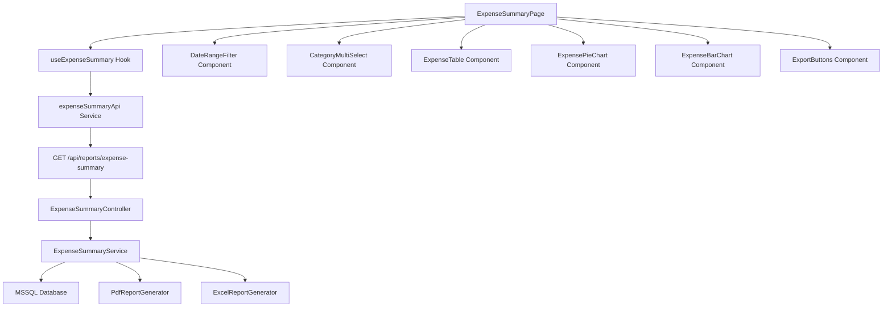

# เอกสารออกแบบ: Expense Summary Report

## Overview

ฟีเจอร์ Expense Summary Report เพิ่มหน้ารายงานสรุปค่าใช้จ่ายสินค้าคงคลัง โดยคำนวณจากมูลค่าสินค้า (จำนวน × ราคาต่อหน่วย) แยกตามหมวดหมู่และช่วงเวลา ประกอบด้วย:

- **แบ็กเอนด์**: API endpoint `GET /api/reports/expense-summary` ที่รองรับ JSON response, PDF export, และ Excel export พร้อมการกรองตามช่วงวันที่และหมวดหมู่
- **ฟรอนต์เอนด์**: หน้า React page แสดงข้อมูลสรุปในรูปแบบตาราง, Pie Chart, และ Bar Chart พร้อมตัวกรองช่วงวันที่และหมวดหมู่ และปุ่มส่งออกรายงาน

ระบบใช้ stack เดิมของโปรเจค: Express.js + MSSQL (backend), React + Recharts + TailwindCSS (frontend)

## Architecture



### การตัดสินใจออกแบบ

1. **แยก API endpoint ใหม่** (`/api/reports/expense-summary`) แทนการแก้ไข endpoint เดิม เพราะ expense summary มี query parameters ต่างจาก report เดิม (date range, multi-category) และ response structure ต่างกัน (มี summary + categoryBreakdown)

2. **ใช้ Custom Hook pattern** (`useExpenseSummary`) เพื่อจัดการ state ของ filters, loading, data fetching, และ export logic ในที่เดียว สอดคล้องกับ pattern `useDashboard` ที่มีอยู่แล้วในโปรเจค

3. **ใช้ Recharts** สำหรับกราฟ เพราะเป็น dependency ที่มีอยู่แล้วใน frontend

4. **ใช้ PdfKit และ ExcelJS** สำหรับการส่งออกรายงาน เพราะเป็น dependency ที่มีอยู่แล้วใน backend

5. **คำนวณค่าใช้จ่ายจาก `quantity * unit_price`** ของแต่ละ product ในช่วงเวลาที่เลือก เนื่องจากระบบนี้ไม่มีตาราง expense/transaction แยก จึงใช้ stock value เป็นตัวแทนค่าใช้จ่าย

## Components and Interfaces

### คอมโพเนนต์ฝั่งแบ็กเอนด์

#### ExpenseSummaryController (`src/controllers/expense-summary.controller.ts`)

```typescript
class ExpenseSummaryController {
  // GET /api/reports/expense-summary
  static async getExpenseSummary(req: Request, res: Response, next: NextFunction): Promise<void>;
}
```

หน้าที่รับผิดชอบ:
- ตรวจสอบความถูกต้องของ query parameters (startDate, endDate, categories, format)
- ส่งต่อไปยัง JSON response หรือ file download ตาม format ที่ระบุ
- จัดการ timeout (504) และ validation errors (400)

#### ExpenseSummaryService (`src/services/expense-summary.service.ts`)

```typescript
class ExpenseSummaryService {
  // ดึงข้อมูลสรุปค่าใช้จ่าย
  async getExpenseSummaryData(filters: ExpenseSummaryFilters): Promise<ExpenseSummaryData>;
  
  // สร้างรายงาน PDF
  async generatePdfReport(data: ExpenseSummaryData): Promise<Buffer>;
  
  // สร้างรายงาน Excel
  async generateExcelReport(data: ExpenseSummaryData): Promise<Buffer>;
}
```

หน้าที่รับผิดชอบ:
- Query ข้อมูล products จากฐานข้อมูลตาม date range และ categories
- คำนวณสรุปรวม (totalAmount, totalItems, totalCategories)
- สร้าง categoryBreakdown
- เรียงลำดับ items ตาม totalValue จากมากไปน้อย
- สร้างไฟล์ PDF/Excel

#### ExpenseSummaryValidator (`src/validators/expense-summary.validator.ts`)

```typescript
const expenseSummaryValidation: ValidationChain[];
```

กฎการตรวจสอบ:
- `startDate`: ต้องระบุ, รูปแบบ YYYY-MM-DD, เป็นวันที่จริง, ≤ endDate
- `endDate`: ต้องระบุ, รูปแบบ YYYY-MM-DD, เป็นวันที่จริง, ≥ startDate, ช่วงวันที่ ≤ 365 วัน
- `categories`: ไม่บังคับ, รูปแบบ comma-separated string, สูงสุด 20 รายการ
- `format`: ต้องระบุ, ค่าที่รับได้คือ "json" | "pdf" | "xlsx"

### คอมโพเนนต์ฝั่งฟรอนต์เอนด์

#### ExpenseSummaryPage (`src/pages/ExpenseSummaryPage.tsx`)

คอมโพเนนต์หน้าหลักที่ประกอบด้วย:
- Summary cards (มูลค่ารวม, จำนวนรายการ, จำนวนหมวดหมู่)
- DateRangeFilter
- CategoryMultiSelect
- ExpenseTable
- ExpensePieChart + ExpenseBarChart
- ExportButtons (PDF/Excel)
- สถานะ Loading, Error, และ Empty

#### DateRangeFilter (`src/components/expense-summary/DateRangeFilter.tsx`)

```typescript
interface DateRangeFilterProps {
  startDate: string;       // YYYY-MM-DD
  endDate: string;         // YYYY-MM-DD
  onFilter: (start: string, end: string) => void;
  disabled: boolean;
}
```

คุณสมบัติ:
- ช่องกรอกวันที่ (แสดงเป็น DD/MM/YYYY, ค่าเก็บเป็น YYYY-MM-DD)
- ปุ่มลัดเลือกช่วงเวลา: วันนี้, สัปดาห์นี้, เดือนนี้, 3 เดือนล่าสุด, ปีนี้
- ตรวจสอบความถูกต้อง: start ≤ end, ย้อนหลังได้สูงสุด 5 ปี, ไม่อนุญาตวันที่ในอนาคต
- แสดงข้อความแจ้งเตือนเมื่อข้อมูลไม่ถูกต้อง

#### CategoryMultiSelect (`src/components/expense-summary/CategoryMultiSelect.tsx`)

```typescript
interface CategoryMultiSelectProps {
  selectedCategories: string[];
  onChange: (categories: string[]) => void;
  disabled: boolean;
}
```

คุณสมบัติ:
- Multi-select dropdown แสดงลำดับชั้นด้วยการย่อหน้า
- Badge แสดงจำนวนหมวดหมู่ที่เลือก
- ปุ่มล้างตัวกรองทั้งหมด
- ดึงรายการหมวดหมู่ที่ active เมื่อ mount

#### ExpenseTable (`src/components/expense-summary/ExpenseTable.tsx`)

```typescript
interface ExpenseTableProps {
  items: ExpenseItem[];
  loading: boolean;
  emptyMessage?: string;
}
```

คอลัมน์ที่แสดง: ชื่อสินค้า, SKU, หมวดหมู่, จำนวน, ราคาต่อหน่วย, มูลค่ารวม

#### ExpensePieChart / ExpenseBarChart

```typescript
interface ExpenseChartProps {
  categoryBreakdown: CategoryBreakdownItem[];
  loading: boolean;
}
```

- PieChart: แสดง 10 หมวดหมู่ที่มีมูลค่าสูงสุด + กลุ่ม "อื่นๆ"
- BarChart: หมวดหมู่เรียงตามมูลค่าจากมากไปน้อย, แกน X = หมวดหมู่, แกน Y = มูลค่า (฿)
- Tooltip: ชื่อหมวดหมู่, มูลค่า (ทศนิยม 2 ตำแหน่ง), เปอร์เซ็นต์ (ทศนิยม 1 ตำแหน่ง)

#### useExpenseSummary Hook (`src/hooks/useExpenseSummary.ts`)

```typescript
interface UseExpenseSummaryReturn {
  data: ExpenseSummaryData | null;
  loading: boolean;
  error: string | null;
  exporting: boolean;
  filters: ExpenseSummaryFilters;
  setDateRange: (start: string, end: string) => void;
  setCategories: (categories: string[]) => void;
  fetchData: () => Promise<void>;
  exportPdf: () => Promise<void>;
  exportExcel: () => Promise<void>;
}
```

## Data Models

### ประเภทข้อมูลฝั่งแบ็กเอนด์ (`src/types/expense-summary.types.ts`)

```typescript
// ตัวกรองสำหรับ query ข้อมูลค่าใช้จ่าย
interface ExpenseSummaryFilters {
  startDate: string;          // YYYY-MM-DD
  endDate: string;            // YYYY-MM-DD
  categories?: string[];      // category IDs
}

// รายการค่าใช้จ่ายแต่ละรายการ
interface ExpenseItem {
  id: string;
  name: string;
  sku: string;
  category: string;
  categoryId: string;
  quantity: number;
  unitPrice: number;          // ทศนิยม 2 ตำแหน่ง
  totalValue: number;         // quantity * unitPrice, ทศนิยม 2 ตำแหน่ง
}

// ข้อมูลแยกตามหมวดหมู่
interface CategoryBreakdownItem {
  categoryName: string;
  categoryId: string;
  amount: number;             // ทศนิยม 2 ตำแหน่ง
  itemCount: number;
  percentage: number;         // ทศนิยม 1 ตำแหน่ง
}

// ข้อมูลสรุปรวม
interface ExpenseSummary {
  totalAmount: number;        // ทศนิยม 2 ตำแหน่ง
  totalItems: number;         // จำนวนเต็ม
  totalCategories: number;    // จำนวนเต็ม
}

// โครงสร้าง API response เต็ม (format=json)
interface ExpenseSummaryData {
  summary: ExpenseSummary;
  categoryBreakdown: CategoryBreakdownItem[];
  items: ExpenseItem[];
  generatedAt: string;        // UTC ISO string
}

// ผลลัพธ์การสร้างรายงาน
interface ExpenseSummaryReportResult {
  buffer: Buffer;
  filename: string;           // expense-summary_YYYY-MM-DD.pdf|xlsx
  contentType: string;
}
```

### รูปแบบ API Response

**กรณีสำเร็จ (format=json)**:
```json
{
  "success": true,
  "data": {
    "summary": {
      "totalAmount": 125000.50,
      "totalItems": 45,
      "totalCategories": 8
    },
    "categoryBreakdown": [
      {
        "categoryName": "อิเล็กทรอนิกส์",
        "categoryId": "cat-001",
        "amount": 50000.00,
        "itemCount": 12,
        "percentage": 40.0
      }
    ],
    "items": [
      {
        "id": "prod-001",
        "name": "Laptop",
        "sku": "SKU-001",
        "category": "อิเล็กทรอนิกส์",
        "categoryId": "cat-001",
        "quantity": 10,
        "unitPrice": 25000.00,
        "totalValue": 250000.00
      }
    ],
    "generatedAt": "2024-01-15T10:30:00.000Z"
  }
}
```

**กรณีข้อผิดพลาด (400 - Validation)**:
```json
{
  "success": false,
  "error": {
    "code": "VALIDATION_ERROR",
    "message": "ข้อมูลไม่ถูกต้อง",
    "details": [{ "startDate": "รูปแบบวันที่ไม่ถูกต้อง ต้องเป็น YYYY-MM-DD" }]
  }
}
```

### รูปแบบ SQL Query

```sql
SELECT 
  p.id, p.name, p.sku, 
  ISNULL(c.name, p.category) as category,
  p.category_id as categoryId,
  p.quantity, p.unit_price,
  ROUND(CAST(p.quantity AS DECIMAL(18,2)) * p.unit_price, 2) as totalValue
FROM products p
LEFT JOIN categories c ON p.category_id = c.id
WHERE p.status = 'active'
  AND p.created_at >= @startDate
  AND p.created_at < DATEADD(day, 1, @endDate)
  AND (@categories IS NULL OR p.category_id IN (SELECT value FROM STRING_SPLIT(@categories, ',')))
ORDER BY (CAST(p.quantity AS DECIMAL(18,2)) * p.unit_price) DESC
```

หมายเหตุ: ตัวกรองวันที่ใช้ `created_at` เป็นตัวแทนวันที่เกิดค่าใช้จ่าย (วันที่สินค้าถูกเพิ่มเข้าคลัง) การรวมวันที่สิ้นสุดจัดการด้วย `< DATEADD(day, 1, @endDate)`

## Correctness Properties

*คุณสมบัติ (property) คือลักษณะหรือพฤติกรรมที่ควรเป็นจริงในทุกการทำงานที่ถูกต้องของระบบ — โดยพื้นฐานแล้วคือข้อกำหนดอย่างเป็นทางการเกี่ยวกับสิ่งที่ระบบควรทำ คุณสมบัติเหล่านี้ทำหน้าที่เป็นสะพานเชื่อมระหว่างข้อกำหนดที่มนุษย์อ่านได้กับการรับรองความถูกต้องที่เครื่องจักรตรวจสอบได้*

### Property 1: ความถูกต้องของการคำนวณสรุปรวม

*สำหรับทุก* อาร์เรย์ของรายการค่าใช้จ่าย ค่าสรุปรวมที่คำนวณได้จะต้องเป็นไปตามเงื่อนไข: `totalAmount` เท่ากับผลรวมของ `totalValue` ของทุกรายการ, `totalItems` เท่ากับจำนวนสมาชิกในอาร์เรย์, และ `totalCategories` เท่ากับจำนวน `categoryId` ที่ไม่ซ้ำกันในอาร์เรย์

**Validates: Requirements 1.1, 6.8, 7.2**

### Property 2: การคำนวณ totalValue ของรายการ

*สำหรับทุก* สินค้าที่มี `quantity` เป็นจำนวนเต็มไม่ติดลบ และ `unitPrice` เป็นค่าไม่ติดลบ ค่า `totalValue` ที่คำนวณได้จะต้องเท่ากับ `quantity × unitPrice` ปัดเศษเป็นทศนิยม 2 ตำแหน่ง

**Validates: Requirements 1.2**

### Property 3: การเรียงลำดับรายการตาม totalValue จากมากไปน้อย

*สำหรับทุก* อาร์เรย์ของรายการค่าใช้จ่ายที่ส่งกลับจาก service สำหรับทุกคู่ของรายการที่อยู่ติดกัน (item[i], item[i+1]) จะต้องเป็นไปตามเงื่อนไข `item[i].totalValue` ≥ `item[i+1].totalValue`

**Validates: Requirements 1.3**

### Property 4: การตรวจสอบช่วงวันที่

*สำหรับทุก* คู่ของสตริงวันที่ (startDate, endDate) ตรรกะการตรวจสอบจะต้องยอมรับคู่วันที่ก็ต่อเมื่อ: ทั้งสองเป็นวันที่ที่ถูกต้องในรูปแบบ YYYY-MM-DD, startDate ≤ endDate, ไม่มีวันที่ใดอยู่ในอนาคต, startDate อยู่ภายใน 5 ปีจากวันปัจจุบัน, และช่วงวันที่ไม่เกิน 365 วัน

**Validates: Requirements 2.1, 2.3, 6.5**

### Property 5: ตัวกรองรวมส่งคืนเฉพาะรายการที่ตรงกัน

*สำหรับทุก* ชุดรายการค่าใช้จ่าย, ช่วงวันที่ [startDate, endDate], และชุดหมวดหมู่ที่เลือก ผลลัพธ์ที่กรองแล้วจะต้องประกอบด้วยเฉพาะรายการที่วันที่ของรายการอยู่ภายใน [startDate, endDate] (รวมขอบ) และหมวดหมู่ของรายการ (หรือหมวดหมู่แม่) อยู่ในชุดหมวดหมู่ที่เลือก (หรือชุดหมวดหมู่ว่าง หมายถึงไม่ได้กรองหมวดหมู่)

**Validates: Requirements 2.2, 3.2, 3.5**

### Property 6: การจัดกลุ่ม Pie Chart 10 อันดับแรกคงมูลค่ารวม

*สำหรับทุก* ข้อมูลแยกตามหมวดหมู่ที่มี N หมวดหมู่ การแปลงข้อมูลสำหรับ pie chart จะต้องให้ผลลัพธ์ไม่เกิน 11 ส่วน (10 อันดับแรกตามมูลค่า + "อื่นๆ") และผลรวมของมูลค่าทุกส่วนจะต้องเท่ากับ `totalAmount` ดั้งเดิม เมื่อ N ≤ 10 จะต้องไม่มีส่วน "อื่นๆ" ปรากฏ

**Validates: Requirements 4.1**

### Property 7: การเรียงลำดับหมวดหมู่ใน Bar Chart

*สำหรับทุก* อาร์เรย์ข้อมูลแยกตามหมวดหมู่ที่ใช้สำหรับ bar chart สำหรับทุกคู่ที่อยู่ติดกัน (cat[i], cat[i+1]) จะต้องเป็นไปตามเงื่อนไข `cat[i].amount` ≥ `cat[i+1].amount`

**Validates: Requirements 4.2**

### Property 8: ความแม่นยำของการคำนวณเปอร์เซ็นต์

*สำหรับทุก* ข้อมูลแยกตามหมวดหมู่ที่ totalAmount > 0 เปอร์เซ็นต์ของแต่ละหมวดหมู่จะต้องเท่ากับ `(amount / totalAmount) * 100` ปัดเศษเป็นทศนิยม 1 ตำแหน่ง และผลรวมของเปอร์เซ็นต์ทั้งหมดจะต้องอยู่ภายใน ±0.1 * N ของ 100 (โดย N คือจำนวนหมวดหมู่ เพื่อชดเชยความคลาดเคลื่อนจากการปัดเศษ)

**Validates: Requirements 4.5**

### Property 9: ความถูกต้องของรูปแบบชื่อไฟล์

*สำหรับทุก* วันที่ UTC ที่ถูกต้องและรูปแบบ ("pdf" หรือ "xlsx") ชื่อไฟล์ที่สร้างขึ้นจะต้องตรงกับรูปแบบ `expense-summary_YYYY-MM-DD.{ext}` โดย YYYY-MM-DD ตรงกับวันที่ UTC และ ext ตรงกับรูปแบบที่เลือก

**Validates: Requirements 5.4**

### Property 10: ความถูกต้องของการตรวจสอบ API parameters

*สำหรับทุก* การผสมกันของ query parameters ที่ส่งไปยัง expense-summary endpoint API จะต้องส่งกลับ HTTP 400 หาก: startDate ไม่มีหรือรูปแบบไม่ถูกต้อง, endDate ไม่มีหรือรูปแบบไม่ถูกต้อง, format ไม่ใช่ "json"/"pdf"/"xlsx", startDate > endDate, ช่วงวันที่เกิน 365 วัน, หรือจำนวน categories เกิน 20 ในกรณีอื่นจะต้องไม่ส่งกลับ 400 สำหรับเหตุผลด้าน validation

**Validates: Requirements 6.1, 6.5, 6.6**

## Error Handling

### การจัดการข้อผิดพลาดฝั่งแบ็กเอนด์

| เงื่อนไขข้อผิดพลาด | HTTP Status | Error Code | ข้อความ |
|---|---|---|---|
| startDate หรือ endDate ไม่มีหรือไม่ถูกต้อง | 400 | VALIDATION_ERROR | ระบุฟิลด์และสาเหตุที่ผิดพลาด |
| parameter format ไม่ถูกต้อง | 400 | VALIDATION_ERROR | ค่า format ต้องเป็น json, pdf, หรือ xlsx |
| startDate > endDate | 400 | VALIDATION_ERROR | วันที่เริ่มต้นต้องไม่เกินวันที่สิ้นสุด |
| ช่วงวันที่ > 365 วัน | 400 | VALIDATION_ERROR | ช่วงวันที่ต้องไม่เกิน 365 วัน |
| categories > 20 รายการ | 400 | VALIDATION_ERROR | เลือกหมวดหมู่ได้สูงสุด 20 หมวดหมู่ |
| token ไม่มีหรือไม่ถูกต้อง/หมดอายุ | 401 | UNAUTHORIZED | กรุณาเข้าสู่ระบบก่อนใช้งาน |
| สร้างรายงานใช้เวลาเกิน 30 วินาที | 504 | TIMEOUT | การสร้างรายงานใช้เวลาเกินกำหนด |
| ข้อผิดพลาดการเชื่อมต่อฐานข้อมูล | 500 | INTERNAL_ERROR | เกิดข้อผิดพลาดภายในระบบ |

### การจัดการข้อผิดพลาดฝั่งฟรอนต์เอนด์

| สถานการณ์ | พฤติกรรม |
|---|---|
| API ส่งกลับ 400 (validation) | แสดงข้อความผิดพลาดเฉพาะฟิลด์ใกล้กับตัวกรองที่เกี่ยวข้อง |
| API ส่งกลับ 401 | เปลี่ยนเส้นทางไปยังหน้า login |
| API ส่งกลับ 504 (timeout) | แสดง toast: "การสร้างรายงานใช้เวลาเกินกำหนด กรุณาลองใหม่" |
| API ส่งกลับ 500 | แสดง error banner พร้อมปุ่มลองใหม่ |
| ข้อผิดพลาดเครือข่าย | แสดง error banner: "ไม่สามารถเชื่อมต่อเซิร์ฟเวอร์ได้" พร้อมปุ่มลองใหม่ |
| การส่งออกล้มเหลว | คืนสถานะปุ่มส่งออก, แสดง toast พร้อมข้อความข้อผิดพลาด |
| ไม่มีข้อมูลสำหรับตัวกรองปัจจุบัน | แสดงข้อความสถานะว่าง, ปิดการใช้งานปุ่มส่งออก |

### กลยุทธ์การจัดการ Timeout

- Timeout การ query API: 30 วินาที (MSSQL request timeout)
- Timeout การสร้างรายงาน: 30 วินาที (ใช้ pattern Promise.race ตามที่มีอยู่ใน `ReportService`)
- Timeout ฝั่ง Frontend (axios): 30 วินาทีสำหรับการส่งออก, 5 วินาทีสำหรับการดึงข้อมูล JSON
- การยกเลิกฝั่ง Frontend: ยกเลิก request ที่ค้างอยู่เมื่อตัวกรองเปลี่ยนอย่างรวดเร็ว (debounce 300ms)

## Testing Strategy

### การทดสอบเชิงคุณสมบัติ (Property-Based Tests ด้วย fast-check)

โปรเจคมี `fast-check` อยู่ใน devDependencies แล้ว การทดสอบเชิงคุณสมบัติจะใช้ fast-check โดยทำงานอย่างน้อย 100 รอบต่อ property

**โมดูลเป้าหมายสำหรับ PBT:**
- `ExpenseSummaryService` — การคำนวณสรุป, การคำนวณรายการ, การเรียงลำดับ
- ฟังก์ชันยูทิลิตี้ตรวจสอบวันที่
- ฟังก์ชันแปลงข้อมูลสำหรับกราฟ (การจัดกลุ่ม 10 อันดับ, การคำนวณเปอร์เซ็นต์)
- ยูทิลิตี้สร้างชื่อไฟล์
- การตรวจสอบ API parameters

**การกำหนดค่า:**
- ไลบรารี: `fast-check` (ติดตั้งแล้ว)
- จำนวนรอบขั้นต่ำ: 100 ต่อ property
- แต่ละ test ต้องมี tag: `Feature: expense-summary-report, Property {N}: {title}`

### การทดสอบหน่วย (Unit Tests ด้วย Jest)

- **Controller**: Mock service, ทดสอบการ routing ของ request/response และการ mapping ข้อผิดพลาด
- **Service**: Mock database pool, ทดสอบ logic การแปลงข้อมูล
- **Validators**: ทดสอบกฎการตรวจสอบแต่ละข้อด้วย input ที่ถูกต้องและไม่ถูกต้อง
- **คอมโพเนนต์ Frontend**: ทดสอบสถานะการ render (loading, error, empty, data)
- **Custom hook**: ทดสอบ state transitions, การเปลี่ยนตัวกรอง, กระบวนการส่งออก

### การทดสอบบูรณาการ (Integration Tests ด้วย Jest + Supertest)

- ทดสอบ API endpoint แบบเต็มด้วย database ที่ mock
- การทดสอบร่วมกับ authentication middleware
- ตรวจสอบ Content-Type และ Content-Disposition headers สำหรับ response แบบ PDF/XLSX
- สถานการณ์ตัวกรองรวม (date + category)

### โครงสร้างไฟล์ทดสอบ

```
backend/src/__tests__/
  expense-summary/
    expense-summary.service.spec.ts       # ทดสอบหน่วยสำหรับ service
    expense-summary.controller.spec.ts    # ทดสอบหน่วยสำหรับ controller
    expense-summary.validator.spec.ts     # ทดสอบหน่วยสำหรับ validation
    expense-summary.properties.spec.ts    # ทดสอบเชิงคุณสมบัติ
    expense-summary.integration.spec.ts   # ทดสอบบูรณาการ API
frontend/src/__tests__/
  expense-summary/
    ExpenseSummaryPage.spec.tsx           # ทดสอบคอมโพเนนต์หน้าหลัก
    useExpenseSummary.spec.ts             # ทดสอบ hook
    chart-utils.spec.ts                   # ทดสอบการแปลงข้อมูลกราฟ
```
