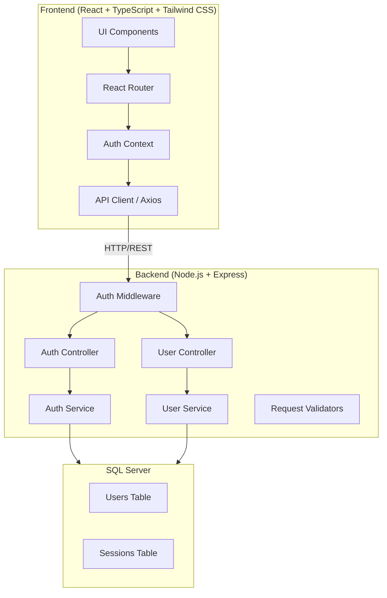
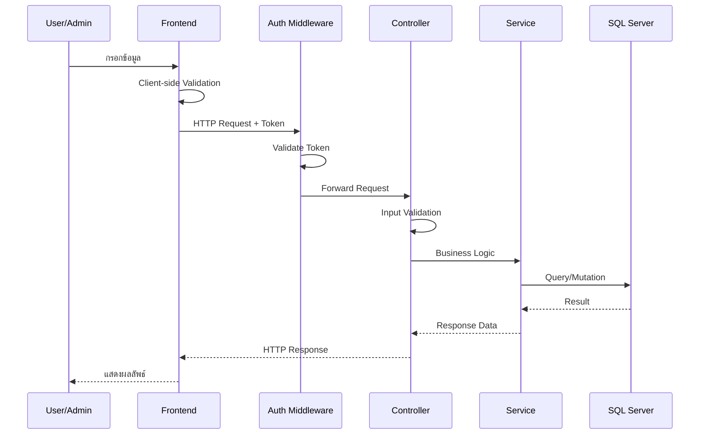
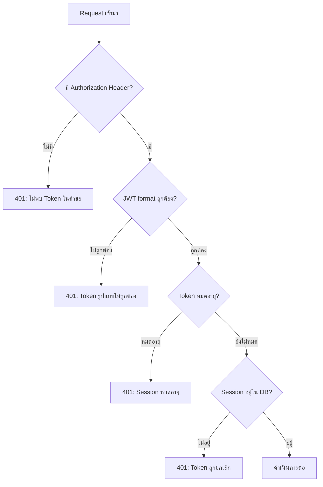
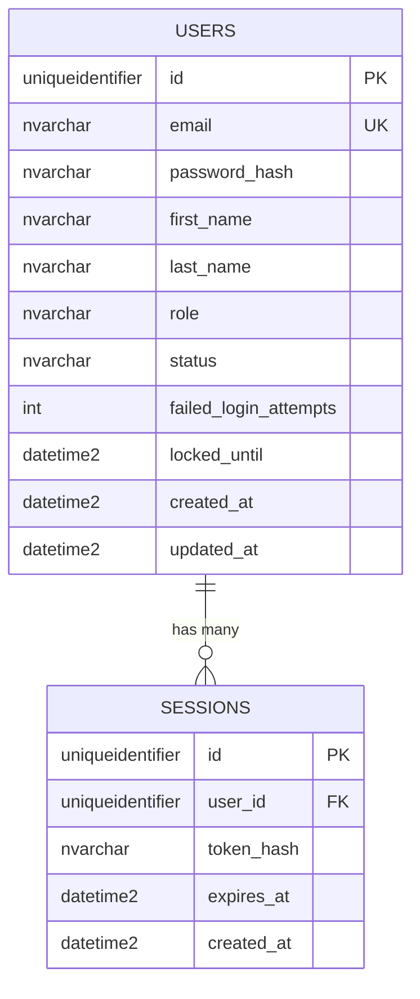

# Design Document: Login CRUD System

## Overview

ระบบ Login CRUD เป็นระบบจัดการผู้ใช้สำหรับ Warehouse Management System ประกอบด้วยการลงทะเบียน, เข้าสู่ระบบ/ออกจากระบบ, และการจัดการข้อมูลผู้ใช้โดย Admin โดยใช้สถาปัตยกรรมแบบ Client-Server ที่แยก Frontend (React + TypeScript) ออกจาก Backend (Node.js + Express) และเชื่อมต่อกับ SQL Server เป็นฐานข้อมูล

### เป้าหมายหลัก
- ระบบ Authentication ที่ปลอดภัยด้วย session token (JWT)
- ระบบ CRUD สำหรับจัดการผู้ใช้โดย Admin
- ระบบป้องกันเส้นทาง (Route Protection) ทั้ง Frontend และ Backend
- ระบบล็อกบัญชีเมื่อกรอก password ผิดเกินกำหนด

## Architecture

### สถาปัตยกรรมแบบ 3-Tier



### การไหลของข้อมูล (Data Flow)



### Design Decisions

1. **Session Token ใช้ JWT**: เลือกใช้ JWT เพราะสามารถ encode ข้อมูล role และ expiry ได้ในตัว ลด database lookup สำหรับ requests ทั่วไป แต่ยังคงเก็บ session ใน database เพื่อรองรับการ revoke token ได้
2. **Password Hashing ใช้ bcrypt**: เลือก bcrypt เพราะมี salt ในตัว และมี cost factor ที่ปรับได้ตามความต้องการด้านความปลอดภัย
3. **Pagination แบบ Offset-based**: เลือกใช้ OFFSET/FETCH เพราะเหมาะกับจำนวนข้อมูลผู้ใช้ที่ไม่มากนักในระบบ warehouse management
4. **แยก Auth Service และ User Service**: แยก concerns ออกจากกันเพื่อให้แก้ไขได้อิสระ

## Components and Interfaces

### Frontend Components

| Component | หน้าที่ | Props/State |
|-----------|---------|-------------|
| `LoginPage` | หน้าเข้าสู่ระบบ | email, password, error, isLoading |
| `RegisterPage` | หน้าลงทะเบียน | email, password, firstName, lastName, error |
| `UserListPage` | แสดงรายชื่อผู้ใช้ (Admin) | users[], page, totalPages, searchQuery |
| `UserFormModal` | ฟอร์มแก้ไขข้อมูลผู้ใช้ | user, isOpen, onSave, onClose |
| `DeleteConfirmDialog` | ยืนยันการลบ | userName, isOpen, onConfirm, onCancel |
| `ChangePasswordPage` | เปลี่ยน password | oldPassword, newPassword, confirmPassword |
| `AuthProvider` | จัดการ auth state | token, user, login(), logout() |
| `ProtectedRoute` | ป้องกันเส้นทาง | requiredRole, children |

### Backend API Endpoints

| Method | Endpoint | Controller | Auth Required | Role |
|--------|----------|------------|---------------|------|
| POST | `/api/auth/register` | AuthController | No | - |
| POST | `/api/auth/login` | AuthController | No | - |
| POST | `/api/auth/logout` | AuthController | Yes | Any |
| POST | `/api/auth/change-password` | AuthController | Yes | Any |
| GET | `/api/users` | UserController | Yes | Admin |
| GET | `/api/users/:id` | UserController | Yes | Admin |
| PUT | `/api/users/:id` | UserController | Yes | Admin |
| DELETE | `/api/users/:id` | UserController | Yes | Admin |

### Service Interfaces

```typescript
// Auth Service Interface
interface IAuthService {
  register(data: RegisterDto): Promise<UserResponse>;
  login(data: LoginDto): Promise<{ token: string; user: UserResponse }>;
  logout(token: string): Promise<void>;
  changePassword(userId: string, data: ChangePasswordDto): Promise<void>;
  validateToken(token: string): Promise<TokenPayload | null>;
}

// User Service Interface
interface IUserService {
  findAll(query: UserQueryDto): Promise<PaginatedResponse<UserResponse>>;
  findById(id: string): Promise<UserResponse | null>;
  update(id: string, data: UpdateUserDto): Promise<UserResponse>;
  delete(id: string, requestingAdminId: string): Promise<void>;
}

// DTOs
interface RegisterDto {
  email: string;       // max 254 chars
  password: string;    // 8-128 chars
  firstName: string;   // 1-100 chars
  lastName: string;    // 1-100 chars
}

interface LoginDto {
  email: string;
  password: string;
}

interface ChangePasswordDto {
  oldPassword: string;
  newPassword: string;    // 8-128 chars
  confirmPassword: string;
}

interface UpdateUserDto {
  email?: string;
  firstName?: string;
  lastName?: string;
  role?: 'admin' | 'user';
  status?: 'active' | 'suspended' | 'locked';
}

interface UserQueryDto {
  page: number;         // default: 1
  limit: number;        // default: 20, max: 20
  search?: string;      // partial match on email/firstName/lastName
}

interface PaginatedResponse<T> {
  data: T[];
  total: number;
  page: number;
  totalPages: number;
}

interface UserResponse {
  id: string;
  email: string;
  firstName: string;
  lastName: string;
  role: 'admin' | 'user';
  status: 'active' | 'suspended' | 'locked';
  createdAt: Date;
  updatedAt: Date;
}

interface TokenPayload {
  userId: string;
  email: string;
  role: 'admin' | 'user';
  sessionId: string;
  exp: number;
}
```

### Auth Middleware Flow



## Data Models

### Database Schema

```sql
-- Users Table
CREATE TABLE users (
    id UNIQUEIDENTIFIER PRIMARY KEY DEFAULT NEWID(),
    email NVARCHAR(254) NOT NULL UNIQUE,
    password_hash NVARCHAR(255) NOT NULL,
    first_name NVARCHAR(100) NOT NULL,
    last_name NVARCHAR(100) NOT NULL,
    role NVARCHAR(10) NOT NULL DEFAULT 'user' CHECK (role IN ('admin', 'user')),
    status NVARCHAR(15) NOT NULL DEFAULT 'active' CHECK (status IN ('active', 'suspended', 'locked')),
    failed_login_attempts INT NOT NULL DEFAULT 0,
    locked_until DATETIME2 NULL,
    created_at DATETIME2 NOT NULL DEFAULT GETUTCDATE(),
    updated_at DATETIME2 NOT NULL DEFAULT GETUTCDATE()
);

-- Sessions Table
CREATE TABLE sessions (
    id UNIQUEIDENTIFIER PRIMARY KEY DEFAULT NEWID(),
    user_id UNIQUEIDENTIFIER NOT NULL REFERENCES users(id) ON DELETE CASCADE,
    token_hash NVARCHAR(255) NOT NULL,
    expires_at DATETIME2 NOT NULL,
    created_at DATETIME2 NOT NULL DEFAULT GETUTCDATE(),
    INDEX idx_sessions_user_id (user_id),
    INDEX idx_sessions_token_hash (token_hash),
    INDEX idx_sessions_expires_at (expires_at)
);

-- Indexes
CREATE INDEX idx_users_email ON users(email);
CREATE INDEX idx_users_status ON users(status);
CREATE INDEX idx_users_name ON users(first_name, last_name);
```

### Entity Relationships



### Account Locking Logic

- เมื่อ login ผิด: `failed_login_attempts += 1`
- เมื่อ `failed_login_attempts >= 5`: ตั้ง `locked_until = NOW + 15 minutes`, `status = 'locked'`
- เมื่อ login สำเร็จ: `failed_login_attempts = 0`, `status = 'active'` (ถ้าเป็น 'locked')
- เมื่อ `locked_until` ผ่านไปแล้ว: อนุญาตให้ login ได้ (auto-unlock)

## Correctness Properties

*A property is a characteristic or behavior that should hold true across all valid executions of a system — essentially, a formal statement about what the system should do. Properties serve as the bridge between human-readable specifications and machine-verifiable correctness guarantees.*

### Property 1: Registration succeeds with valid data

*For any* valid email (≤254 chars with proper format), password (8-128 chars), firstName (1-100 chars), and lastName (1-100 chars), the registration operation should successfully create a new user account in the database.

**Validates: Requirements 1.1**

### Property 2: Duplicate email rejection

*For any* registered user, attempting to register a new account with the same email should be rejected without creating a duplicate record.

**Validates: Requirements 1.2, 5.2**

### Property 3: Password length validation

*For any* password with length less than 8 or greater than 128 characters, registration or password change should be rejected with an appropriate error message.

**Validates: Requirements 1.3**

### Property 4: Password hashing invariant

*For any* password stored in the database, the stored value (password_hash) should never equal the original plaintext password, and should be a valid bcrypt hash.

**Validates: Requirements 1.4**

### Property 5: Email format validation

*For any* string that does not contain '@' followed by a valid domain, the email validator should return invalid.

**Validates: Requirements 1.5**

### Property 6: Name length validation

*For any* firstName or lastName that is empty (length 0) or exceeds 100 characters, the operation should be rejected with a validation error.

**Validates: Requirements 1.6, 5.6**

### Property 7: Successful login produces valid token

*For any* registered user with correct credentials and an unlocked account, the login operation should return a valid JWT token with 24-hour expiry containing the user's id, email, and role.

**Validates: Requirements 2.1**

### Property 8: Generic error message on failed login

*For any* failed login attempt (whether email doesn't exist or password is wrong), the error response should contain the same generic message without revealing which field is incorrect.

**Validates: Requirements 2.2**

### Property 9: Failed login counter reset on success

*For any* user with failed_login_attempts > 0, after a successful login the failed_login_attempts count should be reset to 0.

**Validates: Requirements 2.3**

### Property 10: Account locking after 5 failed attempts

*For any* user account, after exactly 5 consecutive failed login attempts, the account should be locked with status='locked' and locked_until set to approximately 15 minutes from the last failed attempt.

**Validates: Requirements 2.4**

### Property 11: Locked account login rejection

*For any* locked account (where current time < locked_until), login should be rejected regardless of whether the credentials are correct.

**Validates: Requirements 2.5**

### Property 12: Logout invalidates session token

*For any* active session token, after a logout operation, that token should no longer exist in the sessions table and should fail validation.

**Validates: Requirements 3.1**

### Property 13: Protected route redirect without token

*For any* protected route, accessing it without a valid Session_Token should redirect to the login page.

**Validates: Requirements 3.4**

### Property 14: Pagination invariant

*For any* set of N users in the database, requesting page P with limit 20 should return at most 20 users, the correct total count N, and correct totalPages = ceil(N/20).

**Validates: Requirements 4.1**

### Property 15: Search filter correctness

*For any* search term and set of users, all returned users must have the search term as a case-insensitive substring of their email, firstName, or lastName.

**Validates: Requirements 4.3**

### Property 16: Password exclusion from responses

*For any* user data response from any API endpoint, the response object should never contain password or password_hash fields.

**Validates: Requirements 4.4**

### Property 17: Update reflects new values

*For any* valid update request (valid email, non-empty firstName/lastName), after a successful update the returned user should have the updated field values and an updated_at timestamp >= the time of the request.

**Validates: Requirements 5.1, 5.3**

### Property 18: Session revocation on account suspension

*For any* user with active sessions, when their status is changed to 'suspended', all their session records should be removed from the database.

**Validates: Requirements 5.4**

### Property 19: User deletion with session cleanup

*For any* existing user (who is not the requesting admin), after confirmed deletion, the user record and all associated sessions should no longer exist in the database.

**Validates: Requirements 6.2, 6.3**

### Property 20: Self-deletion prevention

*For any* admin user, attempting to delete their own account (userId == requestingAdminId) should be rejected and no data should be modified.

**Validates: Requirements 6.5**

### Property 21: Invalid token rejection

*For any* request to a protected endpoint with an invalid token (missing, malformed, expired, or revoked), the response should be HTTP 401 with an appropriate error message.

**Validates: Requirements 7.1, 7.3, 7.5**

### Property 22: Role-based access control

*For any* user with role='user', accessing any user management API endpoint (GET/PUT/DELETE /api/users) should return HTTP 403.

**Validates: Requirements 7.2**

### Property 23: Password change with valid conditions

*For any* valid change password request (correct old password, new password 8-128 chars, confirmPassword matches newPassword, newPassword differs from old), the password should be updated successfully and stored as a bcrypt hash.

**Validates: Requirements 8.1**

### Property 24: Password change rejection on wrong old password

*For any* change password request where the provided old password does not match the stored hash, the operation should be rejected without modifying any data in the database.

**Validates: Requirements 8.2**

### Property 25: Session cleanup after password change

*For any* user with multiple active sessions, after a successful password change, only the current session (used to make the request) should remain active; all other sessions should be revoked.

**Validates: Requirements 8.3**

### Property 26: Password confirmation mismatch rejection

*For any* change password request where confirmPassword differs from newPassword, the operation should be rejected without modifying the database.

**Validates: Requirements 8.4**

### Property 27: New password same as old rejection

*For any* change password request where the new password is identical to the current password, the operation should be rejected without modifying the database.

**Validates: Requirements 8.5**

## Error Handling

### Error Response Format

ทุก API endpoint ใช้ format เดียวกัน:

```typescript
interface ErrorResponse {
  success: false;
  error: {
    code: string;         // e.g., 'VALIDATION_ERROR', 'UNAUTHORIZED'
    message: string;      // ข้อความสำหรับแสดงผลให้ผู้ใช้
    details?: Record<string, string>[];  // รายละเอียดเพิ่มเติม (field-level errors)
  };
}
```

### HTTP Status Codes

| Status Code | ใช้เมื่อ |
|-------------|----------|
| 200 | สำเร็จ (GET, PUT) |
| 201 | สร้างสำเร็จ (POST register) |
| 400 | ข้อมูลไม่ถูกต้อง (Validation Error) |
| 401 | ไม่ได้ยืนยันตัวตน (Unauthorized) |
| 403 | ไม่มีสิทธิ์ (Forbidden) |
| 404 | ไม่พบข้อมูล (Not Found) |
| 409 | ข้อมูลซ้ำ (Conflict - duplicate email) |
| 423 | บัญชีถูกล็อก (Locked) |
| 500 | ข้อผิดพลาดภายในระบบ (Internal Server Error) |

### Error Handling Strategy แต่ละ Layer

**Frontend:**
- Axios interceptor ดัก 401 → redirect ไป login page
- แสดง error message จาก API response ใน toast/alert
- แสดง generic error สำหรับ 500 errors ("ระบบไม่สามารถดำเนินการได้ชั่วคราว")
- Loading state สำหรับทุก API call เพื่อป้องกันการกดซ้ำ

**Backend Controller:**
- Validate request body ด้วย validation middleware (express-validator)
- Return 400 พร้อม field-level errors เมื่อ validation ไม่ผ่าน
- Catch service errors และ map เป็น HTTP status code ที่เหมาะสม

**Backend Service:**
- Throw custom error classes (ValidationError, NotFoundError, ConflictError, UnauthorizedError)
- ไม่ return sensitive information ใน error messages
- Log errors ด้วย structured logging (ไม่ log password)

**Database Layer:**
- Connection pooling ด้วย mssql package
- Retry logic สำหรับ transient errors (connection timeout)
- Transaction rollback เมื่อ operation ล้มเหลวกลางทาง
- ไม่ partial commit ข้อมูลเมื่อเกิดข้อผิดพลาด

### Security Error Handling

- Login ผิด: ไม่เปิดเผยว่า email หรือ password ตัวใดผิด
- ไม่ส่ง stack trace ใน production
- Rate limiting สำหรับ login endpoint (ป้องกัน brute force เพิ่มเติมจาก account lock)
- ไม่ log password หรือ token ใน plain text

## Testing Strategy

### ภาพรวม

ใช้แนวทาง Dual Testing Approach:
- **Unit Tests**: ทดสอบ specific examples, edge cases, error conditions
- **Property-Based Tests**: ทดสอบ universal properties ครอบคลุม input ที่หลากหลาย

### Testing Stack

| Layer | Tool | Purpose |
|-------|------|---------|
| Property-Based Tests | fast-check + Jest | ทดสอบ correctness properties |
| Unit Tests | Jest | ทดสอบ business logic |
| API Integration Tests | Jest + Supertest | ทดสอบ endpoints |
| Frontend Unit Tests | Jest + React Testing Library | ทดสอบ components |
| E2E Tests (optional) | Playwright | ทดสอบ flows ทั้งหมด |

### Property-Based Testing Configuration

- ใช้ **fast-check** เป็น PBT library สำหรับ TypeScript/Node.js
- แต่ละ property test ต้องรันอย่างน้อย **100 iterations**
- ทุก property test ต้อง tag ด้วย comment อ้างอิง design property:
  ```typescript
  // Feature: login-crud-system, Property 4: Password hashing invariant
  ```
- แต่ละ correctness property ใช้ **1 property-based test** ในการ implement

### Test Coverage Plan

**Property-Based Tests (high-value, automated input generation):**
- Input validation (email format, password length, name length)
- Password hashing (never stores plaintext)
- Duplicate email rejection (registration + update)
- Account locking logic (5 attempts → lock)
- Session invalidation (logout, suspend, delete, password change)
- Pagination correctness
- Search filter accuracy
- Role-based access control
- Token validation

**Unit Tests (specific examples, edge cases):**
- Login redirect behavior
- Logout error handling (frontend graceful degradation)
- Confirmation dialog display
- Empty search results display
- Database connection error responses
- Specific validation error messages

**Integration Tests:**
- Database connection failure handling
- Full registration → login → use API flow
- Session expiry behavior with real timers
- Concurrent session management

### Test Directory Structure

```
src/
├── __tests__/
│   ├── properties/           # Property-based tests
│   │   ├── auth.property.test.ts
│   │   ├── user-crud.property.test.ts
│   │   ├── validation.property.test.ts
│   │   └── session.property.test.ts
│   ├── unit/                 # Unit tests
│   │   ├── auth.service.test.ts
│   │   ├── user.service.test.ts
│   │   └── auth.middleware.test.ts
│   ├── integration/          # Integration tests
│   │   ├── auth.routes.test.ts
│   │   └── user.routes.test.ts
│   └── frontend/            # Frontend component tests
│       ├── LoginPage.test.tsx
│       ├── UserListPage.test.tsx
│       └── ProtectedRoute.test.tsx
```

