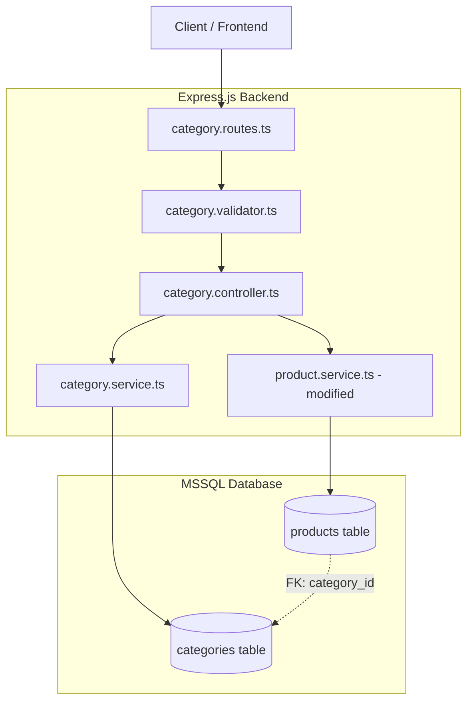
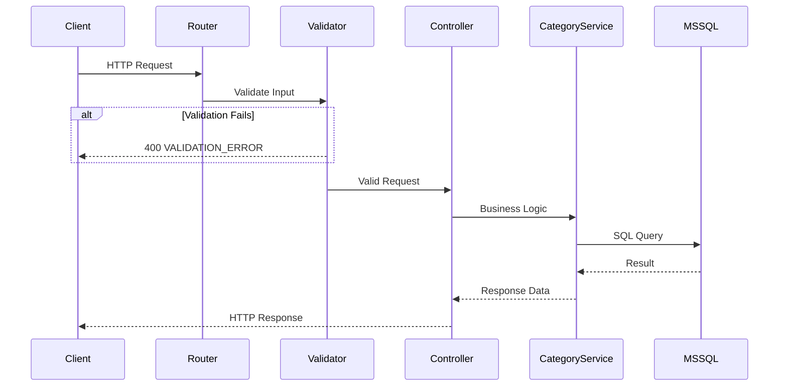

# Design Document: Product Category

## Overview

ระบบ Product Category เพิ่มการจัดการหมวดหมู่สินค้าแบบลำดับชั้น (hierarchical) เข้ากับระบบคลังสินค้าที่มีอยู่ โดยรองรับโครงสร้างแบบต้นไม้สูงสุด 3 ระดับ (Root > Sub > Sub-Sub) พร้อม CRUD operations, status management, และการเชื่อมโยงกับระบบ SKU/Product ที่มีอยู่เดิม

ระบบจะถูกสร้างตามรูปแบบ (pattern) เดียวกับ Product module ที่มีอยู่ ใช้ Express.js + TypeScript + MSSQL + express-validator โดยเพิ่ม categories table ใหม่และปรับปรุง products table ให้อ้างอิง category_id แทน category string

## Architecture

### High-Level Architecture



### Request Flow



## Components and Interfaces

### 1. Category Routes (`src/routes/category.routes.ts`)

ลงทะเบียน route handlers สำหรับ category endpoints ภายใต้ `/api/categories`:

| Method | Path | Description |
|--------|------|-------------|
| GET | `/` | ดูรายการหมวดหมู่ (tree/flat, search, status filter) |
| GET | `/:id` | ดูรายละเอียดหมวดหมู่ |
| POST | `/` | สร้างหมวดหมู่ใหม่ |
| PUT | `/:id` | แก้ไขหมวดหมู่ |
| PATCH | `/:id/status` | เปลี่ยนสถานะหมวดหมู่ |
| DELETE | `/:id` | ลบหมวดหมู่ |

### 2. Category Validator (`src/validators/category.validator.ts`)

Input validation rules ใช้ express-validator:

```typescript
interface CreateCategoryValidation {
  name: string;        // 1-100 chars, Thai/English/numbers/spaces
  code: string;        // 2-10 uppercase A-Z only
  description?: string; // 0-500 chars
  parentId?: string;   // UUID format or null
}

interface UpdateCategoryValidation {
  name?: string;       // 1-100 chars if provided
  code?: string;       // 2-10 uppercase A-Z if provided
  description?: string; // 0-500 chars if provided
  parentId?: string;   // UUID format if provided
}

interface CategoryListQuery {
  flat?: boolean;      // true for flat list
  search?: string;     // 1-100 chars partial match
  status?: 'active' | 'inactive';
}

interface UpdateStatusValidation {
  status: 'active' | 'inactive';
}
```

### 3. Category Controller (`src/controllers/category.controller.ts`)

Handles HTTP request/response, validation result checking, and delegates to service layer. Follows the same pattern as `ProductController`.

### 4. Category Service (`src/services/category.service.ts`)

Core business logic:

```typescript
interface ICategoryService {
  findAll(query: CategoryQueryDto): Promise<CategoryTreeResponse[] | CategoryFlatResponse[]>;
  findById(id: string): Promise<CategoryDetailResponse>;
  create(data: CreateCategoryDto): Promise<CategoryResponse>;
  update(id: string, data: UpdateCategoryDto): Promise<CategoryResponse>;
  updateStatus(id: string, status: 'active' | 'inactive'): Promise<CategoryResponse>;
  delete(id: string): Promise<void>;
}
```

Key business rules implemented in service:
- **Depth validation**: Calculate depth by traversing parent chain, reject if > 3
- **Circular reference detection**: On parent_id change, walk ancestor chain to ensure target isn't a descendant
- **Referential integrity**: Check for child categories and linked products before deletion
- **Code uniqueness**: Verify category_code doesn't already exist (excluding self on update)

### 5. Modified Product Service (`src/services/product.service.ts`)

Modifications to existing product service:
- **Create/Update**: Validate `category_id` exists in categories table with status 'active'
- **SKU Generation**: Lookup `category_code` from categories table by `category_id` instead of using hardcoded mapping
- **Fallback**: Use "MISC" if category has no code

### 6. Database Migration (`src/database/migrations/xxx_create_categories.ts`)

Creates the categories table and modifies products table.

## Data Models

### Categories Table

```sql
CREATE TABLE categories (
  id UNIQUEIDENTIFIER PRIMARY KEY DEFAULT NEWID(),
  name NVARCHAR(100) NOT NULL,
  code NVARCHAR(10) NOT NULL UNIQUE,
  description NVARCHAR(500) NULL,
  parent_id UNIQUEIDENTIFIER NULL,
  status NVARCHAR(10) NOT NULL DEFAULT 'active',
  created_at DATETIME2 NOT NULL DEFAULT GETUTCDATE(),
  updated_at DATETIME2 NOT NULL DEFAULT GETUTCDATE(),
  
  CONSTRAINT FK_categories_parent FOREIGN KEY (parent_id) REFERENCES categories(id),
  CONSTRAINT CK_categories_status CHECK (status IN ('active', 'inactive')),
  CONSTRAINT CK_categories_code CHECK (code LIKE '%[A-Z]%' AND LEN(code) >= 2 AND LEN(code) <= 10),
  CONSTRAINT UQ_categories_name_parent UNIQUE (name, parent_id)
);

CREATE INDEX IX_categories_parent_id ON categories(parent_id);
CREATE INDEX IX_categories_status ON categories(status);
CREATE INDEX IX_categories_code ON categories(code);
```

### Products Table Modification

```sql
-- Add category_id column
ALTER TABLE products ADD category_id UNIQUEIDENTIFIER NULL;

-- Add foreign key
ALTER TABLE products ADD CONSTRAINT FK_products_category 
  FOREIGN KEY (category_id) REFERENCES categories(id);

-- Index for lookups
CREATE INDEX IX_products_category_id ON products(category_id);
```

> **Migration Strategy**: The existing `category` (NVARCHAR) column will be kept initially for backward compatibility. New products will require `category_id`. A data migration step will map existing category strings to new category records.

### TypeScript DTOs

```typescript
// Create Category DTO
interface CreateCategoryDto {
  name: string;
  code: string;
  description?: string;
  parentId?: string | null;
}

// Update Category DTO (partial)
interface UpdateCategoryDto {
  name?: string;
  code?: string;
  description?: string;
  parentId?: string | null;
}

// Category Query DTO
interface CategoryQueryDto {
  flat?: boolean;
  search?: string;
  status?: 'active' | 'inactive';
}

// Database Model
interface CategoryModel {
  id: string;
  name: string;
  code: string;
  description: string | null;
  parent_id: string | null;
  status: 'active' | 'inactive';
  created_at: Date;
  updated_at: Date;
}

// API Response
interface CategoryResponse {
  id: string;
  name: string;
  code: string;
  description: string | null;
  parentId: string | null;
  status: 'active' | 'inactive';
  createdAt: Date;
  updatedAt: Date;
}

// Tree Response (nested children)
interface CategoryTreeResponse extends CategoryResponse {
  children: CategoryTreeResponse[];
}

// Flat Response (with level indicator)
interface CategoryFlatResponse extends CategoryResponse {
  level: number;
}

// Detail Response (includes parent, children, product count)
interface CategoryDetailResponse extends CategoryResponse {
  parent: CategoryResponse | null;
  children: CategoryResponse[];
  productCount: number;
}
```

### Depth Calculation Algorithm

```typescript
async function getCategoryDepth(categoryId: string): Promise<number> {
  // Walk up the parent chain to find depth
  let depth = 1;
  let currentParentId = await getParentId(categoryId);
  
  while (currentParentId !== null) {
    depth++;
    currentParentId = await getParentId(currentParentId);
  }
  
  return depth;
}

async function getMaxChildDepth(categoryId: string): Promise<number> {
  // Recursive CTE to find deepest descendant
  const result = await pool.request()
    .input('id', sql.UniqueIdentifier, categoryId)
    .query(`
      WITH CategoryTree AS (
        SELECT id, parent_id, 1 AS depth
        FROM categories WHERE id = @id
        UNION ALL
        SELECT c.id, c.parent_id, ct.depth + 1
        FROM categories c
        INNER JOIN CategoryTree ct ON c.parent_id = ct.id
      )
      SELECT MAX(depth) as maxDepth FROM CategoryTree
    `);
  return result.recordset[0].maxDepth;
}
```

## Correctness Properties

*A property is a characteristic or behavior that should hold true across all valid executions of a system—essentially, a formal statement about what the system should do. Properties serve as the bridge between human-readable specifications and machine-verifiable correctness guarantees.*

### Property 1: Category creation round-trip

*For any* valid category name (1-100 chars, Thai/English/numbers/spaces) and valid code (2-10 uppercase A-Z), creating a category and then retrieving it by ID should return the same name, code, and description with status 'active' and valid timestamps.

**Validates: Requirements 1.1, 8.1**

### Property 2: Code uniqueness enforcement

*For any* two category creation requests with the same code, the second request should be rejected with a CONFLICT error, regardless of other field values.

**Validates: Requirements 1.3, 4.2, 8.6**

### Property 3: Non-existent parent reference rejected

*For any* randomly generated UUID that doesn't correspond to an existing category, attempting to create or update a category with that UUID as parent_id should return NOT_FOUND.

**Validates: Requirements 1.4, 4.7, 8.4**

### Property 4: Validation rejects invalid input

*For any* category creation or update request where the name is empty or exceeds 100 characters, or the code contains non-uppercase-A-Z characters or is outside 2-10 characters, or description exceeds 500 characters, the system should reject the request with VALIDATION_ERROR and specify which fields failed.

**Validates: Requirements 1.5, 4.5, 8.2, 2.5**

### Property 5: Depth constraint enforcement

*For any* category hierarchy, attempting to create a subcategory or move a category such that the resulting tree would exceed 3 levels of depth should be rejected with VALIDATION_ERROR.

**Validates: Requirements 1.2, 1.6, 4.6, 8.3, 8.5**

### Property 6: Search filter correctness

*For any* search query term, all categories returned by the search endpoint should have either their name or code contain the search term (case-insensitive partial match).

**Validates: Requirements 2.3**

### Property 7: Status filter correctness

*For any* collection of categories with mixed statuses, filtering by a specific status should return only categories with that exact status.

**Validates: Requirements 2.4**

### Property 8: Non-existent category_id returns NOT_FOUND

*For any* randomly generated UUID that doesn't exist in the categories table, all endpoints that accept category_id (GET detail, PUT update, DELETE, PATCH status) should return NOT_FOUND.

**Validates: Requirements 3.2, 4.3, 5.4, 6.3**

### Property 9: Invalid UUID format rejected

*For any* string that does not match UUID format, all endpoints that accept an ID parameter should return VALIDATION_ERROR.

**Validates: Requirements 3.3, 5.5**

### Property 10: Partial update preserves unmodified fields

*For any* existing category and any subset of updatable fields (name, code, description, parentId), updating only that subset should change only the specified fields while preserving all other fields unchanged.

**Validates: Requirements 4.1**

### Property 11: Status toggle round-trip

*For any* category, setting its status to inactive and then back to active should result in the category having status 'active' with all other fields preserved.

**Validates: Requirements 6.1, 6.2**

### Property 12: Delete removes category permanently

*For any* category that has no subcategories and no linked products, deleting it and then attempting to retrieve it should return NOT_FOUND.

**Validates: Requirements 5.1**

### Property 13: Product category_id validation

*For any* product creation or update request, if the specified category_id does not exist in the categories table or has status 'inactive', the request should be rejected with VALIDATION_ERROR.

**Validates: Requirements 7.1, 7.2**

### Property 14: SKU generation from category code

*For any* category with a valid code, creating a product under that category without specifying a SKU should generate a SKU in the format `{category_code}-{5-digit-number}` where the number increments from the last existing SKU with the same prefix.

**Validates: Requirements 7.3**

### Property 15: Tree structure returns correct nesting

*For any* set of categories with parent-child relationships, the tree endpoint should return all root categories at the top level with their children nested recursively, and every category should appear exactly once.

**Validates: Requirements 2.1**

### Property 16: Flat list preserves hierarchy ordering

*For any* set of categories with parent-child relationships, the flat list should order categories such that every parent appears before its children.

**Validates: Requirements 2.2**

## Error Handling

ระบบใช้ error classes ที่มีอยู่เดิม (`AppError`, `ValidationError`, `NotFoundError`, `ConflictError`) ผ่าน global error handler middleware:

| Scenario | HTTP Status | Error Code | Message (Thai) |
|----------|------------|------------|----------------|
| Input validation fails | 400 | VALIDATION_ERROR | ข้อมูลไม่ถูกต้อง + field details |
| Depth exceeds 3 levels | 400 | VALIDATION_ERROR | เกินจำนวนระดับความลึกสูงสุดที่อนุญาต |
| Circular reference | 400 | VALIDATION_ERROR | ไม่สามารถย้ายหมวดหมู่ไปอยู่ภายใต้ตัวเองหรือหมวดหมู่ย่อยของตัวเอง |
| Move exceeds depth | 400 | VALIDATION_ERROR | ไม่สามารถย้ายได้เนื่องจากจะทำให้เกินจำนวนระดับชั้นสูงสุด 3 ระดับ |
| Invalid status parameter | 400 | VALIDATION_ERROR | ค่าสถานะไม่ถูกต้อง |
| Invalid UUID format | 400 | VALIDATION_ERROR | รูปแบบ ID ไม่ถูกต้อง |
| Category not found | 404 | NOT_FOUND | ไม่พบหมวดหมู่ |
| Parent category not found | 404 | NOT_FOUND | ไม่พบหมวดหมู่หลัก |
| Invalid category for product | 400 | VALIDATION_ERROR | หมวดหมู่ที่เลือกไม่สามารถใช้งานได้ |
| Duplicate category code | 409 | CONFLICT | รหัสหมวดหมู่นี้มีอยู่ในระบบแล้ว |
| Delete has products | 409 | CONFLICT | ไม่สามารถลบหมวดหมู่ที่มีสินค้าอยู่ |
| Delete has subcategories | 409 | CONFLICT | ไม่สามารถลบหมวดหมู่ที่มีหมวดหมู่ย่อยอยู่ |
| Unauthenticated | 401 | UNAUTHORIZED | ไม่ได้รับอนุญาต |

## Testing Strategy

### Property-Based Testing (PBT)

ใช้ **fast-check** (มีอยู่แล้วใน devDependencies) สำหรับ property-based tests ทุก property ต้อง run อย่างน้อย 100 iterations

**Tag format**: `Feature: product-category, Property {number}: {property_text}`

Key generators:
- `validNameArb`: 1-100 chars string with Thai, English, numbers, spaces
- `validCodeArb`: 2-10 uppercase A-Z characters
- `validDescriptionArb`: optional 0-500 chars string
- `validUuidArb`: properly formatted UUID strings
- `invalidUuidArb`: strings that don't match UUID format
- `invalidNameArb`: empty strings or strings > 100 chars
- `invalidCodeArb`: strings with lowercase, numbers, special chars, or length outside 2-10

### Unit Tests (Example-Based)

- Circular reference detection (4.4): Create A→B→C chain, try to move A under C
- Depth limit on move (4.6): Create depth-3 tree, try move that would create depth 4
- Delete with products (5.2): Link product to category, attempt delete
- Delete with subcategories (5.3): Create parent-child, attempt delete parent
- Category detail response (3.1): Create tree, verify detail response structure
- Empty search results (2.6): Search for nonexistent term, verify empty array
- SKU fallback to MISC (7.4): Category without code → SKU uses "MISC"

### Integration Tests

- Full category CRUD lifecycle (create → read → update → delete)
- Product-category integration: create category, create product with category_id, verify SKU generation
- Authentication: verify all endpoints require valid token

### Test File Structure

```
src/__tests__/
├── category.api.test.ts          # Integration/example tests for category endpoints
├── category.property.test.ts     # Property-based tests (16 properties)
└── product.api.test.ts           # Existing + updated product tests
```

### Configuration

- Minimum 100 iterations per property test (configurable via `numRuns`)
- Tests use mocked auth middleware (same pattern as existing product tests)
- Test database cleanup after each test suite
- 60-second timeout for property test suites
