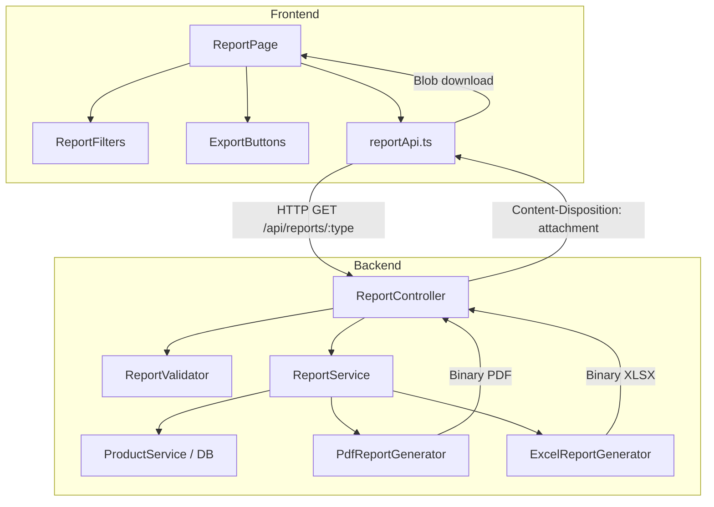
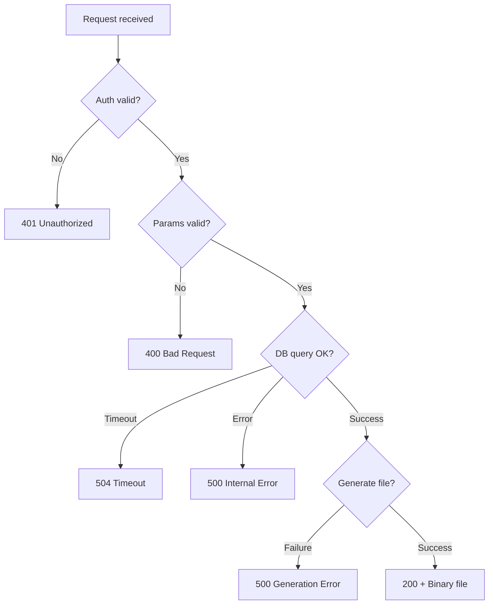

# Design Document: Report Printing

## Overview

This feature adds report generation and export capabilities to the Warehouse Management System. Authenticated users (both admin and user roles) can generate four types of reports — Inventory, Category, Low Stock, and Stock Value — and export them as PDF or Excel (XLSX) files.

The system follows the existing architecture: a backend REST API built with Express/TypeScript that generates report files on the server, and a React/TypeScript frontend that provides the UI for selecting report types, applying filters, and triggering downloads.

### Key Design Decisions

1. **Server-side generation**: Reports are generated on the backend to keep PDF/Excel library dependencies server-side and avoid exposing raw data queries to the client.
2. **Streaming binary response**: Report files are returned as binary responses with appropriate Content-Type/Content-Disposition headers, letting the browser handle the download.
3. **Library choices**: `pdfkit` for PDF generation (lightweight, no headless browser needed) and `exceljs` for XLSX generation (widely used, supports formatting).
4. **Shared data layer**: A `ReportService` queries product data, while format-specific generators (`PdfReportGenerator`, `ExcelReportGenerator`) handle rendering.

## Architecture



### Request Flow

1. User selects report type and filters on `ReportPage`
2. User clicks PDF or Excel export button
3. Frontend calls `GET /api/reports/:type?format=pdf|xlsx&filters...`
4. `authenticate` middleware validates JWT token
5. `ReportValidator` validates query parameters
6. `ReportController` delegates to `ReportService`
7. `ReportService` queries product data from the database with filters
8. `ReportService` invokes the appropriate generator (PDF or Excel)
9. Generator produces a `Buffer` with the file content
10. Controller sends the buffer as a binary response with download headers

## Components and Interfaces

### Backend Components

#### ReportController (`src/controllers/report.controller.ts`)

Handles HTTP requests for report generation.

```typescript
class ReportController {
  static async generateInventoryReport(req: Request, res: Response, next: NextFunction): Promise<void>;
  static async generateCategoryReport(req: Request, res: Response, next: NextFunction): Promise<void>;
  static async generateLowStockReport(req: Request, res: Response, next: NextFunction): Promise<void>;
  static async generateStockValueReport(req: Request, res: Response, next: NextFunction): Promise<void>;
}
```

#### ReportService (`src/services/report.service.ts`)

Orchestrates data retrieval and report generation.

```typescript
interface ReportFilters {
  category?: string;
  status?: 'active' | 'inactive';
  threshold?: number;
}

interface ReportOptions {
  type: 'inventory' | 'category' | 'low-stock' | 'stock-value';
  format: 'pdf' | 'xlsx';
  filters: ReportFilters;
}

interface ReportResult {
  buffer: Buffer;
  filename: string;
  contentType: string;
}

class ReportService {
  async generateReport(options: ReportOptions): Promise<ReportResult>;
  async getInventoryData(filters: ReportFilters): Promise<InventoryReportData>;
  async getCategoryData(filters: ReportFilters): Promise<CategoryReportData>;
  async getLowStockData(threshold: number): Promise<LowStockReportData>;
  async getStockValueData(filters: ReportFilters): Promise<StockValueReportData>;
}
```

#### PdfReportGenerator (`src/services/pdf-report.generator.ts`)

Generates PDF files using `pdfkit`.

```typescript
class PdfReportGenerator {
  generateInventoryReport(data: InventoryReportData): Promise<Buffer>;
  generateCategoryReport(data: CategoryReportData): Promise<Buffer>;
  generateLowStockReport(data: LowStockReportData): Promise<Buffer>;
  generateStockValueReport(data: StockValueReportData): Promise<Buffer>;
}
```

#### ExcelReportGenerator (`src/services/excel-report.generator.ts`)

Generates XLSX files using `exceljs`.

```typescript
class ExcelReportGenerator {
  generateInventoryReport(data: InventoryReportData): Promise<Buffer>;
  generateCategoryReport(data: CategoryReportData): Promise<Buffer>;
  generateLowStockReport(data: LowStockReportData): Promise<Buffer>;
  generateStockValueReport(data: StockValueReportData): Promise<Buffer>;
}
```

#### ReportValidator (`src/validators/report.validator.ts`)

Express-validator chains for report request validation.

```typescript
const inventoryReportValidation: ValidationChain[];
const categoryReportValidation: ValidationChain[];
const lowStockReportValidation: ValidationChain[];
const stockValueReportValidation: ValidationChain[];
```

#### Report Routes (`src/routes/report.routes.ts`)

```
GET /api/reports/inventory?format=pdf|xlsx&category=&status=
GET /api/reports/category?format=pdf|xlsx&category=
GET /api/reports/low-stock?format=pdf|xlsx&threshold=
GET /api/reports/stock-value?format=pdf|xlsx&category=
```

### Frontend Components

#### ReportPage (`src/pages/ReportPage.tsx`)

Main page component that composes filters and export actions.

#### ReportFilters (`src/components/ReportFilters.tsx`)

Renders filter controls based on the selected report type:
- Inventory: category dropdown, status dropdown
- Category: category dropdown
- Low Stock: threshold numeric input (default: 10)
- Stock Value: category dropdown

#### ExportButtons (`src/components/ExportButtons.tsx`)

PDF and Excel download buttons with loading state.

#### reportApi (`src/services/reportApi.ts`)

```typescript
interface ReportRequestParams {
  format: 'pdf' | 'xlsx';
  category?: string;
  status?: string;
  threshold?: number;
}

function downloadInventoryReport(params: ReportRequestParams): Promise<void>;
function downloadCategoryReport(params: ReportRequestParams): Promise<void>;
function downloadLowStockReport(params: ReportRequestParams): Promise<void>;
function downloadStockValueReport(params: ReportRequestParams): Promise<void>;
```

## Data Models

### Report Data Interfaces

```typescript
// Base product row used across reports
interface ReportProductRow {
  sku: string;
  name: string;
  category: string;
  quantity: number;
  unitPrice: number;
  status: 'active' | 'inactive';
}

// Inventory Report
interface InventoryReportData {
  title: string;
  generatedAt: string; // UTC format YYYY-MM-DD HH:mm
  totalCount: number;
  products: ReportProductRow[];
}

// Category Report
interface CategoryGroup {
  categoryName: string;
  products: Omit<ReportProductRow, 'status'>[];
  productCount: number;
  totalStockValue: number; // sum of quantity * unitPrice
}

interface CategoryReportData {
  title: string;
  generatedAt: string;
  categories: CategoryGroup[];
}

// Low Stock Report
interface LowStockReportData {
  title: string;
  generatedAt: string;
  threshold: number;
  products: ReportProductRow[];
}

// Stock Value Report
interface StockValueProductRow extends ReportProductRow {
  stockValue: number; // quantity * unitPrice
}

interface StockValueReportData {
  title: string;
  generatedAt: string;
  products: StockValueProductRow[];
  summary: {
    totalProducts: number;
    totalQuantity: number;
    totalStockValue: number;
  };
}
```

### Database Queries

The report service queries the existing `products` table (and `categories` for joins) using the established `mssql` connection pool. No new tables are required.

| Report Type | Query Pattern |
|---|---|
| Inventory | `SELECT` from products with optional category/status filters, ordered by category ASC, name ASC |
| Category | `SELECT` from products `LEFT JOIN` categories, grouped by category, ordered alphabetically |
| Low Stock | `SELECT` from products `WHERE quantity <= @threshold`, ordered by quantity ASC |
| Stock Value | `SELECT` with calculated `quantity * unit_price AS stock_value`, ordered by stock_value DESC |


## Correctness Properties

*A property is a characteristic or behavior that should hold true across all valid executions of a system — essentially, a formal statement about what the system should do. Properties serve as the bridge between human-readable specifications and machine-verifiable correctness guarantees.*

### Property 1: Filter correctness

*For any* set of products and any combination of filter parameters (category, status), the report service SHALL return only products where every specified filter condition is satisfied (AND logic). No product in the result set should fail any active filter, and no product excluded from the result set should satisfy all active filters.

**Validates: Requirements 1.2, 2.4, 4.3**

### Property 2: Inventory report sort order

*For any* set of filtered products returned in an inventory report, the products SHALL be sorted by category name ascending as the primary sort key and by product name ascending as the secondary sort key. For every consecutive pair of products in the result, the first product's category must be lexicographically ≤ the second's, and when categories are equal, the first product's name must be lexicographically ≤ the second's.

**Validates: Requirements 1.1**

### Property 3: Report header metadata accuracy

*For any* generated report (regardless of type), the header SHALL contain a totalCount that exactly equals the number of product rows in the report body, and the generatedAt timestamp SHALL match the UTC format pattern `YYYY-MM-DD HH:mm`.

**Validates: Requirements 1.4**

### Property 4: Category grouping and ordering

*For any* set of products with various categories, the category report SHALL group every product into exactly the group matching its category name, categories SHALL be sorted alphabetically, and products within each category group SHALL be sorted by name ascending. No product shall appear in a group that does not match its category.

**Validates: Requirements 2.1, 2.2**

### Property 5: Category subtotal calculation

*For any* category group in a category report, the reported productCount SHALL equal the number of products in that group, and the reported totalStockValue SHALL equal the sum of (quantity × unitPrice) for all products in that group.

**Validates: Requirements 2.3**

### Property 6: Threshold filtering

*For any* valid threshold value T (1 ≤ T ≤ 999999) and any set of products, the low stock report SHALL include exactly those products whose quantity is ≤ T. Every product with quantity > T must be excluded, and every product with quantity ≤ T must be included.

**Validates: Requirements 3.1**

### Property 7: Low stock sort order

*For any* set of products in a low stock report, the products SHALL be sorted by quantity in ascending order. For every consecutive pair of products in the result, the first product's quantity must be ≤ the second's quantity.

**Validates: Requirements 3.4**

### Property 8: Stock value calculation and summary integrity

*For any* set of products in a stock value report, each product's stockValue SHALL equal quantity × unitPrice, products SHALL be sorted by stockValue descending, and the summary SHALL satisfy: totalProducts equals the count of distinct products, totalQuantity equals the sum of all quantities, and totalStockValue equals the sum of all individual stockValues.

**Validates: Requirements 4.1, 4.2, 4.4**

### Property 9: Export filename formatting

*For any* report type and generation date, the exported file's filename SHALL match the pattern `{report_type}_{YYYY-MM-DD}.xlsx` for Excel exports where report_type is one of (inventory, category, low-stock, stock-value) and the date portion is a valid date string.

**Validates: Requirements 6.1**

### Property 10: Excel number formatting

*For any* product row in an Excel report, quantity values SHALL be formatted as integers with comma thousand separators (no decimal places), and currency values (unitPrice, stockValue) SHALL be formatted with exactly 2 decimal places and comma thousand separators.

**Validates: Requirements 6.4**

## Error Handling

| Scenario | Response | HTTP Status |
|---|---|---|
| Unauthenticated request | `{ success: false, error: { code: "UNAUTHORIZED", message: "..." } }` | 401 |
| Invalid export format | `{ success: false, error: { code: "VALIDATION_ERROR", message: "Supported formats: pdf, xlsx" } }` | 400 |
| Invalid threshold (< 1 or > 999999) | `{ success: false, error: { code: "VALIDATION_ERROR", message: "Threshold must be between 1 and 999999" } }` | 400 |
| Invalid filter parameter | `{ success: false, error: { code: "VALIDATION_ERROR", message: "..." } }` | 400 |
| Database timeout (> 30s) | `{ success: false, error: { code: "TIMEOUT", message: "Report generation timed out" } }` | 504 |
| PDF/Excel generation failure | `{ success: false, error: { code: "GENERATION_ERROR", message: "..." } }` | 500 |
| No matching data | Return valid report file with headers only (not an error) | 200 |

### Timeout Strategy

- Database query timeout: Set `mssql` request timeout to 30 seconds
- Report generation: Wrap the generation call in a `Promise.race` with a 30-second timer
- Frontend: Axios request timeout set to 30 seconds; on timeout, show user-friendly error message

### Error Flow



## Testing Strategy

### Property-Based Testing (PBT)

This feature is well-suited for property-based testing because the report data transformation logic consists of pure functions (filtering, sorting, grouping, calculating) that operate on product data with clearly defined universal properties.

**Library**: `fast-check` (already installed in the project)

**Configuration**:
- Minimum 100 iterations per property test
- Each test tagged with: `Feature: report-printing, Property {N}: {title}`

**Generators needed**:
- `arbitraryProduct()`: Generates random product rows with valid fields
- `arbitraryProductList(minLength, maxLength)`: Generates arrays of products
- `arbitraryFilters()`: Generates random filter combinations
- `arbitraryThreshold()`: Generates valid threshold values (1–999999)

### Unit Tests (Example-Based)

| Area | Tests |
|---|---|
| Report header formatting | Verify date format, title, count for known data |
| Empty results | Verify report generation with zero products produces valid output |
| Default threshold | Verify default of 10 when no threshold provided |
| Zero-quantity styling | Verify red indicator on products with quantity = 0 |
| PDF page structure | Verify A4 dimensions, margins, page numbers |
| Excel header styling | Verify bold first row, column widths within [8, 50] |
| Column width bounds | Verify auto-fit respects min/max constraints |
| Category filter validation | Verify invalid category ID returns 400 |
| Uncategorized grouping | Verify null-category products grouped under "Uncategorized" at end |

### Integration Tests

| Area | Tests |
|---|---|
| Full API flow | Authenticated request → valid PDF/XLSX binary response |
| Auth rejection | Unauthenticated request → 401 |
| Invalid format | Request with format=csv → 400 |
| Timeout handling | Mocked slow DB → 504 or timeout error |
| Content headers | Verify Content-Type and Content-Disposition on valid responses |

### Frontend Tests

| Area | Tests |
|---|---|
| Report type selector | All four options render correctly |
| Conditional filters | Correct filters shown per report type |
| Export button states | Disabled when no type selected, loading during generation |
| Download trigger | Blob download initiated on success |
| Error display | Error message shown on failure or timeout |
