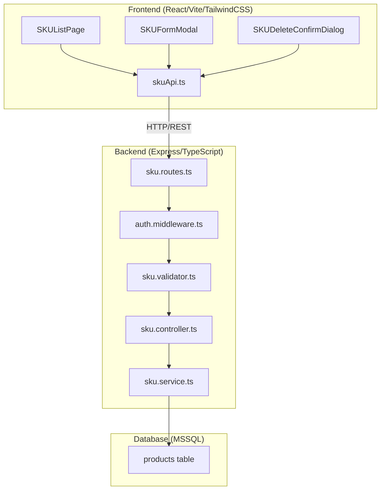
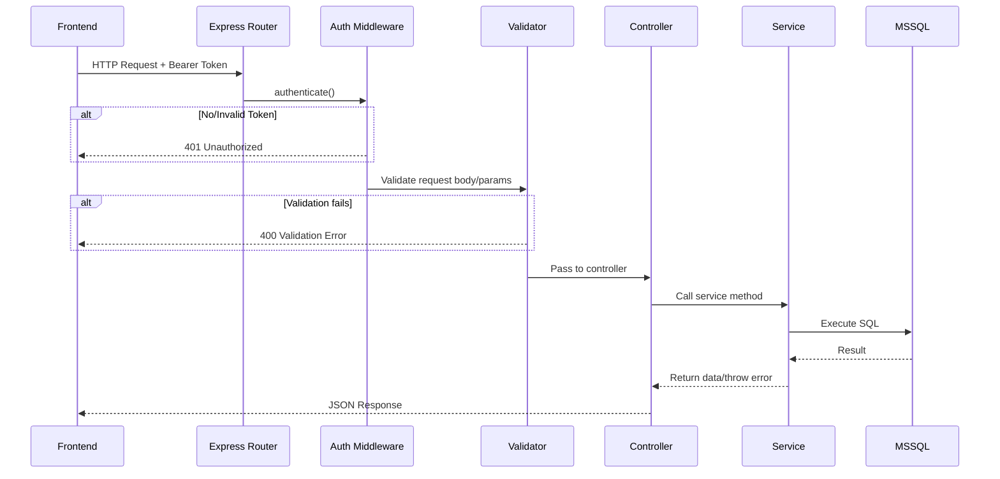

# Design Document: SKU Management

## Overview

ระบบจัดการ SKU (Stock Keeping Unit) สำหรับระบบบริหารจัดการคลังสินค้า ออกแบบเป็น RESTful API บน Node.js/Express ด้วย TypeScript เชื่อมต่อกับ MSSQL และ Frontend React/Vite/TailwindCSS

ฟีเจอร์หลัก:
- CRUD operations สำหรับ SKU (สร้าง, อ่าน, แก้ไข, ลบ)
- สร้าง SKU อัตโนมัติตามหมวดหมู่ในรูปแบบ `{CATEGORY_CODE}-{RUNNING_NUMBER}`
- ค้นหาและแบ่งหน้า (pagination) ผลลัพธ์
- จัดการสถานะ active/inactive
- UI หน้าเว็บสำหรับดำเนินการ CRUD ผ่าน modal forms

### Design Decisions

1. **ใช้ product table ที่มีอยู่แล้ว** — SKU เป็นฟิลด์ในตาราง `products` อยู่แล้ว ไม่จำเป็นต้องสร้างตาราง SKU แยก เนื่องจาก SKU เป็นตัวระบุสินค้า ไม่ใช่ entity แยกต่างหาก
2. **ขยาย ProductService ที่มีอยู่** — เพิ่ม method `generateSku()` (มีอยู่แล้วใน service เดิม) และเพิ่ม endpoint สำหรับ auto-generate SKU
3. **ใช้ express-validator สำหรับ input validation** — สอดคล้องกับ pattern เดิมของระบบ
4. **ใช้ fast-check สำหรับ property-based testing** — มีอยู่แล้วใน devDependencies และมี pattern ทดสอบอ้างอิงได้

## Architecture



### Request Flow



## Components and Interfaces

### Backend Components

#### 1. SKU Routes (`src/routes/sku.routes.ts`)

```typescript
// Endpoints - mounted at /api/skus
GET    /           — List SKUs with pagination and search
GET    /:id        — Get SKU detail by product ID
POST   /           — Create SKU (manual or auto-generate)
PUT    /:id        — Update SKU/product data
PATCH  /:id/status — Update SKU status (active/inactive)
DELETE /:id        — Delete SKU/product
POST   /generate   — Generate SKU preview (without creating product)
```

#### 2. SKU Controller (`src/controllers/sku.controller.ts`)

```typescript
export class SkuController {
  static async findAll(req: Request, res: Response, next: NextFunction): Promise<void>;
  static async findById(req: Request, res: Response, next: NextFunction): Promise<void>;
  static async create(req: Request, res: Response, next: NextFunction): Promise<void>;
  static async update(req: Request, res: Response, next: NextFunction): Promise<void>;
  static async updateStatus(req: Request, res: Response, next: NextFunction): Promise<void>;
  static async delete(req: Request, res: Response, next: NextFunction): Promise<void>;
  static async generatePreview(req: Request, res: Response, next: NextFunction): Promise<void>;
}
```

#### 3. SKU Service (`src/services/sku.service.ts`)

```typescript
export class SkuService {
  async findAll(query: SkuQueryDto): Promise<PaginatedResponse<ProductResponse>>;
  async findById(id: string): Promise<ProductResponse | null>;
  async create(data: CreateSkuDto): Promise<ProductResponse>;
  async update(id: string, data: UpdateSkuDto): Promise<ProductResponse>;
  async updateStatus(id: string, status: 'active' | 'inactive'): Promise<ProductResponse>;
  async delete(id: string): Promise<void>;
  async generateSku(category: string): Promise<string>;
}
```

#### 4. SKU Validator (`src/validators/sku.validator.ts`)

```typescript
export const createSkuValidation: ValidationChain[];
export const updateSkuValidation: ValidationChain[];
export const updateStatusValidation: ValidationChain[];
export const skuListValidation: ValidationChain[];
export const skuIdValidation: ValidationChain[];
export const generateSkuValidation: ValidationChain[];
```

### Frontend Components

#### 1. SKU List Page (`src/pages/SKUListPage.tsx`)
- Table displaying SKU data with columns: SKU, ชื่อสินค้า, หมวดหมู่, จำนวน, ราคา, สถานะ
- Search input for filtering
- Pagination controls
- Add/Edit/Delete action buttons

#### 2. SKU Form Modal (`src/components/SKUFormModal.tsx`)
- Modal form for create/edit operations
- Toggle switch: กรอก SKU เอง / สร้างอัตโนมัติจากหมวดหมู่
- Fields: name, sku (or auto), category (dropdown), quantity, unitPrice, description, image
- Validation feedback on submit

#### 3. SKU Delete Confirm Dialog (`src/components/SKUDeleteConfirmDialog.tsx`)
- Confirmation dialog before deletion
- Shows SKU code and product name for verification

#### 4. SKU API Service (`src/services/skuApi.ts`)
- `getSkus(params)` — fetch paginated list
- `getSkuById(id)` — fetch single SKU detail
- `createSku(data)` — create with manual or auto SKU
- `updateSku(id, data)` — partial update
- `updateSkuStatus(id, status)` — toggle status
- `deleteSku(id)` — delete SKU
- `generateSkuPreview(category)` — preview auto-generated SKU

## Data Models

### Database Schema (existing `products` table)

```sql
CREATE TABLE products (
  id UNIQUEIDENTIFIER PRIMARY KEY DEFAULT NEWID(),
  name NVARCHAR(200) NOT NULL,
  sku NVARCHAR(50) NOT NULL UNIQUE,
  category NVARCHAR(100) NOT NULL,
  quantity INT NOT NULL DEFAULT 0 CHECK (quantity >= 0 AND quantity <= 999999),
  unit_price DECIMAL(12, 2) NOT NULL DEFAULT 0 CHECK (unit_price >= 0 AND unit_price <= 999999999.99),
  description NVARCHAR(1000) NULL,
  image_url NVARCHAR(500) NULL,
  status NVARCHAR(10) NOT NULL DEFAULT 'active' CHECK (status IN ('active', 'inactive')),
  created_at DATETIME2 NOT NULL DEFAULT GETUTCDATE(),
  updated_at DATETIME2 NOT NULL DEFAULT GETUTCDATE()
);
```

### TypeScript DTOs

```typescript
// Create SKU DTO - supports both manual and auto-generate
interface CreateSkuDto {
  name: string;           // 1-200 chars
  sku?: string;           // 1-50 chars, [a-zA-Z0-9_-] — if omitted, auto-generate
  category: string;       // 1-100 chars
  quantity: number;       // 0-999999
  unitPrice: number;      // 0-999999999.99, max 2 decimals
  description?: string;   // 0-1000 chars
  imageUrl?: string;
}

// Update SKU DTO (all fields optional)
interface UpdateSkuDto {
  name?: string;
  sku?: string;
  category?: string;
  quantity?: number;
  unitPrice?: number;
  description?: string;
  imageUrl?: string | null;
  status?: 'active' | 'inactive';
}

// SKU Query DTO
interface SkuQueryDto {
  page: number;           // default: 1, min: 1
  limit: number;          // default: 20, min: 1, max: 100
  search?: string;        // partial match on name, sku, category
}
```

### Category Code Mapping

| หมวดหมู่ (Thai) | Category Code |
|---|---|
| อิเล็กทรอนิกส์ | ELEC |
| อุปกรณ์สำนักงาน | OFFC |
| เครื่องมือช่าง | TOOL |
| วัสดุบรรจุภัณฑ์ | PACK |
| อะไหล่และชิ้นส่วน | PART |
| เครื่องใช้ไฟฟ้า | APPL |
| สินค้าอุปโภคบริโภค | CONS |
| เคมีภัณฑ์ | CHEM |
| วัตถุดิบ | RAWM |
| อื่นๆ | MISC |

### Auto-Generation Algorithm

```
function generateSku(category: string): string {
  1. Map category → CATEGORY_CODE (fallback to "MISC" if unknown)
  2. Query: SELECT TOP 1 sku FROM products WHERE sku LIKE '{CODE}-%' ORDER BY sku DESC
  3. If no results: nextNumber = 1
     Else: parse last number from SKU, nextNumber = lastNumber + 1
  4. Return `${CODE}-${nextNumber.toString().padStart(5, '0')}`
}
```

## Correctness Properties

*A property is a characteristic or behavior that should hold true across all valid executions of a system — essentially, a formal statement about what the system should do. Properties serve as the bridge between human-readable specifications and machine-verifiable correctness guarantees.*

### Property 1: Product creation round-trip

*For any* valid product payload (valid name, SKU, category, quantity, unitPrice), creating a product via POST and then retrieving it by ID via GET should return data with identical field values, status "active", and valid timestamps.

**Validates: Requirements 1.1, 6.1**

### Property 2: SKU uniqueness enforcement

*For any* valid product, if it is created successfully, then attempting to create another product with the same SKU should be rejected with HTTP 409. Similarly, updating an existing product's SKU to match another product's SKU should also be rejected with HTTP 409.

**Validates: Requirements 1.2, 4.2**

### Property 3: SKU validation rejects invalid formats

*For any* string containing characters outside [a-zA-Z0-9_-], or any string with length > 50, or any empty string, submitting it as a SKU value should be rejected with HTTP 400.

**Validates: Requirements 1.3, 1.4**

### Property 4: Auto-generated SKU format correctness

*For any* supported category, auto-generating a SKU should produce a string matching the pattern `{CATEGORY_CODE}-{5_DIGIT_NUMBER}` where the number is greater than the previous maximum for that category.

**Validates: Requirements 2.1**

### Property 5: Unknown category falls back to MISC

*For any* category string not present in the predefined category mapping table, auto-generating a SKU should produce a string starting with "MISC-".

**Validates: Requirements 2.4**

### Property 6: Pagination metadata consistency

*For any* valid page and limit parameters, the response should contain pagination metadata where `totalPages == ceil(total / limit)`, `data.length <= limit`, and `page` matches the requested page.

**Validates: Requirements 3.1, 3.4**

### Property 7: Search filter correctness

*For any* search term, all products returned in the result set should contain that term (case-insensitive partial match) in at least one of: name, sku, or category.

**Validates: Requirements 3.2**

### Property 8: Partial update preserves unmodified fields

*For any* existing product and any subset of updatable fields, after a PUT request containing only those fields, only the specified fields (and `updatedAt`) should differ from the original; all other fields should remain unchanged.

**Validates: Requirements 4.1, 4.4**

### Property 9: Delete removes product permanently

*For any* product that exists in the system, after a successful DELETE request, attempting to GET that product by ID should return HTTP 404.

**Validates: Requirements 5.1**

### Property 10: Status toggle persists valid values

*For any* existing product and any valid status value ("active" or "inactive"), updating the status should persist the new value such that a subsequent GET returns the updated status.

**Validates: Requirements 7.1, 7.2**

### Property 11: Invalid status rejected

*For any* string that is not "active" or "inactive", attempting to update a product's status with that value should be rejected with HTTP 400.

**Validates: Requirements 7.3**

### Property 12: Unauthenticated access rejected

*For any* SKU API endpoint, requests without a valid Bearer token (missing header, invalid token, or expired token) should be rejected with HTTP 401.

**Validates: Requirements 9.1, 9.2**

## Error Handling

### Error Response Format

ทุก error response ใช้รูปแบบมาตรฐานเดียวกันกับระบบเดิม:

```json
{
  "success": false,
  "error": {
    "code": "ERROR_CODE",
    "message": "ข้อความแจ้งข้อผิดพลาด",
    "details": [{ "field": "message" }]
  }
}
```

### Error Codes and HTTP Status

| HTTP Status | Error Code | เงื่อนไข |
|---|---|---|
| 400 | VALIDATION_ERROR | ข้อมูล input ไม่ถูกต้อง (SKU format, length, missing fields) |
| 401 | UNAUTHORIZED | ไม่มี token หรือ token หมดอายุ/ไม่ถูกต้อง |
| 404 | NOT_FOUND | ไม่พบสินค้าจาก ID ที่ระบุ |
| 409 | CONFLICT | SKU ซ้ำกับที่มีอยู่ในระบบ |
| 500 | INTERNAL_ERROR | ข้อผิดพลาดภายในระบบ (database connection, unexpected errors) |

### Error Handling Strategy

- **Validation errors** — จัดการที่ validator layer ด้วย express-validator ก่อนถึง controller
- **Business logic errors** — ใช้ custom error classes (`NotFoundError`, `ConflictError`) throw จาก service layer
- **Error middleware** — จับ error ที่ controller ส่งผ่าน `next(error)` และแปลงเป็น response format มาตรฐาน
- **Frontend** — แสดง error message จาก API response ให้ผู้ใช้ทราบผ่าน UI notification

## Testing Strategy

### Property-Based Testing (fast-check)

ใช้ `fast-check` library ที่มีอยู่แล้วใน project สำหรับ property-based tests ทุก property ต้องรัน minimum 100 iterations (ลดเหลือ 20 สำหรับ tests ที่เรียก database จริงเพื่อความเร็ว CI)

**Configuration:**
- Library: `fast-check` ^3.22.0
- Runner: `jest` ^29.7.0
- Minimum iterations: 100 (pure logic), 20 (integration with DB)
- Tag format: `Feature: sku-management, Property {N}: {description}`

**Properties to implement:**
1. Product creation round-trip (validates 1.1, 6.1)
2. SKU uniqueness enforcement (validates 1.2, 4.2)
3. SKU validation rejects invalid formats (validates 1.3, 1.4)
4. Auto-generated SKU format correctness (validates 2.1)
5. Unknown category falls back to MISC (validates 2.4)
6. Pagination metadata consistency (validates 3.1, 3.4)
7. Search filter correctness (validates 3.2)
8. Partial update preserves unmodified fields (validates 4.1, 4.4)
9. Delete removes product permanently (validates 5.1)
10. Status toggle persists valid values (validates 7.1, 7.2)
11. Invalid status rejected (validates 7.3)
12. Unauthenticated access rejected (validates 9.1, 9.2)

### Unit Tests (example-based)

- Category code mapping correctness (Requirement 2.2)
- First SKU in category starts at 00001 (Requirement 2.3)
- Request beyond total pages returns empty data (Requirement 3.3)
- Update/Delete non-existent product returns 404 (Requirements 4.3, 5.2)
- Valid token grants API access (Requirement 9.3)

### Frontend Tests (manual/component)

- UI renders table with search and add button (Requirement 8.1)
- Modal form appears on add/edit click (Requirements 8.2, 8.3)
- Confirmation dialog on delete (Requirements 5.3, 8.4)
- Modal closes and list refreshes on success (Requirement 8.5)
- Error messages displayed on API failure (Requirement 8.6)

### Test File Structure

```
backend/src/__tests__/
  sku.property.test.ts    — Property-based tests (fast-check)
  sku.api.test.ts         — Example-based API integration tests
```
