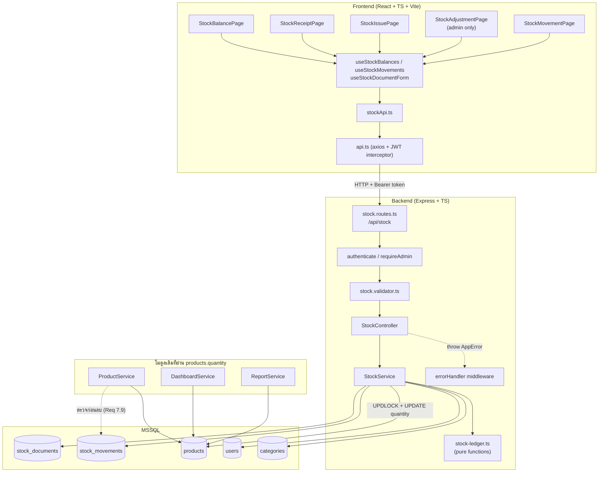
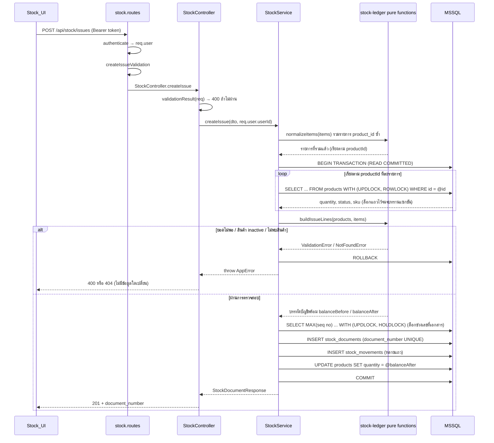
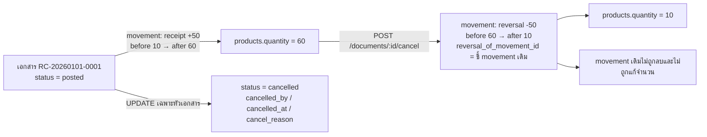
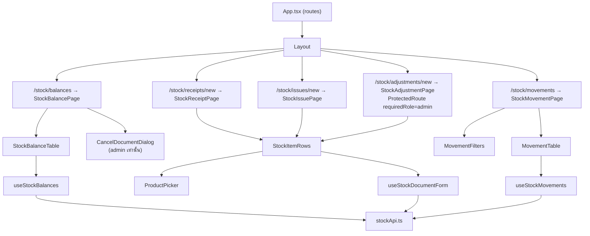

# Design Document

## Overview

ระบบจัดการสต็อก (Stock Management) เพิ่มบัญชีแยกประเภทความเคลื่อนไหวสต็อกแบบ append-only (`stock_movements`) และเอกสารสต็อก (`stock_documents`) เข้าไปในสถาปัตยกรรมเดิมของโปรเจกต์ โดยยังคงใช้ `products.quantity` เป็น On_Hand_Balance (cached balance) เพื่อไม่กระทบ Dashboard, รายงาน low-stock และหน้าสินค้าเดิมที่อ่านค่าจากฟิลด์นี้อยู่แล้ว

### หลักการออกแบบ (Design Principles)

| หลักการ | รายละเอียด | เหตุผล |
|---|---|---|
| Ledger เป็นแหล่งความจริง | ทุกการเปลี่ยนแปลงยอดคงเหลือต้องมี `stock_movements` 1 แถวกำกับ | ตรวจสอบย้อนกลับได้ (Requirement 7.3) |
| `products.quantity` เป็น cached balance | อัปเดตในทรานแซกชันเดียวกับการ insert movement | เข้ากันได้กับโค้ดเดิมที่อ่าน `products.quantity` (dashboard.service, report.service) |
| Append-only | ไม่มี UPDATE/DELETE บน `stock_movements` การแก้ไขทำด้วยการกลับรายการ (`reversal`) | รักษาร่องรอยการตรวจสอบ (Requirement 6.2, 7.8) |
| แยกตรรกะบริสุทธิ์ออกจาก I/O | คำนวณบรรทัดบัญชีทั้งหมดใน `stock-ledger.ts` (pure functions) แล้วให้ `stock.service.ts` ทำหน้าที่อ่าน/เขียนฐานข้อมูล | ทดสอบคุณสมบัติ (property-based testing) ได้ด้วยต้นทุนต่ำ และตรวจสอบ invariant ของบัญชีได้โดยไม่ต้องแตะฐานข้อมูล |
| ทำตามแบบแผนเดิมทั้งหมด | routes → controller (static methods + `validationResult`) → service (class implements interface, `pool.request().input(...)`) → types | ลดภาระการเรียนรู้และความไม่สอดคล้องในโค้ดเบส |

### ผลการสำรวจโค้ดเดิม (Research Findings)

สำรวจจากโค้ดจริงในโปรเจกต์ ณ ปัจจุบัน:

1. **ยังไม่มีการใช้ทรานแซกชันที่ใดในโค้ดเบส** — ค้นหา `new sql.Transaction`, `isolationLevel`, `UPDLOCK` ทั้ง `backend/src` แล้วไม่พบผลลัพธ์ ฟีเจอร์นี้เป็นตัวแรกที่ต้องใช้ `sql.Transaction` จึงต้องกำหนดแบบแผนการใช้ทรานแซกชันไว้ให้ชัด (ดูหัวข้อ Transaction and Locking Strategy) เพื่อให้ฟีเจอร์ถัดไปนำไปใช้ซ้ำได้
2. **`products.quantity` ถูกอ่านโดยตรงจาก 3 ที่** — `dashboard.service.ts` (`quantity <= 10` สำหรับ lowStockCount และ low stock table), `report.service.ts` (`getLowStockData(threshold = 10)`) และ `product.service.ts` (คืนค่าใน `ProductResponse`) การคง `products.quantity` เป็น cached balance จึงจำเป็น ไม่ใช่ทางเลือกเพื่อประสิทธิภาพเท่านั้น
3. **Low_Stock_Threshold ค่าเริ่มต้น 10** — ยืนยันจาก `report.service.ts` `getLowStockData(threshold: number = 10)` และ `dashboard.service.ts` ที่ hardcode `quantity <= 10` ค่าคงที่ใหม่ `LOW_STOCK_THRESHOLD_DEFAULT = 10` จะประกาศไว้ที่ `types/dto.ts`
4. **แบบแผน migration** — `database/migrate.ts` เก็บสคีมาหลัก และ migration รายฟีเจอร์อยู่ที่ `database/migrations/001_create_categories.ts` ใช้รูปแบบ `IF NOT EXISTS (SELECT * FROM sysobjects WHERE name='...' AND xtype='U')` + `PRINT` + สคริปต์ใน `package.json` (`migrate:categories`)
5. **แบบแผน response** — ฐานข้อมูลใช้ snake_case, API คืนค่า camelCase (เช่น `products.unit_price` → `ProductResponse.unitPrice`) เอกสารข้อกำหนดเขียนชื่อฟิลด์แบบ snake_case แต่การนำไปสร้าง response จะแปลงเป็น camelCase ตามแบบแผนเดิม
6. **แบบแผนการทดสอบ** — `backend/src/__tests__/*.api.test.ts` (supertest + mock `auth.middleware`) และ `*.property.test.ts` (fast-check ^3.22.0 ติดตั้งแล้ว) รัน `jest --runInBand`
7. **`ProductService.delete` ยังลบสินค้าได้ทันที** ไม่มีการตรวจสอบข้อมูลอ้างอิง จึงต้องแก้ตาม Requirement 7.9

### ขอบเขตการเปลี่ยนแปลงไฟล์

**Backend (ไฟล์ใหม่)**

| ไฟล์ | หน้าที่ |
|---|---|
| `backend/src/database/migrations/002_create_stock_movements.ts` | สร้างตาราง `stock_documents`, `stock_movements` และ index |
| `backend/src/types/stock.types.ts` | DTO, response, model, service interface ของฟีเจอร์สต็อก |
| `backend/src/services/stock-ledger.ts` | ตรรกะบริสุทธิ์: รวมรายการซ้ำ, คำนวณบรรทัดบัญชี, สร้าง/ตรวจรูปแบบเลขที่เอกสาร |
| `backend/src/services/stock.service.ts` | `StockService implements IStockService` (I/O + ทรานแซกชัน) |
| `backend/src/controllers/stock.controller.ts` | `StockController` (static methods) |
| `backend/src/validators/stock.validator.ts` | express-validator chains |
| `backend/src/routes/stock.routes.ts` | เส้นทางภายใต้ `/api/stock` |

**Backend (ไฟล์ที่แก้ไข)**

| ไฟล์ | การเปลี่ยนแปลง |
|---|---|
| `backend/src/routes/index.ts` | `router.use('/stock', stockRoutes)` |
| `backend/src/types/index.ts` | `export * from './stock.types'` |
| `backend/src/types/dto.ts` | เพิ่ม `LOW_STOCK_THRESHOLD_DEFAULT`, `STOCK_DOCUMENT_PREFIX` |
| `backend/src/services/index.ts`, `controllers/index.ts` | export `StockService`, `StockController` |
| `backend/src/services/product.service.ts` | `delete()` ตรวจสอบว่ามี `stock_movements` อ้างอิงหรือไม่ (Requirement 7.9) |
| `backend/package.json` | เพิ่มสคริปต์ `migrate:stock` |

**Frontend (ไฟล์ใหม่)**

`types/stock.types.ts`, `services/stockApi.ts`, `hooks/useStockBalances.ts`, `hooks/useStockMovements.ts`, `hooks/useStockDocumentForm.ts`, `pages/StockBalancePage.tsx`, `pages/StockReceiptPage.tsx`, `pages/StockIssuePage.tsx`, `pages/StockAdjustmentPage.tsx`, `pages/StockMovementPage.tsx`, `components/stock/StockBalanceTable.tsx`, `components/stock/StockItemRows.tsx`, `components/stock/ProductPicker.tsx`, `components/stock/MovementFilters.tsx`, `components/stock/MovementTable.tsx`, `components/stock/CancelDocumentDialog.tsx`

**Frontend (ไฟล์ที่แก้ไข)**: `App.tsx` (เพิ่มเส้นทาง), `components/Layout.tsx` (เพิ่มเมนู), `types/index.ts` (re-export)

---

## Architecture

### ภาพรวมองค์ประกอบ



**การตัดสินใจ:** โมดูลเดิม (Product/Dashboard/Report) ไม่ต้องแก้ตรรกะการอ่าน เพราะ `products.quantity` ยังเป็นยอดคงเหลือปัจจุบันเสมอ มีเพียง `ProductService.delete` ที่ต้องเพิ่มการตรวจสอบข้อมูลอ้างอิง

### ลำดับการทำงาน: บันทึกจ่ายออก (กรณีที่มีการแข่งขันกัน)



### Transaction and Locking Strategy

ข้อกำหนดที่เกี่ยวข้อง: 1.4, 2.2, 2.8, 3.3, 6.4, 7.3, 7.4, 8.3, 8.4

| หัวข้อ | การตัดสินใจ | เหตุผล |
|---|---|---|
| Isolation level | READ COMMITTED (ค่าเริ่มต้นของ MSSQL) + lock hint ที่ระบุชัดเจน | ไม่ต้องยกระดับ isolation ทั้งทรานแซกชัน (ซึ่งจะเพิ่มโอกาส deadlock กับโมดูลเดิมที่อ่าน `products` ตลอดเวลา) แต่ล็อกเฉพาะแถวที่ต้องแก้ |
| ล็อกแถวสินค้า | `SELECT id, sku, status, quantity FROM products WITH (UPDLOCK, ROWLOCK) WHERE id = @id` ยิงทีละรายการ **เรียงตาม `product_id` แบบ ascending** | `UPDLOCK` ค้างถึงจบทรานแซกชัน ทำให้ read-modify-write ของยอดคงเหลือถูก serialize ต่อสินค้า 1 รายการ (Requirement 2.8) การเรียงลำดับการขอล็อกเหมือนกันทุกคำขอทำให้ไม่เกิด deadlock แบบวงกลม การยิงทีละรายการจำเป็นเพราะ `ORDER BY` ใน `SELECT ... IN (...)` ไม่รับประกันลำดับการได้ล็อกจริง |
| ขอบเขตทรานแซกชัน | 1 เอกสาร = 1 ทรานแซกชัน ครอบทั้งการล็อกสินค้า, สร้างเลขที่เอกสาร, insert เอกสาร, insert movements และ update `products.quantity` | ทำให้ผลลัพธ์เป็นสำเร็จทั้งหมดหรือไม่เปลี่ยนแปลงเลย (all-or-nothing) |
| การตรวจสอบข้อมูล | ตรวจรูปแบบด้วย express-validator ก่อนเข้าทรานแซกชัน แต่ตรวจ **การมีอยู่ / สถานะ / ยอดคงเหลือ** หลังได้ล็อกแล้วเท่านั้น | ป้องกัน TOCTOU (ยอดเปลี่ยนระหว่างตรวจกับเขียน) |
| Retry | ดักข้อผิดพลาด SQL 2627/2601 (unique violation) แล้วสร้างเลขที่เอกสารใหม่ ลองใหม่รวมสูงสุด 3 ครั้ง; ดัก 1205 (deadlock victim) แล้วลองใหม่สูงสุด 3 ครั้งพร้อม backoff 50/100/200 ms | Requirement 8.4 |
| Rollback | `try/catch` รอบทรานแซกชัน โดย `rollback()` ใน catch และห่อด้วย try เงียบ ๆ กัน error ซ้อน error | ป้องกันการกลืนสาเหตุที่แท้จริงของข้อผิดพลาด |

โครงร่างการใช้ทรานแซกชัน (แบบแผนใหม่ของโปรเจกต์):

```ts
private async withTransaction<T>(fn: (tx: sql.Transaction) => Promise<T>): Promise<T> {
  const pool = await getPool();
  const tx = new sql.Transaction(pool);
  await tx.begin(sql.ISOLATION_LEVEL.READ_COMMITTED);
  try {
    const result = await fn(tx);
    await tx.commit();
    return result;
  } catch (error) {
    try { await tx.rollback(); } catch { /* ทรานแซกชันถูกยกเลิกไปแล้ว */ }
    throw error;
  }
}
```

### Document Number Generation

รูปแบบ: `{prefix}-{YYYYMMDD}-{NNNN}` โดย prefix คือ `RC` (receipt), `IS` (issue), `AJ` (adjustment) — เช่น `RC-20260101-0001` วันที่ใช้ UTC ให้สอดคล้องกับ `GETUTCDATE()` ที่ใช้อยู่ทั้งโปรเจกต์

ขั้นตอน (อยู่ในทรานแซกชันเดียวกับการ insert เอกสาร):

1. คำนวณ `datePart` จาก `document_date` (UTC) และ `prefix` จาก `document_type`
2. หาเลขรันสูงสุดของคู่ prefix+วันที่ พร้อมล็อกช่วง:
   ```sql
   SELECT MAX(CAST(RIGHT(document_number, 4) AS INT)) AS maxRunning
   FROM stock_documents WITH (UPDLOCK, HOLDLOCK)
   WHERE document_number LIKE @pattern   -- 'RC-20260101-%'
   ```
   `UPDLOCK, HOLDLOCK` บนช่วงที่ index `UQ_stock_documents_number` ครอบ ทำให้คำขอที่ใช้ prefix+วันเดียวกันเข้าคิวกัน จึงได้เลขรันไม่ซ้ำตั้งแต่ครั้งแรกในกรณีปกติ
3. `next = (maxRunning ?? 0) + 1` ถ้า `next > 9999` → `ConflictError('จำนวนเอกสารของวันนี้ถึงขีดจำกัดแล้ว')` (Requirement 8.5)
4. `formatDocumentNumber(prefix, date, next)` (pure function ใน `stock-ledger.ts`) → `RC-20260101-0001`
5. INSERT เอกสาร ถ้าชน `UQ_stock_documents_number` (SQL error 2627/2601) → rollback แล้วเริ่มใหม่ทั้งขั้นตอน ลองรวมสูงสุด 3 ครั้ง ครั้งที่ 3 ยังชน → `ConflictError('สร้างเลขที่เอกสารไม่สำเร็จ กรุณาลองใหม่อีกครั้ง')` (Requirement 8.4)

**เหตุผลที่ไม่ใช้ตารางตัวนับแยก:** ข้อกำหนด 8.3 กำหนดให้ใช้ unique constraint ระดับฐานข้อมูลเป็นตัวรับประกันความไม่ซ้ำ การใช้ `MAX(...) + UPDLOCK/HOLDLOCK` ร่วมกับ unique constraint และ retry ให้ผลลัพธ์เดียวกันโดยไม่เพิ่มตารางและไม่ต้องดูแล counter ให้ตรงกับข้อมูลจริง ต้นทุนการค้นหาต่ำเพราะ query ใช้ index prefix scan บน `document_number`

### การกลับรายการ (Reversal / Cancel)



- ยกเลิกได้เฉพาะเอกสารสถานะ `posted` (ถ้าเป็น `cancelled` แล้ว → 409, Requirement 6.6)
- Reversal 1 แถวต่อ movement เดิม 1 แถว โดย `quantity = -original.quantity`, `movement_type = 'reversal'`, `reversal_of_movement_id = original.id`, `document_id` ยังชี้เอกสารเดิม (เพื่อให้ Stock_Card ของเอกสารนั้นครบในที่เดียว)
- การอัปเดตสถานะหัวเอกสารเป็น `cancelled` ไม่ขัดกับหลัก append-only เพราะ append-only บังคับใช้กับ `stock_movements` เท่านั้น ส่วน `stock_documents` เป็นหัวเอกสารที่มี state machine `posted → cancelled` (ทางเดียว)
- การยกเลิกเอกสาร `adjustment`: quantity ของ movement ประเภท adjustment คือค่าส่วนต่าง (`counted - balance_before`) ดังนั้นการกลับรายการด้วย `-quantity` ให้ผลถูกต้องเหมือนกันทุกประเภทเอกสาร ไม่ต้องแยกตรรกะตามประเภท
- ถ้าผลการกลับรายการทำให้ยอดคงเหลือของสินค้าใดต่ำกว่า 0 → `ConflictError` (409) และไม่มีข้อมูลใดเปลี่ยน (Requirement 6.5)

---

## Components and Interfaces

### Stock API Endpoints

ทุกเส้นทางอยู่ภายใต้ `/api/stock` และผ่าน `router.use(authenticate)` ที่ระดับ router (แบบเดียวกับ `product.routes.ts` / `category.routes.ts`) เส้นทางที่จำกัดเฉพาะผู้ดูแลระบบเพิ่ม `requireAdmin` เป็น middleware รายเส้นทาง

| Method | Path | สิทธิ์ | Request | สำเร็จ | ข้อผิดพลาดที่เป็นไปได้ |
|---|---|---|---|---|---|
| POST | `/api/stock/receipts` | authenticated | `CreateReceiptDto` | 201 `StockDocumentResponse` | 400, 401, 404, 409 |
| POST | `/api/stock/issues` | authenticated | `CreateIssueDto` | 201 `StockDocumentResponse` | 400, 401, 404, 409 |
| POST | `/api/stock/adjustments` | admin | `CreateAdjustmentDto` | 201 `StockDocumentResponse` | 400, 401, 403, 404, 409 |
| POST | `/api/stock/documents/:id/cancel` | admin | `CancelDocumentDto` | 200 `CancelDocumentResponse` | 400, 401, 403, 404, 409 |
| GET | `/api/stock/documents/:id` | authenticated | — | 200 `StockDocumentResponse` | 400, 401, 404 |
| GET | `/api/stock/balances` | authenticated | query `StockBalanceQueryDto` | 200 `PaginatedResponse<StockBalanceResponse>` | 400, 401 |
| GET | `/api/stock/balances/:productId` | authenticated | — | 200 `StockBalanceDetailResponse` | 400, 401, 404 |
| GET | `/api/stock/movements` | authenticated | query `StockMovementQueryDto` | 200 `PaginatedResponse<StockMovementResponse>` | 400, 401 |
| PUT / PATCH / DELETE | `/api/stock/movements/:id` | authenticated | — | — | 403 เสมอ (Requirement 7.8) |

หมายเหตุการจัดลำดับเส้นทาง: ประกาศ `/balances` ก่อน `/balances/:productId` และ `/documents/:id/cancel` ก่อน `/documents/:id` เพื่อไม่ให้ path parameter จับเส้นทางที่เจาะจงกว่า (แบบเดียวกับที่ `product.routes.ts` วาง `/generate` ไว้ก่อน `/:id`)

**เส้นทาง guard สำหรับ Requirement 7.8:** ประกาศ handler `StockController.rejectMutation` ที่คืน 403 พร้อมข้อความ `"รายการความเคลื่อนไหวแก้ไขหรือลบไม่ได้ กรุณายกเลิกเอกสารแทน"` ตั้งใจให้มีเส้นทางนี้เพื่อคืนข้อผิดพลาดที่สื่อความหมาย แทนที่จะปล่อยให้ Express คืน 404 ที่ไม่ได้อธิบายเหตุผล

```ts
// backend/src/routes/stock.routes.ts (โครงร่าง)
const router = Router();
router.use(authenticate);

router.post('/receipts', createReceiptValidation, StockController.createReceipt);
router.post('/issues', createIssueValidation, StockController.createIssue);
router.post('/adjustments', requireAdmin, createAdjustmentValidation, StockController.createAdjustment);

router.get('/balances', stockBalanceListValidation, StockController.findBalances);
router.get('/balances/:productId', productIdParamValidation, StockController.findBalanceByProductId);

router.get('/movements', stockMovementListValidation, StockController.findMovements);
router.put('/movements/:id', StockController.rejectMutation);
router.patch('/movements/:id', StockController.rejectMutation);
router.delete('/movements/:id', StockController.rejectMutation);

router.post('/documents/:id/cancel', requireAdmin, cancelDocumentValidation, StockController.cancelDocument);
router.get('/documents/:id', documentIdValidation, StockController.findDocumentById);

export default router;
```

### StockController

`static` methods แบบเดียวกับ `ProductController` แต่ละเมธอดทำ 4 ขั้น: ตรวจ `validationResult(req)` → แปลง input → เรียก service (ส่ง `(req as any).user.userId` เข้าไป) → คืน envelope `{ success, data, message }` และส่ง error ต่อด้วย `next(error)` ให้ `errorHandler` จัดการ

| Method | Endpoint | ข้อความเมื่อสำเร็จ |
|---|---|---|
| `createReceipt` | POST `/receipts` | `บันทึกรับสินค้าเข้าสำเร็จ` |
| `createIssue` | POST `/issues` | `บันทึกจ่ายสินค้าออกสำเร็จ` |
| `createAdjustment` | POST `/adjustments` | `ปรับยอดสินค้าสำเร็จ` |
| `cancelDocument` | POST `/documents/:id/cancel` | `ยกเลิกเอกสารสำเร็จ` |
| `findDocumentById` | GET `/documents/:id` | — |
| `findBalances` | GET `/balances` | — |
| `findBalanceByProductId` | GET `/balances/:productId` | — |
| `findMovements` | GET `/movements` | — |
| `rejectMutation` | PUT/PATCH/DELETE `/movements/:id` | — (คืน 403 เสมอ) |

การจัดรูปแบบ `details` ของข้อผิดพลาดจาก express-validator ใช้ตัวเดียวกับโค้ดเดิม:

```ts
details: errors.array().map(e => ({ [e.type === 'field' ? (e as any).path : 'general']: e.msg }))
```
express-validator รายงาน path ของ array แบบ `items[2].quantity` ซึ่งครอบคลุมข้อกำหนด "ระบุลำดับรายการและชื่อฟิลด์" (Requirement 1.7, 2.6, 3.6, 3.7) ได้โดยตรง และ `validationResult` คืน error ทุกฟิลด์พร้อมกันตามที่ข้อกำหนดต้องการ

### IStockService

```ts
// backend/src/types/stock.types.ts
export interface IStockService {
  createReceipt(data: CreateReceiptDto, userId: string): Promise<StockDocumentResponse>;
  createIssue(data: CreateIssueDto, userId: string): Promise<StockDocumentResponse>;
  createAdjustment(data: CreateAdjustmentDto, userId: string): Promise<StockDocumentResponse>;
  cancelDocument(documentId: string, data: CancelDocumentDto, userId: string): Promise<CancelDocumentResponse>;
  findDocumentById(documentId: string): Promise<StockDocumentResponse>;
  findBalances(query: StockBalanceQueryDto): Promise<PaginatedResponse<StockBalanceResponse>>;
  findBalanceByProductId(productId: string): Promise<StockBalanceDetailResponse>;
  findMovements(query: StockMovementQueryDto): Promise<PaginatedResponse<StockMovementResponse>>;
}
```

เมธอดภายในของ `StockService` (private):

| เมธอด | หน้าที่ |
|---|---|
| `withTransaction<T>(fn)` | จัดการ begin/commit/rollback |
| `withRetry<T>(fn)` | ลองใหม่เมื่อเจอ SQL 2627/2601/1205 สูงสุด 3 ครั้ง |
| `lockProducts(tx, productIds)` | ล็อกแถว `products` ทีละรายการเรียงตาม id แบบ ascending แล้วคืน `Map<productId, LockedProductRow>` |
| `nextDocumentNumber(tx, type, date)` | คำนวณเลขที่เอกสารถัดไป (ใช้ `formatDocumentNumber`) |
| `insertDocument(tx, ...)` / `insertMovements(tx, ...)` / `applyBalances(tx, ...)` | เขียนข้อมูล |
| `loadDocumentResponse(tx | pool, documentId)` | ประกอบ `StockDocumentResponse` (หัวเอกสาร + รายการ + ชื่อผู้บันทึก) |
| `toMovementResponse(row)` / `toBalanceResponse(row)` | แปลง model → response (แบบเดียวกับ `toProductResponse`) |

### stock-ledger.ts (pure functions)

โมดูลนี้ไม่แตะฐานข้อมูล รับ snapshot ของสินค้าที่ล็อกไว้แล้ว + รายการที่ขอ แล้วคืนบรรทัดบัญชีหรือโยนข้อผิดพลาด ทำให้ตรรกะยอดคงเหลือทั้งหมดทดสอบด้วย property-based testing ได้ในหน่วยความจำ

```ts
export interface LedgerProductSnapshot {
  id: string;
  sku: string;
  status: 'active' | 'inactive';
  quantity: number; // On_Hand_Balance ปัจจุบัน
}

export interface LedgerLine {
  productId: string;
  movementType: MovementType;
  quantity: number;        // มีเครื่องหมาย: receipt > 0, issue < 0, adjustment/reversal = ส่วนต่าง
  balanceBefore: number;
  balanceAfter: number;
  unitCost: number | null;
  reason: string | null;
  reversalOfMovementId: string | null;
}

// รวมรายการ product_id ซ้ำเป็นรายการเดียว และเรียงผลลัพธ์ตาม productId (Requirement 1.9, 2.7)
export function normalizeQuantityItems(items: StockItemInput[]): StockItemInput[];
// รายการ adjustment ที่ product_id ซ้ำ: ใช้รายการสุดท้ายเป็นค่าที่ต้องการนับจริง
export function normalizeAdjustmentItems(items: AdjustmentItemInput[]): AdjustmentItemInput[];

export function buildReceiptLines(snapshots: Map<string, LedgerProductSnapshot>, items: StockItemInput[]): LedgerLine[];
export function buildIssueLines(snapshots: Map<string, LedgerProductSnapshot>, items: StockItemInput[]): LedgerLine[];
export function buildAdjustmentLines(snapshots: Map<string, LedgerProductSnapshot>, items: AdjustmentItemInput[]): LedgerLine[];
export function buildReversalLines(snapshots: Map<string, LedgerProductSnapshot>, originals: StockMovementModel[]): LedgerLine[];

export function formatDocumentNumber(prefix: DocumentPrefix, date: Date, running: number): string;
export function parseDocumentNumber(documentNumber: string): { prefix: DocumentPrefix; datePart: string; running: number } | null;
export const MAX_RUNNING_NUMBER = 9999;
export const MAX_BALANCE = 999999;
```

ข้อผิดพลาดที่ฟังก์ชัน `build*Lines` โยน (ใช้คลาสจาก `utils/errors.ts` เดิม):

| กรณี | ข้อผิดพลาด | ข้อกำหนด |
|---|---|---|
| ไม่พบ product_id ใน snapshot | `NotFoundError('ไม่พบสินค้า: {productId}')` | 1.5, 2.4, 3.8 |
| สินค้ามีสถานะ `inactive` | `ValidationError('สินค้า {sku} ไม่อยู่ในสถานะที่รับเข้าได้'/'จ่ายออกได้')` | 1.6, 2.5 |
| ยอดหลังรับเข้าเกิน 999999 | `ValidationError('ยอดคงเหลือของสินค้า {sku} จะเกินค่าสูงสุดที่ระบบรองรับ (999,999)')` | 1.8 |
| ยอดคงเหลือไม่พอจ่ายออก | `ValidationError('สินค้า {sku} มีคงเหลือ {current} ชิ้น ไม่เพียงพอกับจำนวนที่ขอจ่ายออก {requested} ชิ้น')` | 2.3 |
| กลับรายการทำให้ยอดต่ำกว่า 0 | `ConflictError('ไม่สามารถยกเลิกเอกสารได้ เนื่องจากสินค้า {sku} มีคงเหลือ {current} ชิ้น น้อยกว่าจำนวนที่ต้องหักกลบ')` | 6.5 |

**เหตุผลของการแยกโมดูลนี้:** ข้อกำหนดข้อ 7 ทั้งหมดเป็น invariant ทางเลขคณิตของบัญชี ซึ่งเหมาะกับ property-based testing มาก แต่ถ้าตรรกะฝังอยู่ใน service ที่พูดกับฐานข้อมูล การรัน 100+ รอบต่อคุณสมบัติจะช้าและเปราะ การแยก pure layer ทำให้ทดสอบคุณสมบัติเชิงเลขคณิตได้เร็ว และเหลือการทดสอบระดับ API ไว้สำหรับพฤติกรรมที่ต้องมีฐานข้อมูลจริง (ทรานแซกชัน, ล็อก, unique constraint)

### Validators (`stock.validator.ts`)

ใช้ `body`, `query`, `param` จาก express-validator และ `UUID_REGEX` ชุดเดียวกับ `product.validator.ts` ข้อความทั้งหมดเป็นภาษาไทย

| Chain | กฎหลัก |
|---|---|
| `createReceiptValidation` | `documentDate` optional ISO8601; `note` optional ≤1000; `items` array 1-100; `items.*.productId` ตรง UUID_REGEX; `items.*.quantity` `isInt({min:1,max:999999})`; `items.*.unitCost` optional `isFloat({min:0,max:999999999.99})` + custom ตรวจทศนิยม ≤2 ตำแหน่ง (ใช้ตรรกะเดียวกับ `unitPrice` เดิม) |
| `createIssueValidation` | เหมือน receipt แต่ไม่มี `unitCost` |
| `createAdjustmentValidation` | `items` array 1-100; `items.*.productId` UUID; `items.*.countedQuantity` `isInt({min:0,max:999999})`; `items.*.reason` trim + `isLength({min:1,max:500})` |
| `cancelDocumentValidation` | `param('id')` UUID; `body('reason')` trim + `isLength({min:1,max:500})` |
| `stockBalanceListValidation` | `page` `isInt({min:1})`; `limit` `isInt({min:1,max:100})`; `search` ≤200; `categoryId` UUID; `lowStock` `isBoolean()`; `threshold` `isInt({min:0,max:999999})` |
| `stockMovementListValidation` | `page`, `limit` เหมือนบน; `productId` UUID; `movementType` `isIn(['receipt','issue','adjustment','reversal'])`; `startDate`/`endDate` `matches(/^\d{4}-\d{2}-\d{2}$/)` + custom cross-field ตรวจ `startDate <= endDate` |
| `productIdParamValidation` / `documentIdValidation` | UUID_REGEX |

`items` ที่ไม่ใช่ array หรือเป็น array ว่าง จะถูกปฏิเสธด้วย `body('items').isArray({ min: 1, max: 100 })` (Requirement 1.7, 2.6)

### Frontend Components



| องค์ประกอบ | ความรับผิดชอบ | ข้อกำหนด |
|---|---|---|
| `StockBalancePage` | ตารางยอดคงเหลือ + ช่องค้นหา (debounce 300 ms) + ตัวกรองหมวดหมู่ + checkbox สินค้าใกล้หมด + pagination + ปุ่มลิงก์ไปหน้ารับเข้า/จ่ายออก | 10.1, 10.2 |
| `StockItemRows` | เพิ่ม/ลบแถวรายการสินค้า แต่ละแถวมี `ProductPicker` (โหลดเฉพาะสินค้า `status=active`) + ช่องจำนวน + แสดงยอดคงเหลือปัจจุบัน + ข้อความเตือนระดับแถวเมื่อจำนวนจ่ายออกเกินยอดคงเหลือ | 10.3, 10.4 |
| `useStockDocumentForm` | สถานะฟอร์ม, ตรวจสอบฝั่งลูกค้า, `submitting` flag, แม็ป `error.details` (path เช่น `items[2].quantity`) กลับไปยังแถว/ฟิลด์ที่เกี่ยวข้อง | 10.2, 10.4, 10.6 |
| `MovementFilters` + `MovementTable` | ตัวกรองสินค้า/ประเภทรายการ/ช่วงวันที่ และตารางที่มีคอลัมน์เลขที่เอกสาร, วันที่, ประเภท, สินค้า, จำนวน, ยอดคงเหลือหลังรายการ, ผู้บันทึก | 10.8 |
| `CancelDocumentDialog` | ยืนยันการยกเลิกพร้อมช่องกรอกเหตุผล เรนเดอร์เฉพาะเมื่อ `user.role === 'admin'` | 10.7 |
| `Layout.tsx` | เพิ่มเมนู `สต็อก` (`/stock/balances`) ใน `navItems` และเมนู `ปรับยอดสต็อก` (`/stock/adjustments/new`) ใน `adminItems` ซึ่งเรนเดอร์ภายใต้เงื่อนไข `user?.role === 'admin'` ที่มีอยู่แล้ว | 10.7 |

**การเข้าถึงได้ (Requirement 10.9):** ทุก input มี `<label htmlFor>` ผูกกับ `id`, ปุ่มไอคอนมี `aria-label`, ตารางใช้ `<th scope="col">`, ข้อความ error ผูกกับ input ด้วย `aria-describedby` + `aria-invalid`, แถวรายการที่ลบได้มีปุ่มที่โฟกัสด้วยแป้นพิมพ์ได้ และสถานะกำลังโหลดประกาศด้วย `aria-live="polite"`

**การจัดการ session (Requirement 10.10):** ใช้ `ProtectedRoute` เดิมที่ redirect ไป `/login` เมื่อไม่ได้ยืนยันตัวตน ประกอบกับ axios response interceptor ใน `services/api.ts` ที่ล้าง token และพาไป `/login` เมื่อได้ 401 — ไม่ต้องเขียนกลไกใหม่

**stockApi.ts:** ใช้ `api` instance เดิม (แนบ Bearer token อัตโนมัติ) ส่ง JSON ธรรมดา (ไม่ใช่ FormData เพราะไม่มีการอัปโหลดไฟล์) และคืน `ApiResponse<T>` แบบเดียวกับ `productApi.ts`

---

## Data Models

### Database Schema

Migration ใหม่: `backend/src/database/migrations/002_create_stock_movements.ts` ใช้แบบแผนเดียวกับ `001_create_categories.ts` (ตรวจ `sysobjects` + `PRINT`) และเพิ่มสคริปต์ `"migrate:stock": "ts-node src/database/migrations/002_create_stock_movements.ts"` ใน `package.json`

```sql
-- Create Stock Documents Table
IF NOT EXISTS (SELECT * FROM sysobjects WHERE name='stock_documents' AND xtype='U')
BEGIN
    CREATE TABLE stock_documents (
        id UNIQUEIDENTIFIER PRIMARY KEY DEFAULT NEWID(),
        document_number NVARCHAR(20) NOT NULL,
        document_type NVARCHAR(10) NOT NULL,
        document_date DATETIME2 NOT NULL DEFAULT GETUTCDATE(),
        note NVARCHAR(1000) NULL,
        status NVARCHAR(10) NOT NULL DEFAULT 'posted',
        created_by UNIQUEIDENTIFIER NOT NULL,
        created_at DATETIME2 NOT NULL DEFAULT GETUTCDATE(),
        cancelled_by UNIQUEIDENTIFIER NULL,
        cancelled_at DATETIME2 NULL,
        cancel_reason NVARCHAR(500) NULL,

        CONSTRAINT UQ_stock_documents_number UNIQUE (document_number),
        CONSTRAINT CK_stock_documents_type CHECK (document_type IN ('receipt', 'issue', 'adjustment')),
        CONSTRAINT CK_stock_documents_status CHECK (status IN ('posted', 'cancelled')),
        CONSTRAINT CK_stock_documents_cancel_fields CHECK (
            (status = 'posted'    AND cancelled_by IS NULL     AND cancelled_at IS NULL) OR
            (status = 'cancelled' AND cancelled_by IS NOT NULL AND cancelled_at IS NOT NULL)
        ),
        CONSTRAINT FK_stock_documents_created_by FOREIGN KEY (created_by) REFERENCES users(id),
        CONSTRAINT FK_stock_documents_cancelled_by FOREIGN KEY (cancelled_by) REFERENCES users(id)
    );

    CREATE INDEX IX_stock_documents_type_date ON stock_documents(document_type, document_date DESC);
    CREATE INDEX IX_stock_documents_status ON stock_documents(status);
    CREATE INDEX IX_stock_documents_created_by ON stock_documents(created_by);

    PRINT 'Stock documents table created successfully';
END
ELSE
    PRINT 'Stock documents table already exists';

-- Create Stock Movements Table
IF NOT EXISTS (SELECT * FROM sysobjects WHERE name='stock_movements' AND xtype='U')
BEGIN
    CREATE TABLE stock_movements (
        id UNIQUEIDENTIFIER NOT NULL DEFAULT NEWID(),
        seq BIGINT IDENTITY(1,1) NOT NULL,
        document_id UNIQUEIDENTIFIER NOT NULL,
        movement_type NVARCHAR(10) NOT NULL,
        product_id UNIQUEIDENTIFIER NOT NULL,
        quantity INT NOT NULL,
        balance_before INT NOT NULL,
        balance_after INT NOT NULL,
        unit_cost DECIMAL(12, 2) NULL,
        reason NVARCHAR(500) NULL,
        reversal_of_movement_id UNIQUEIDENTIFIER NULL,
        created_by UNIQUEIDENTIFIER NOT NULL,
        created_at DATETIME2 NOT NULL DEFAULT GETUTCDATE(),

        CONSTRAINT PK_stock_movements PRIMARY KEY (id),
        CONSTRAINT CK_stock_movements_type CHECK (movement_type IN ('receipt', 'issue', 'adjustment', 'reversal')),
        CONSTRAINT CK_stock_movements_quantity CHECK (quantity >= -999999 AND quantity <= 999999),
        CONSTRAINT CK_stock_movements_balance_before CHECK (balance_before >= 0 AND balance_before <= 999999),
        CONSTRAINT CK_stock_movements_balance_after CHECK (balance_after >= 0 AND balance_after <= 999999),
        CONSTRAINT CK_stock_movements_balance_math CHECK (balance_after = balance_before + quantity),
        CONSTRAINT CK_stock_movements_sign CHECK (
            (movement_type = 'receipt' AND quantity > 0) OR
            (movement_type = 'issue'   AND quantity < 0) OR
            (movement_type IN ('adjustment', 'reversal'))
        ),
        CONSTRAINT CK_stock_movements_unit_cost CHECK (unit_cost IS NULL OR (unit_cost >= 0 AND unit_cost <= 999999999.99)),
        CONSTRAINT FK_stock_movements_document FOREIGN KEY (document_id) REFERENCES stock_documents(id),
        CONSTRAINT FK_stock_movements_product FOREIGN KEY (product_id) REFERENCES products(id),
        CONSTRAINT FK_stock_movements_created_by FOREIGN KEY (created_by) REFERENCES users(id),
        CONSTRAINT FK_stock_movements_reversal FOREIGN KEY (reversal_of_movement_id) REFERENCES stock_movements(id)
    );

    CREATE UNIQUE INDEX UX_stock_movements_seq ON stock_movements(seq);
    CREATE INDEX IX_stock_movements_product_seq ON stock_movements(product_id, seq);
    CREATE INDEX IX_stock_movements_document ON stock_movements(document_id);
    CREATE INDEX IX_stock_movements_type ON stock_movements(movement_type);
    CREATE INDEX IX_stock_movements_created_at ON stock_movements(created_at DESC);

    PRINT 'Stock movements table created successfully';
END
ELSE
    PRINT 'Stock movements table already exists';
```

### เหตุผลของโครงสร้างที่เลือก

| การตัดสินใจ | เหตุผล |
|---|---|
| `seq BIGINT IDENTITY(1,1)` เพิ่มเข้ามานอกเหนือจากที่ข้อกำหนดระบุ | `created_at DATETIME2 DEFAULT GETUTCDATE()` ของ movement หลายแถวในทรานแซกชันเดียวมีค่าเท่ากันได้ ทำให้เรียงลำดับไม่ชี้ขาด แต่ Requirement 7.6 ต้องการลำดับที่ชัดเจนเพื่อเชื่อม `balance_before`/`balance_after` `seq` ให้ลำดับ monotonic ที่ตรวจสอบได้ และใช้เป็นคีย์เรียงของ Stock_Card |
| `CK_stock_movements_balance_math` | บังคับ Requirement 7.5 ที่ระดับฐานข้อมูล ทำให้บั๊กในชั้นแอปพลิเคชันไม่สามารถเขียนบัญชีที่ผิดเลขคณิตลงไปได้ |
| `CK_stock_movements_sign` | บังคับ Requirement 7.7 (receipt เป็นบวก, issue เป็นลบ) ส่วน adjustment/reversal เป็นค่าส่วนต่างจึงเป็นบวก ลบ หรือศูนย์ได้ |
| `CK_stock_movements_balance_before/after` ในช่วง 0-999999 | บังคับ Requirement 7.4 ให้ยอดคงเหลือทุกจุดของบัญชีอยู่ในช่วงที่ `products.quantity` รองรับ (`CHECK (quantity >= 0 AND quantity <= 999999)` เดิม) |
| `reversal_of_movement_id` (นอกเหนือจากข้อกำหนด) | ทำให้ตรวจสอบได้ว่า reversal แถวใดหักกลบ movement ใด และเป็นฐานของการทดสอบคุณสมบัติ round-trip (Requirement 6.9) |
| ไม่มี `ON DELETE CASCADE` บน FK ไปยัง `products` | บังคับให้การลบสินค้าที่มีประวัติต้องถูกปฏิเสธที่ชั้นแอปพลิเคชันด้วยข้อความไทย (Requirement 7.9) และ FK เป็นแนวป้องกันชั้นที่สองถ้าโค้ดพลาด |
| ไม่มีตาราง `stock_document_items` แยก | `stock_movements` ทำหน้าที่เป็นรายการของเอกสารอยู่แล้ว (`document_id`) การแยกตารางจะทำให้ยอดในรายการเอกสารและยอดในบัญชีมีโอกาสไม่ตรงกัน |
| `CK_stock_documents_cancel_fields` | ทำให้สถานะ `cancelled` ต้องมาพร้อม `cancelled_by`/`cancelled_at` เสมอ (Requirement 6.3) |

### ค่าคงที่ของยอดคงเหลือ (Invariant)

```
สำหรับทุก product p:
  products.quantity(p) = SUM(stock_movements.quantity WHERE product_id = p)
  0 <= products.quantity(p) <= 999999
```

ค่านี้ถูกรักษาไว้ด้วย 3 กลไกร่วมกัน:

1. ทุกการเปลี่ยน `products.quantity` เกิดในทรานแซกชันเดียวกับการ insert movement ที่กำกับ และค่าที่เขียนคือ `balance_after` ของ movement บรรทัดสุดท้ายของสินค้านั้นในทรานแซกชัน
2. `UPDLOCK` บนแถวสินค้าทำให้ไม่มีคำขออื่นอ่านยอดเดิมไปคำนวณซ้อนกันได้
3. `CK_stock_movements_balance_math` + `CHECK (quantity >= 0 AND quantity <= 999999)` บน `products` เป็นตัวดักท้ายสุด

มี query สำหรับตรวจสอบ (ใช้ในการทดสอบ และเป็นเครื่องมือตรวจสุขภาพข้อมูล):

```sql
SELECT p.id, p.sku, p.quantity, ISNULL(SUM(m.quantity), 0) AS ledger_sum
FROM products p
LEFT JOIN stock_movements m ON m.product_id = p.id
GROUP BY p.id, p.sku, p.quantity
HAVING p.quantity <> ISNULL(SUM(m.quantity), 0);
```

หมายเหตุสำคัญ: สินค้าที่ถูกสร้างก่อนฟีเจอร์นี้ (หรือสร้างผ่าน `POST /api/products` ด้วย `quantity` ตั้งต้น) จะมี `products.quantity > 0` โดยไม่มี movement รองรับ ทำให้ invariant ข้างต้นเป็นจริงเฉพาะกับสินค้าที่ยอดเริ่มต้นเป็น 0 หรือมี movement ครบ การทดสอบคุณสมบัติจึงใช้รูปแบบที่ทนต่อยอดตั้งต้น:

```
products.quantity(p) = opening_quantity(p) + SUM(stock_movements.quantity WHERE product_id = p)
```

โดย `opening_quantity(p)` คือยอดก่อนมี movement แรก ซึ่งเท่ากับ `balance_before` ของ movement แรกของสินค้านั้น (และเป็น 0 เมื่อสินค้าเริ่มจากศูนย์ ตาม Requirement 7.6) รูปแบบนี้ครอบคลุมทั้งข้อมูลเดิมและข้อมูลใหม่ และเป็นสิ่งที่ทดสอบได้จริง

### TypeScript Types

```ts
// backend/src/types/stock.types.ts

export type MovementType = 'receipt' | 'issue' | 'adjustment' | 'reversal';
export type StockDocumentType = 'receipt' | 'issue' | 'adjustment';
export type StockDocumentStatus = 'posted' | 'cancelled';
export type DocumentPrefix = 'RC' | 'IS' | 'AJ';

export const STOCK_DOCUMENT_PREFIX: Record<StockDocumentType, DocumentPrefix> = {
  receipt: 'RC',
  issue: 'IS',
  adjustment: 'AJ',
};

export const LOW_STOCK_THRESHOLD_DEFAULT = 10;

// --- DTOs (input) ---

export interface StockItemInput {
  productId: string;     // UUID
  quantity: number;      // จำนวนเต็ม 1-999999 (ค่าบวกเสมอ; เครื่องหมายกำหนดโดยประเภทเอกสาร)
  unitCost?: number;     // ทศนิยม ≤2 ตำแหน่ง, 0-999999999.99 (receipt เท่านั้น)
}

export interface AdjustmentItemInput {
  productId: string;
  countedQuantity: number; // จำนวนเต็ม 0-999999
  reason: string;          // 1-500 ตัวอักษร
}

export interface CreateReceiptDto {
  documentDate?: string;   // ISO 8601; ไม่ระบุ = เวลาปัจจุบัน UTC
  note?: string;           // ≤1000
  items: StockItemInput[]; // 1-100 รายการ
}

export interface CreateIssueDto {
  documentDate?: string;
  note?: string;
  items: Omit<StockItemInput, 'unitCost'>[];
}

export interface CreateAdjustmentDto {
  documentDate?: string;
  note?: string;
  items: AdjustmentItemInput[];
}

export interface CancelDocumentDto {
  reason: string;          // 1-500 ตัวอักษร
}

export interface StockBalanceQueryDto {
  page: number;            // default 1
  limit: number;           // default 20, max 100
  search?: string;         // 1-200, partial match บน name/sku
  categoryId?: string;     // UUID
  lowStock?: boolean;      // true = คืนเฉพาะที่ ≤ threshold เรียงจากน้อยไปมาก
  threshold?: number;      // 0-999999, default LOW_STOCK_THRESHOLD_DEFAULT
}

export interface StockMovementQueryDto {
  page: number;
  limit: number;
  productId?: string;      // UUID; ถ้าระบุ = โหมด Stock_Card (เรียงเก่า→ใหม่)
  movementType?: MovementType;
  startDate?: string;      // YYYY-MM-DD (นับรวม)
  endDate?: string;        // YYYY-MM-DD (นับรวม)
}

// --- Responses (output, camelCase ตามแบบแผนเดิม) ---

export interface StockMovementResponse {
  id: string;
  documentId: string;
  documentNumber: string;
  movementType: MovementType;
  productId: string;
  productName: string;
  sku: string;
  quantity: number;        // มีเครื่องหมาย
  balanceBefore: number;
  balanceAfter: number;
  difference: number;      // = quantity (มีความหมายชัดเจนสำหรับ adjustment)
  unitCost: number | null;
  reason: string | null;
  reversalOfMovementId: string | null;
  createdBy: string;
  createdByName: string;
  createdAt: Date;
}

export interface StockDocumentResponse {
  id: string;
  documentNumber: string;
  documentType: StockDocumentType;
  documentDate: Date;
  note: string | null;
  status: StockDocumentStatus;
  createdBy: string;
  createdByName: string;
  createdAt: Date;
  cancelledBy: string | null;
  cancelledByName: string | null;
  cancelledAt: Date | null;
  cancelReason: string | null;
  items: StockMovementResponse[];
}

export interface CancelDocumentResponse {
  document: StockDocumentResponse;   // status = 'cancelled'
  reversals: StockMovementResponse[];
}

export interface StockBalanceResponse {
  productId: string;
  name: string;
  sku: string;
  category: string;
  categoryId: string | null;
  onHandBalance: number;
  unitPrice: number;
  stockValue: number;                // onHandBalance * unitPrice ปัดเป็น 2 ตำแหน่ง
  status: 'active' | 'inactive';
  lastMovementAt: Date | null;
}

export interface StockBalanceDetailResponse extends StockBalanceResponse {
  recentMovements: StockMovementResponse[];  // ล่าสุด 5 รายการ
}

// --- Database Models (internal, snake_case) ---

export interface StockDocumentModel {
  id: string;
  document_number: string;
  document_type: StockDocumentType;
  document_date: Date;
  note: string | null;
  status: StockDocumentStatus;
  created_by: string;
  created_at: Date;
  cancelled_by: string | null;
  cancelled_at: Date | null;
  cancel_reason: string | null;
}

export interface StockMovementModel {
  id: string;
  seq: number;
  document_id: string;
  movement_type: MovementType;
  product_id: string;
  quantity: number;
  balance_before: number;
  balance_after: number;
  unit_cost: number | null;
  reason: string | null;
  reversal_of_movement_id: string | null;
  created_by: string;
  created_at: Date;
}
```

### Query Design

**ยอดคงเหลือ (`findBalances`)** — `products` เป็นตารางหลัก และดึง `last_movement_at` ด้วย subquery เพื่อไม่ให้จำนวนแถวบวมจากการ join:

```sql
SELECT p.id AS product_id, p.name, p.sku, p.category, p.category_id,
       p.quantity AS on_hand_balance, p.unit_price,
       ROUND(CAST(p.quantity AS DECIMAL(18,2)) * p.unit_price, 2) AS stock_value,
       p.status,
       (SELECT MAX(m.created_at) FROM stock_movements m WHERE m.product_id = p.id) AS last_movement_at
FROM products p
WHERE (@search IS NULL OR p.name LIKE @search OR p.sku LIKE @search)
  AND (@categoryId IS NULL OR p.category_id = @categoryId)
  AND (@lowStock = 0 OR p.quantity <= @threshold)
ORDER BY /* lowStock = 1 → p.quantity ASC, p.name ASC | อื่น ๆ → p.name ASC */
OFFSET @offset ROWS FETCH NEXT @limit ROWS ONLY
```

การเปรียบเทียบ `LIKE` ไม่คำนึงถึงตัวพิมพ์เล็ก-ใหญ่โดยอาศัย collation ของฐานข้อมูล (แบบเดียวกับที่ `product.service.ts` ทำอยู่) `stock_value` ปัดเป็น 2 ตำแหน่งด้วย `ROUND` ที่ฝั่งฐานข้อมูลแบบเดียวกับ `dashboard.service.ts` เพื่อเลี่ยงปัญหาการปัดเศษของ float ใน JS

**ประวัติความเคลื่อนไหว (`findMovements`)**:

```sql
SELECT m.id, m.document_id, d.document_number, m.movement_type, m.product_id,
       p.name AS product_name, p.sku, m.quantity, m.balance_before, m.balance_after,
       m.unit_cost, m.reason, m.reversal_of_movement_id, m.created_by,
       u.first_name + ' ' + u.last_name AS created_by_name, m.created_at, m.seq
FROM stock_movements m
INNER JOIN stock_documents d ON d.id = m.document_id
INNER JOIN products p ON p.id = m.product_id
INNER JOIN users u ON u.id = m.created_by
WHERE (@productId IS NULL OR m.product_id = @productId)
  AND (@movementType IS NULL OR m.movement_type = @movementType)
  AND (@startDate IS NULL OR d.document_date >= @startDate)              -- 00:00:00 ของวันเริ่มต้น
  AND (@endDate IS NULL OR d.document_date < DATEADD(day, 1, @endDate))  -- นับรวมวันสิ้นสุดทั้งวัน
ORDER BY /* productId ระบุ → m.seq ASC (Stock_Card) | อื่น ๆ → m.created_at DESC, m.seq DESC */
OFFSET @offset ROWS FETCH NEXT @limit ROWS ONLY
```

การใช้ `d.document_date < DATEADD(day, 1, @endDate)` แทน `<= @endDate` ทำให้ครอบคลุมทุกเวลาในวันสิ้นสุด ซึ่งจำเป็นเพราะ `document_date` เป็น `DATETIME2` ไม่ใช่ `DATE` (Requirement 5.4)

---

## Correctness Properties

*คุณสมบัติ (property) คือลักษณะหรือพฤติกรรมที่ต้องเป็นจริงในทุกการทำงานที่ถูกต้องของระบบ ซึ่งก็คือข้อความเชิงรูปนัยที่ระบุว่าระบบต้องทำอะไร คุณสมบัติทำหน้าที่เป็นสะพานเชื่อมระหว่างข้อกำหนดที่มนุษย์อ่านได้ กับการรับประกันความถูกต้องที่เครื่องตรวจสอบได้*

ฟีเจอร์นี้เหมาะกับ property-based testing อย่างยิ่ง เพราะแกนกลางคือเลขคณิตของบัญชีสต็อกที่มี invariant ชัดเจน (ผลรวมของบัญชี, ความต่อเนื่องของยอด, การกลับรายการ, idempotence ของการปรับยอด) และมีพื้นที่ input ที่กว้าง (จำนวน 0-999999, รายการ 1-100 บรรทัด, สินค้าซ้ำ, ลำดับการดำเนินการ) โดยตรรกะเหล่านี้ถูกแยกไว้ใน `stock-ledger.ts` ที่เป็นฟังก์ชันบริสุทธิ์ ทำให้รัน 100+ รอบต่อคุณสมบัติได้ด้วยต้นทุนต่ำ

### Property 1: บรรทัดบัญชีรับเข้าและจ่ายออกถูกต้องตามเลขคณิตและเครื่องหมาย

*For any* snapshot ของสินค้า และรายการรับเข้าหรือจ่ายออกที่ถูกต้อง (จำนวนเต็ม 1-999999 และไม่เกินยอดคงเหลือในกรณีจ่ายออก) บรรทัดบัญชีที่สร้างขึ้นทุกบรรทัดต้องมี `balanceAfter = balanceBefore + quantity` โดย `quantity` เป็นบวกเมื่อเป็น `receipt` และเป็นลบเมื่อเป็น `issue` ผลต่างของยอดคงเหลือต่อสินค้าต้องเท่ากับจำนวนที่ขอ (บวกเมื่อรับเข้า ลบเมื่อจ่ายออก) และ `unitCost` ต้องเท่ากับค่าที่ส่งเข้ามาหรือเป็น null เมื่อไม่ระบุ

**Validates: Requirements 1.1, 1.2, 2.1, 7.5, 7.7**

### Property 2: การปฏิเสธที่ขอบเขตของยอดคงเหลือ

*For any* ยอดคงเหลือ b ในช่วง 0-999999 และจำนวนที่ขอ q ในช่วง 1-999999 การรับเข้าต้องสำเร็จเมื่อ b + q ≤ 999999 และต้องถูกปฏิเสธด้วย VALIDATION_ERROR เมื่อ b + q > 999999 ส่วนการจ่ายออกต้องสำเร็จเมื่อ q ≤ b และต้องถูกปฏิเสธด้วย VALIDATION_ERROR ที่มีข้อความระบุ sku, ยอดคงเหลือปัจจุบัน และจำนวนที่ขอจ่ายออก เมื่อ q > b

**Validates: Requirements 1.8, 2.3**

### Property 3: การปรับยอดตั้งยอดเป็นจำนวนที่นับได้และคำนวณส่วนต่างถูกต้อง

*For any* ยอดคงเหลือ b และจำนวนที่นับได้ c ในช่วง 0-999999 (รวมกรณี c = b) บรรทัดบัญชีของการปรับยอดต้องมี `balanceBefore = b`, `balanceAfter = c` และ `quantity = c − b` เสมอ

**Validates: Requirements 3.1, 3.2, 3.4**

### Property 4: ยอดคงเหลือจากการปรับยอดเป็น idempotent

*For any* ยอดคงเหลือเริ่มต้นและจำนวนที่นับได้ c การส่งเอกสารปรับยอดเนื้อหาเดียวกันสองครั้งติดกันโดยไม่มีความเคลื่อนไหวอื่นคั่นกลาง ต้องทำให้ยอดคงเหลือหลังครั้งที่สองเท่ากับหลังครั้งแรก (คือเท่ากับ c) และรายการปรับยอดของครั้งที่สองต้องมีส่วนต่างเท่ากับ 0

**Validates: Requirements 3.9**

### Property 5: รายการสินค้าซ้ำถูกรวมก่อนตรวจสอบและบันทึก

*For any* รายการสินค้าที่อาจมี product_id ซ้ำกัน ผลลัพธ์หลังการรวมต้องไม่มี product_id ซ้ำ, จำนวนบรรทัดต้องเท่ากับจำนวน product_id ที่ไม่ซ้ำ, และผลรวมของจำนวนต่อ product_id ต้องเท่ากับผลรวมก่อนรวม ทั้งนี้การตรวจสอบยอดคงเหลือของการจ่ายออกต้องใช้จำนวนที่รวมแล้ว ดังนั้นชุดรายการที่แต่ละบรรทัดไม่เกินยอดคงเหลือแต่ผลรวมเกิน ต้องถูกปฏิเสธ

**Validates: Requirements 1.9, 2.7**

### Property 6: การบันทึกเอกสารเป็นสำเร็จทั้งหมดหรือไม่เปลี่ยนแปลงเลย

*For any* ประเภทเอกสาร (receipt, issue, adjustment หรือการยกเลิก) และชุดรายการที่มีรายการไม่ถูกต้องอยู่ 1 รายการที่ตำแหน่งใดก็ได้ คำขอต้องล้มเหลว และหลังจากคำขอล้มเหลว ยอดคงเหลือของสินค้าทุกรายการที่เกี่ยวข้อง จำนวนแถวใน `stock_documents` และจำนวนแถวใน `stock_movements` ต้องเท่ากับก่อนส่งคำขอทุกค่า

**Validates: Requirements 1.4, 2.2, 3.3, 6.4**

### Property 7: product_id ที่ไม่มีอยู่ทำให้ปฏิเสธทั้งฉบับโดยไม่มีผลข้างเคียง

*For any* ชุดรายการที่ถูกต้องซึ่งมี product_id หนึ่งรายการถูกแทนด้วย UUID ที่ไม่มีอยู่ในตาราง products ณ ตำแหน่งใดก็ได้ และสำหรับทุกประเภทเอกสาร คำขอต้องได้รับข้อผิดพลาดรหัส NOT_FOUND (HTTP 404) ที่ข้อความระบุ product_id ที่ไม่พบ และไม่มีข้อมูลใดในระบบเปลี่ยนแปลง

**Validates: Requirements 1.5, 2.4, 3.8**

### Property 8: สินค้าสถานะ inactive ทำให้ปฏิเสธทั้งฉบับโดยไม่มีผลข้างเคียง

*For any* ชุดรายการที่ถูกต้องซึ่งมีสินค้าหนึ่งรายการมีสถานะ `inactive` ณ ตำแหน่งใดก็ได้ คำขอรับเข้าหรือจ่ายออกต้องได้รับข้อผิดพลาดรหัส VALIDATION_ERROR (HTTP 400) ที่ข้อความระบุว่าสินค้ารายการนั้นไม่อยู่ในสถานะที่ดำเนินการได้ และไม่มีข้อมูลใดในระบบเปลี่ยนแปลง

**Validates: Requirements 1.6, 2.5**

### Property 9: การตรวจสอบข้อมูลนำเข้ารายงานทุกรายการและทุกฟิลด์ที่ไม่ผ่าน

*For any* ชุดรายการที่มีฟิลด์ไม่ถูกต้อง k ฟิลด์ (k ≥ 1) กระจายอยู่ในตำแหน่งใดก็ได้ (quantity หรือ countedQuantity นอกช่วงที่กำหนด, reason ว่างหรือยาวเกิน 500, items เป็นรายการว่าง) คำขอต้องได้รับข้อผิดพลาดรหัส VALIDATION_ERROR (HTTP 400) และ `error.details` ต้องมีรายการที่ระบุลำดับรายการและชื่อฟิลด์ครบทั้ง k ตำแหน่ง

**Validates: Requirements 1.7, 2.6, 3.6, 3.7**

### Property 10: การตรวจสอบพารามิเตอร์การค้นหา

*For any* ชุดพารามิเตอร์ query ที่มีค่าไม่ถูกต้องอย่างน้อย 1 ค่า (page หรือ limit ไม่ใช่จำนวนเต็มบวก, limit > 100, categoryId หรือ productId ไม่ใช่รูปแบบ UUID, threshold นอกช่วง 0-999999, movementType ไม่อยู่ใน 4 ค่าที่กำหนด, startDate อยู่หลัง endDate) คำขอต้องได้รับข้อผิดพลาดรหัส VALIDATION_ERROR (HTTP 400) พร้อม `error.details` ที่ระบุชื่อพารามิเตอร์ที่ไม่ผ่าน

**Validates: Requirements 4.10, 5.7, 5.8**

### Property 11: การยกเลิกสร้างรายการหักกลบครบถ้วนโดยไม่แก้ไขรายการเดิม

*For any* เอกสารสถานะ `posted` การยกเลิกที่สำเร็จต้องสร้างรายการ `reversal` จำนวนเท่ากับจำนวนรายการของเอกสารเดิม โดยแต่ละรายการมี `quantity` เท่ากับค่าตรงข้ามของรายการเดิมที่อ้างถึง เอกสารต้องมีสถานะ `cancelled` พร้อม cancelled_by เท่ากับผู้เรียก, cancelled_at ไม่ว่าง และ cancel_reason เท่ากับเหตุผลที่ส่งมา และรายการ Stock_Movement เดิมทุกแถวต้องยังคงอยู่ครบด้วยค่า quantity, balance_before, balance_after เดิมทุกค่า

**Validates: Requirements 6.1, 6.2, 6.3**

### Property 12: การยกเลิกที่ทำให้ยอดต่ำกว่าศูนย์ถูกปฏิเสธโดยไม่มีผลข้างเคียง

*For any* เอกสารรับเข้าจำนวน q ที่ถูกจ่ายออกไปภายหลัง r หน่วยจนทำให้ยอดคงเหลือปัจจุบันน้อยกว่า q การยกเลิกเอกสารรับเข้านั้นต้องได้รับข้อผิดพลาดรหัส CONFLICT (HTTP 409) ที่ข้อความระบุ sku และยอดคงเหลือปัจจุบัน โดยสถานะเอกสารยังเป็น `posted` และยอดคงเหลือไม่เปลี่ยนแปลง

**Validates: Requirements 6.5**

### Property 13: ยกเลิกเอกสารได้เพียงครั้งเดียว

*For any* เอกสารที่ถูกยกเลิกสำเร็จแล้ว การยกเลิกครั้งถัดไปต้องได้รับข้อผิดพลาดรหัส CONFLICT (HTTP 409) และยอดคงเหลือของสินค้าทุกรายการต้องเท่ากับค่าหลังการยกเลิกครั้งแรก

**Validates: Requirements 6.6**

### Property 14: บันทึกแล้วยกเลิกคืนยอดคงเหลือกลับสู่ค่าเดิม (round-trip)

*For any* เอกสารสต็อกทุกประเภทที่บันทึกสำเร็จ ถ้าไม่มีความเคลื่อนไหวอื่นเกิดขึ้นกับสินค้าในเอกสารนั้น การยกเลิกเอกสารต้องทำให้ยอดคงเหลือของสินค้าทุกรายการเท่ากับค่า `balance_before` ของรายการนั้นในเอกสารเดิม

**Validates: Requirements 6.9**

### Property 15: ยอดคงเหลือเท่ากับยอดตั้งต้นบวกผลรวมของบัญชีเสมอ

*For all* ลำดับการดำเนินการที่ถูกต้อง (รับเข้า, จ่ายออก, ปรับยอด, ยกเลิก) ที่กระทำต่อชุดสินค้าใด ๆ เมื่อจบทุกขั้นตอน สินค้าทุกรายการต้องมี `products.quantity` เท่ากับยอดตั้งต้นของสินค้านั้นบวกด้วยผลรวมของ `quantity` ของ Stock_Movement ทุกแถวของสินค้านั้น และค่า `products.quantity` ต้องอยู่ในช่วง 0 ถึง 999999 หลังทุกขั้นตอนของลำดับ

**Validates: Requirements 7.3, 7.4**

### Property 16: ทุกแถวในบัญชีสมเหตุสมผล

*For all* แถวใน `stock_movements` ที่ระบบบันทึก ต้องเป็นจริงว่า `balance_after = balance_before + quantity`, `balance_before` และ `balance_after` อยู่ในช่วง 0-999999, `quantity` อยู่ในช่วง -999999 ถึง 999999, และเครื่องหมายของ `quantity` เป็นบวกเมื่อ movement_type เป็น `receipt` และเป็นลบเมื่อเป็น `issue`

**Validates: Requirements 7.5, 7.7**

### Property 17: ยอดคงเหลือของแต่ละสินค้าต่อเนื่องกันตามลำดับการบันทึก

*For any* สินค้าที่สร้างขึ้นด้วยยอดตั้งต้น 0 และลำดับการดำเนินการใด ๆ ที่กระทำกับสินค้านั้น เมื่อดึง Stock_Card ผ่าน `GET /api/stock/movements?productId=...` ผลลัพธ์ต้องมีเฉพาะรายการของสินค้านั้น เรียงจากเก่าไปใหม่ โดยรายการแรกมี `balanceBefore` เท่ากับ 0 และทุกรายการถัดไปมี `balanceBefore` เท่ากับ `balanceAfter` ของรายการก่อนหน้า

**Validates: Requirements 5.2, 7.6**

### Property 18: สินค้าที่มีประวัติความเคลื่อนไหวลบไม่ได้

*For any* สินค้าที่มี Stock_Movement อย่างน้อย 1 รายการ คำขอลบสินค้านั้นต้องได้รับข้อผิดพลาดรหัส CONFLICT (HTTP 409) และสินค้าต้องยังคงอยู่ในระบบ ในทางกลับกัน สินค้าที่ไม่มี Stock_Movement เลยต้องลบได้สำเร็จ

**Validates: Requirements 7.9**

### Property 19: เลขที่เอกสารแปลงไปกลับได้ (round-trip) และมีรูปแบบตามที่กำหนด

*For any* prefix ใน {RC, IS, AJ}, วันที่ใด ๆ และเลขรันในช่วง 1-9999 การแปลงเป็นสตริงแล้วแปลงกลับ (`parseDocumentNumber(formatDocumentNumber(prefix, date, running))`) ต้องได้ prefix, วันที่ (YYYYMMDD ตาม UTC) และเลขรันเดิมทุกค่า และเลขที่เอกสารของเอกสารที่ระบบสร้างขึ้นทุกฉบับต้องตรงรูปแบบ `^(RC|IS|AJ)-\d{8}-\d{4}$` โดย prefix ตรงกับประเภทเอกสาร

**Validates: Requirements 8.1**

### Property 20: เลขที่เอกสารไม่ซ้ำและเลขรันเพิ่มขึ้นภายในคู่ prefix กับวันที่

*For any* จำนวนคำขอสร้างเอกสารประเภทเดียวกัน n คำขอในวันเดียวกัน (ทั้งแบบต่อเนื่องและแบบส่งพร้อมกัน) เอกสารที่สร้างสำเร็จทุกฉบับต้องมี document_number ไม่ซ้ำกัน มี prefix และส่วนวันที่เหมือนกัน และเซตของเลขรันต้องเป็นจำนวนที่ไม่ซ้ำกันทั้งหมด โดยจำนวนแถวที่เพิ่มขึ้นใน `stock_documents` ต้องเท่ากับจำนวนคำขอที่สำเร็จ

**Validates: Requirements 8.2, 8.3**

### Property 21: ตัวกรองยอดคงเหลือคืนเฉพาะรายการที่ตรงเงื่อนไข และค่าที่คำนวณถูกต้อง

*For any* ชุดพารามิเตอร์การค้นหายอดคงเหลือที่ถูกต้อง ทุกรายการในผลลัพธ์ต้องมีฟิลด์ครบตามสัญญา และ (ก) เมื่อระบุ search ต้องมี name หรือ sku ที่บรรจุคำค้นแบบไม่คำนึงถึงตัวพิมพ์ (ข) เมื่อระบุ categoryId ต้องมี categoryId ตรงกัน (ค) เมื่อ lowStock เป็น true ต้องมี onHandBalance ไม่เกิน threshold ที่ใช้ (ค่าเริ่มต้น 10) และลำดับของ onHandBalance ต้องไม่ลดลง (ง) `stockValue` ต้องเท่ากับ `onHandBalance × unitPrice` ปัดเป็น 2 ตำแหน่ง และเมื่อไม่มีรายการใดตรงเงื่อนไข ต้องได้ HTTP 200 พร้อม data ว่าง, total = 0 และ totalPages = 1

**Validates: Requirements 4.1, 4.3, 4.4, 4.5, 4.6, 4.9**

### Property 22: ตัวกรองและการเรียงลำดับประวัติความเคลื่อนไหวถูกต้อง

*For any* ชุดพารามิเตอร์การค้นหาประวัติที่ถูกต้อง ทุกรายการในผลลัพธ์ต้องมีฟิลด์ครบตามสัญญา และ (ก) เมื่อระบุ movementType ต้องมี movementType ตรงกัน (ข) เมื่อระบุ startDate และ endDate ต้องมี documentDate อยู่ในช่วงวันที่ระบุโดยนับรวมทั้งวันเริ่มต้นและวันสิ้นสุด (ค) เมื่อไม่ระบุ productId ลำดับของ createdAt ต้องไม่เพิ่มขึ้น (ใหม่ไปเก่า) และเมื่อไม่มีรายการใดตรงเงื่อนไข ต้องได้ HTTP 200 พร้อม data ว่างและ total = 0

**Validates: Requirements 5.1, 5.3, 5.4, 5.10**

### Property 23: การแบ่งหน้าครบถ้วนและไม่ซ้ำซ้อน

*For any* endpoint ใน {`/api/stock/balances`, `/api/stock/movements`} และค่า page, limit ที่ถูกต้อง (limit ไม่เกิน 100) ผลลัพธ์ต้องมีจำนวนรายการไม่เกิน limit, `totalPages` เท่ากับ `ceil(total / limit)` หรือเท่ากับ 1 เมื่อ total เป็น 0, และการรวมผลลัพธ์จากทุกหน้าต้องได้จำนวนรายการเท่ากับ total โดยไม่มีรายการซ้ำและไม่มีรายการขาด เมื่อไม่ระบุพารามิเตอร์ ต้องใช้ page เท่ากับ 1 และ limit เท่ากับ 20

**Validates: Requirements 4.2, 5.5**

### Property 24: รายละเอียดยอดคงเหลือของสินค้ารายการเดียวคืนความเคลื่อนไหวล่าสุดอย่างถูกต้อง

*For any* สินค้าที่มีจำนวน Stock_Movement เท่ากับ n การเรียก `GET /api/stock/balances/:productId` ต้องคืน `recentMovements` จำนวนเท่ากับ `min(5, n)` เรียงจากใหม่ไปเก่า และเมื่อ n มากกว่า 0 ค่า `balanceAfter` ของรายการแรกต้องเท่ากับ `onHandBalance` ที่คืนมา

**Validates: Requirements 4.7**

### Property 25: อ่านเอกสารกลับได้ตรงกับที่บันทึก (round-trip)

*For any* เอกสารสต็อกที่บันทึกสำเร็จ การเรียก `GET /api/stock/documents/:id` ต้องคืนหัวเอกสารที่มี documentNumber, documentType, documentDate, note, status และข้อมูลผู้บันทึกตรงกับผลลัพธ์ตอนสร้าง และคืนรายการสินค้าจำนวนเท่ากันโดยทุกรายการมี productId, quantity, balanceBefore, balanceAfter ตรงกับตอนสร้าง

**Validates: Requirements 5.6**

### Property 26: การจ่ายออกพร้อมกันไม่ทำให้ยอดคงเหลือติดลบ

*For any* ยอดคงเหลือเริ่มต้น b และชุดคำขอจ่ายออกสินค้ารายการเดียวกันที่ส่งเข้าสู่ระบบพร้อมกัน เมื่อทุกคำขอประมวลผลเสร็จ ยอดคงเหลือต้องมากกว่าหรือเท่ากับ 0, ผลรวมของจำนวนที่จ่ายออกสำเร็จต้องไม่เกิน b, และยอดคงเหลือสุดท้ายต้องเท่ากับ b ลบด้วยผลรวมของจำนวนที่จ่ายออกสำเร็จ

**Validates: Requirements 2.8**

### Property 27: ทุกเส้นทางของ Stock_API ต้องยืนยันตัวตน

*For all* คู่ (method, path) ของเส้นทางภายใต้ `/api/stock` และ *for any* รูปแบบส่วนหัว Authorization ที่ไม่ถูกต้อง (ไม่มีส่วนหัว, ไม่มีคำนำหน้า Bearer, token ที่ไม่ถูกต้องหรือหมดอายุ) คำขอต้องได้รับข้อผิดพลาดรหัส UNAUTHORIZED (HTTP 401) พร้อมข้อความภาษาไทยที่ไม่ว่าง

**Validates: Requirements 9.1, 9.2**

### Property 28: การบังคับสิทธิ์ตามบทบาทถูกต้องทุกเส้นทาง

*For all* เส้นทางที่จำกัดเฉพาะ Admin_User (บันทึก Adjustment และยกเลิกเอกสาร) และ *for any* payload คำขอที่มาพร้อม token ที่มี role เท่ากับ `user` ต้องได้รับข้อผิดพลาดรหัส FORBIDDEN (HTTP 403) พร้อมข้อความ "สิทธิ์ไม่เพียงพอ" และไม่มีข้อมูลใดเปลี่ยนแปลง ส่วน *for all* เส้นทางที่อนุญาตทุก role (ดูยอดคงเหลือ, ดูประวัติ, บันทึก Receipt, บันทึก Issue) คำขอที่มี token role เท่ากับ `user` ต้องไม่ได้รับสถานะ 403

**Validates: Requirements 3.5, 6.7, 9.3, 9.4, 9.6**

### Property 29: ผู้บันทึกถูกเก็บจาก token ของคำขอ

*For any* ผู้ใช้ที่ยืนยันตัวตนแล้วและเอกสารสต็อกใด ๆ ที่ผู้ใช้นั้นบันทึกสำเร็จ ค่า `created_by` ของหัวเอกสารและของ Stock_Movement ทุกแถวในเอกสารนั้นต้องเท่ากับ userId ที่อยู่ใน JWT ของคำขอ

**Validates: Requirements 9.5**

### Property 30: การเพิ่มและลบแถวรายการในฟอร์มให้จำนวนแถวที่ถูกต้อง

*For any* ลำดับการกระทำ addRow และ removeRow ที่กระทำต่อสถานะฟอร์มเอกสาร จำนวนแถวที่ได้ต้องเท่ากับ `max(1, 1 + จำนวน addRow − จำนวน removeRow ที่สำเร็จ)` และแถวที่เหลือต้องคงข้อมูลเดิมของแถวที่ไม่ได้ถูกลบไว้ตามลำดับเดิม

**Validates: Requirements 10.3**

### Property 31: ฟอร์มจ่ายออกปิดการบันทึกเมื่อจำนวนเกินยอดคงเหลือ

*For any* ชุดแถวรายการจ่ายออกที่แต่ละแถวมียอดคงเหลือปัจจุบันและจำนวนที่กรอก สถานะ "บันทึกได้" ต้องเป็นเท็จเมื่อมีแถวใดที่จำนวนที่กรอกมากกว่ายอดคงเหลือของแถวนั้น และเป็นจริงเมื่อทุกแถวมีจำนวนที่ถูกต้องและไม่เกินยอดคงเหลือ โดยแถวที่ไม่ผ่านทุกแถวต้องมีข้อความแจ้งเตือนกำกับ

**Validates: Requirements 10.4**

### Property 32: การแม็ปรายละเอียดข้อผิดพลาดไปยังฟิลด์ที่เกี่ยวข้อง

*For any* รายการ `error.details` ที่มีคีย์ในรูป `items[i].{field}` ฟังก์ชันแม็ปข้อผิดพลาดของฟอร์มต้องนำข้อความไปผูกกับแถวลำดับที่ i และฟิลด์ชื่อ {field} ตรงตำแหน่งทุกรายการ และคีย์ที่ไม่อยู่ในรูปแบบดังกล่าวต้องถูกจัดเป็นข้อผิดพลาดระดับฟอร์มโดยไม่สูญหาย

**Validates: Requirements 10.6**

### Property 33: ทุกองค์ประกอบที่รับการโต้ตอบมีชื่อที่เข้าถึงได้

*For all* องค์ประกอบ input, select, textarea และ button ในทุกหน้าของ Stock_UI องค์ประกอบนั้นต้องมีชื่อที่เข้าถึงได้ (label ที่ผูกด้วย htmlFor/id, `aria-label` หรือ `aria-labelledby`) และต้องไม่มีค่า tabIndex เป็นลบ

**Validates: Requirements 10.9**

หมายเหตุ: การยืนยันความสอดคล้องกับ WCAG อย่างเต็มรูปแบบต้องอาศัยการทดสอบด้วยเทคโนโลยีช่วยเหลือจริงและการตรวจสอบโดยผู้เชี่ยวชาญด้านการเข้าถึง คุณสมบัติข้อนี้ตรวจได้เฉพาะส่วนที่ตรวจอัตโนมัติได้

### ข้อกำหนดที่ไม่ได้เขียนเป็นคุณสมบัติ

| ข้อกำหนด | เหตุผล | วิธีทดสอบแทน |
|---|---|---|
| 1.3 (ค่าเริ่มต้นของ document_date) | พฤติกรรมค่าเริ่มต้นเดียว ไม่แปรผันตาม input | unit/API test 1 กรณี |
| 4.8, 5.9, 6.8 (id ไม่พบ → 404) | ผลลัพธ์เหมือนกันทุก UUID ที่ไม่มีอยู่ | API test รายกรณี |
| 7.1, 7.2 (โครงสร้างฟิลด์) | เป็นข้อกำหนดเชิงสคีมา | smoke test ตรวจ INFORMATION_SCHEMA / sys.check_constraints หลัง migration |
| 7.8 (แก้ไข/ลบ movement → 403) | เส้นทาง guard คืน 403 เสมอ ไม่แปรผันตาม input | API test 3 กรณี (PUT/PATCH/DELETE) |
| 8.4 (retry 3 ครั้งแล้ว 409) | ต้อง mock ให้ INSERT ชนซ้ำเสมอเพื่อเดินเส้นทางนี้ | unit test พร้อม mock (ชน 3 ครั้ง → 409; ชน 2 ครั้งแล้วสำเร็จ → 201) |
| 8.5 (เลขรันถึง 9999) | กรณีขอบค่าคงที่เดียว | unit test บน pure function |
| 10.1, 10.2, 10.5, 10.7, 10.8, 10.10 | เป็นการตรวจการมีอยู่/สถานะขององค์ประกอบ UI ที่ไม่แปรผันตาม input | component test |
| 3.4, 4.9, 5.10 | เป็นกรณีขอบที่ generator ของ Property 3, 21, 22 ต้องครอบคลุมอยู่แล้ว | รวมอยู่ในคุณสมบัติที่เกี่ยวข้อง |

---

## Error Handling

### กลยุทธ์รวม

ทำตามแบบแผนเดิมของโปรเจกต์: service โยน error จาก `utils/errors.ts` → controller ส่งต่อด้วย `next(error)` → `errorHandler` middleware แปลงเป็น envelope มาตรฐาน `{ success: false, error: { code, message, details? } }` ไม่มีการเขียน middleware ใหม่และไม่มีการ `res.status().json()` ของ error ในชั้น service

ข้อยกเว้นเดียวคือข้อผิดพลาดจาก express-validator ซึ่ง controller ตอบกลับเองด้วย 400 ตามรูปแบบที่ `ProductController` ใช้อยู่ เพื่อคง `details` แบบรายฟิลด์

### ตารางข้อผิดพลาด

| สถานการณ์ | คลาส | code | HTTP | ข้อความ (ไทย) | ข้อกำหนด |
|---|---|---|---|---|---|
| รูปแบบ input ไม่ถูกต้อง | (ตอบใน controller) | VALIDATION_ERROR | 400 | `ข้อมูลไม่ถูกต้อง` + `details` รายฟิลด์ | 1.7, 2.6, 3.6, 3.7, 4.10, 5.7, 5.8 |
| ไม่พบสินค้าใน items | `NotFoundError` | NOT_FOUND | 404 | `ไม่พบสินค้า: {productId}` | 1.5, 2.4, 3.8 |
| ไม่พบสินค้า (endpoint รายการเดียว) | `NotFoundError` | NOT_FOUND | 404 | `ไม่พบสินค้า` | 4.8 |
| ไม่พบเอกสาร | `NotFoundError` | NOT_FOUND | 404 | `ไม่พบเอกสาร` | 5.9, 6.8 |
| สินค้า inactive (รับเข้า) | `ValidationError` | VALIDATION_ERROR | 400 | `สินค้า {sku} ไม่อยู่ในสถานะที่รับเข้าได้` | 1.6 |
| สินค้า inactive (จ่ายออก) | `ValidationError` | VALIDATION_ERROR | 400 | `สินค้า {sku} ไม่อยู่ในสถานะที่จ่ายออกได้` | 2.5 |
| ยอดคงเหลือจะเกินเพดาน | `ValidationError` | VALIDATION_ERROR | 400 | `ยอดคงเหลือของสินค้า {sku} จะเกินค่าสูงสุดที่ระบบรองรับ (999,999)` | 1.8 |
| ยอดคงเหลือไม่พอจ่ายออก | `ValidationError` | VALIDATION_ERROR | 400 | `สินค้า {sku} มีคงเหลือ {current} ชิ้น ไม่เพียงพอกับจำนวนที่ขอจ่ายออก {requested} ชิ้น` | 2.3 |
| ไม่มี token / token ผิด | (auth middleware เดิม) | UNAUTHORIZED | 401 | `ไม่พบ Token ในคำขอ` / `Token รูปแบบไม่ถูกต้อง` / `Token ไม่ถูกต้องหรือหมดอายุ` | 9.1, 9.2 |
| role ไม่ใช่ admin | (`requireAdmin` เดิม) | FORBIDDEN | 403 | `สิทธิ์ไม่เพียงพอ` | 3.5, 6.7, 9.4, 9.6 |
| แก้ไข/ลบ movement | `ForbiddenError` | FORBIDDEN | 403 | `รายการความเคลื่อนไหวแก้ไขหรือลบไม่ได้ กรุณายกเลิกเอกสารแทน` | 7.8 |
| เอกสารถูกยกเลิกแล้ว | `ConflictError` | CONFLICT | 409 | `เอกสารนี้ถูกยกเลิกแล้ว` | 6.6 |
| ยกเลิกแล้วยอดจะติดลบ | `ConflictError` | CONFLICT | 409 | `ไม่สามารถยกเลิกเอกสารได้ เนื่องจากสินค้า {sku} มีคงเหลือ {current} ชิ้น น้อยกว่าจำนวนที่ต้องหักกลบ` | 6.5 |
| สร้างเลขที่เอกสารไม่สำเร็จหลัง retry 3 ครั้ง | `ConflictError` | CONFLICT | 409 | `สร้างเลขที่เอกสารไม่สำเร็จ กรุณาลองใหม่อีกครั้ง` | 8.4 |
| เลขรันของวันถึง 9999 | `ConflictError` | CONFLICT | 409 | `จำนวนเอกสารของวันนี้ถึงขีดจำกัดแล้ว (9,999 ฉบับ)` | 8.5 |
| ลบสินค้าที่มีประวัติสต็อก | `ConflictError` | CONFLICT | 409 | `ไม่สามารถลบสินค้าได้ เนื่องจากมีประวัติความเคลื่อนไหวสต็อกอยู่ {count} รายการ` | 7.9 |
| ข้อผิดพลาดที่ไม่คาดคิด | (errorHandler เดิม) | INTERNAL_ERROR | 500 | `ระบบไม่สามารถดำเนินการได้ชั่วคราว` | — |

### การจัดการข้อผิดพลาดระดับฐานข้อมูล

| SQL error number | ความหมาย | การจัดการ |
|---|---|---|
| 2627 / 2601 | ละเมิด unique constraint (`document_number`) | rollback แล้วสร้างเลขที่เอกสารใหม่ ลองรวมสูงสุด 3 ครั้ง เกินนั้น → `ConflictError` |
| 1205 | ถูกเลือกเป็น deadlock victim | rollback แล้วลองใหม่สูงสุด 3 ครั้ง พร้อม backoff 50/100/200 ms |
| 547 | ละเมิด FK / CHECK constraint | ถือเป็นบั๊กของชั้นแอปพลิเคชัน (การตรวจสอบควรดักไปก่อนแล้ว) → ปล่อยให้เป็น 500 และ log ไว้ เพื่อไม่ซ่อนความผิดพลาดของตรรกะ |
| ข้อผิดพลาดการเชื่อมต่อ | pool มี retry 3 ครั้งอยู่แล้วใน `connection.ts` | ไม่ต้องทำเพิ่ม |

การตัดสินใจที่สำคัญ: ไม่แปลง SQL error 547 เป็นข้อความสำหรับผู้ใช้ เพราะ CHECK constraint ที่เราตั้ง (เช่น `CK_stock_movements_balance_math`) จะถูกละเมิดได้เฉพาะเมื่อชั้นแอปพลิเคชันคำนวณผิด การซ่อนด้วย 400/409 จะทำให้บั๊กหลุดรอดไปโดยไม่มีใครเห็น

### การจัดการข้อผิดพลาดฝั่ง Frontend

- ข้อผิดพลาดระดับคำขอ: แสดง `error.response.data.error.message` ในแถบแจ้งเตือนสีแดงเหนือฟอร์ม
- ข้อผิดพลาดระดับฟิลด์: แม็ป `error.details` ที่มีคีย์รูป `items[i].{field}` ไปยังแถวและฟิลด์ที่ตรงกัน (Property 32) คีย์ที่แม็ปไม่ได้แสดงเป็นข้อผิดพลาดระดับฟอร์ม
- 401: จัดการโดย axios interceptor เดิมใน `services/api.ts` (ล้าง token แล้วพาไป `/login`)
- 403: แสดงข้อความ `สิทธิ์ไม่เพียงพอ` และไม่ redirect (ผู้ใช้ยังอยู่ในระบบ)
- ข้อผิดพลาดเครือข่าย: ใช้แนวเดียวกับ `useDashboard.ts` (`ไม่สามารถเชื่อมต่อเครือข่ายได้`, `หมดเวลาในการเชื่อมต่อ กรุณาลองใหม่อีกครั้ง`)
- ไม่ retry อัตโนมัติสำหรับคำขอที่เปลี่ยนข้อมูล (POST) เพื่อไม่ให้เกิดเอกสารซ้ำจากการกดครั้งเดียว ส่วนคำขออ่าน (GET) ใช้ retry 1 ครั้งแบบเดียวกับ `useDashboard`

---

## Testing Strategy

### ภาพรวม

ใช้สองแนวทางร่วมกัน: unit/integration test สำหรับตัวอย่างเฉพาะและกรณีขอบ และ property-based test สำหรับคุณสมบัติที่ต้องเป็นจริงกับ input ทุกแบบ เครื่องมือใช้ของที่มีอยู่แล้วในโปรเจกต์: jest + ts-jest + supertest + fast-check (^3.22.0) รันด้วย `npm test` (`jest --runInBand`) ตามแบบแผนเดิมของ `product.property.test.ts`

### ไฟล์ทดสอบ

| ไฟล์ | ชนิด | ครอบคลุม |
|---|---|---|
| `backend/src/__tests__/stock-ledger.property.test.ts` | property (pure, ไม่แตะฐานข้อมูล) | Property 1, 2, 3, 5, 19 |
| `backend/src/__tests__/stock.api.test.ts` | integration (ตัวอย่าง) | 1.3, 4.8, 5.9, 6.8, 7.8, 8.4, 8.5 และเส้นทาง happy path ของทุก endpoint |
| `backend/src/__tests__/stock.property.test.ts` | property (ผ่าน API + ฐานข้อมูลจริง) | Property 4, 6, 7, 8, 9, 10, 11, 12, 13, 14, 18, 21, 22, 23, 24, 25, 27, 28, 29 |
| `backend/src/__tests__/stock-ledger-invariant.property.test.ts` | property แบบ model-based | Property 15, 16, 17 |
| `backend/src/__tests__/stock-concurrency.property.test.ts` | property (ฐานข้อมูลจริง, ส่งคำขอพร้อมกัน) | Property 20, 26 |
| `backend/src/__tests__/stock-schema.smoke.test.ts` | smoke | 7.1, 7.2 (คอลัมน์, ชนิดข้อมูล และ CHECK constraint หลัง migration) |
| `frontend/src/__tests__/stock-form.property.test.ts` | property (pure) | Property 30, 31, 32 |
| `frontend/src/__tests__/stock-ui.test.tsx` | component | 10.1, 10.2, 10.5, 10.7, 10.8, 10.10 และ Property 33 |

### ข้อกำหนดของ property test

- ใช้ไลบรารีสำเร็จ **fast-check** เท่านั้น ไม่เขียนกลไก property-based testing เอง
- ทุกคุณสมบัติต้องรันอย่างน้อย **100 รอบ** (`{ numRuns: 100 }`) และหนึ่งคุณสมบัติในเอกสารออกแบบต้องมี property test เพียง **1 ตัว** เป็นตัวแทน
- ทุก property test ต้องมีคอมเมนต์กำกับในรูปแบบ:
  ```ts
  // Feature: stock-management, Property 14: บันทึกแล้วยกเลิกคืนยอดคงเหลือกลับสู่ค่าเดิม (round-trip)
  ```
- ให้ต้นทุนต่อรอบต่ำพอที่จะรัน 100 รอบได้จริง ด้วยการ:
  - ผลักตรรกะเลขคณิตทั้งหมดไปที่ `stock-ledger.ts` แล้วทดสอบที่นั่น (ไม่มี I/O)
  - กำหนดขนาด generator ของการทดสอบที่ใช้ฐานข้อมูลให้เล็ก: สินค้า 1-4 รายการ, รายการต่อเอกสาร 1-5 บรรทัด, ลำดับการดำเนินการ 1-10 ขั้น
  - เตรียมสินค้าและผู้ใช้ทดสอบใน `beforeAll` แล้วใช้ซ้ำ (สร้าง sku ด้วย prefix `STK-` เพื่อให้ `afterAll` ลบข้อมูลทดสอบได้ตรงกลุ่ม)
  - ตั้ง jest timeout ต่อกรณีเป็น 180000 ms สำหรับไฟล์ที่ใช้ฐานข้อมูล (แบบเดียวกับที่ `product.property.test.ts` ตั้ง 60000 ms)
- ห้ามใช้รูปแบบ "ข้ามรอบเมื่อ status ไม่ตรงคาด" (`if (res.status !== 201) return;`) กับคุณสมบัติที่ generator สร้าง input ที่ถูกต้องแน่นอน เพราะจะทำให้คุณสมบัติผ่านโดยไม่ได้ตรวจอะไร ให้ใช้ `fc.pre(...)` เมื่อจำเป็นต้องกรอง input จริง ๆ เท่านั้น

### Generators หลัก (fast-check)

```ts
const productIdArb = fc.constantFrom(...seededProductIds);          // สินค้าที่เตรียมไว้ใน beforeAll
const quantityArb = fc.integer({ min: 1, max: 999999 });
const countedQuantityArb = fc.integer({ min: 0, max: 999999 });
const unitCostArb = fc.integer({ min: 0, max: 99999999999 }).map(v => v / 100);  // ทศนิยม ≤2 ตำแหน่ง
const reasonArb = fc.string({ minLength: 1, maxLength: 500 }).filter(s => s.trim().length >= 1);
const balanceArb = fc.integer({ min: 0, max: 999999 });

// สำหรับ Property 3: ให้มีโอกาสสุ่มกรณี counted = balance (Requirement 3.4)
const adjustmentPairArb = balanceArb.chain(b =>
  fc.tuple(fc.constant(b), fc.oneof(fc.constant(b), countedQuantityArb))
);

// สำหรับ Property 15/17: ลำดับการดำเนินการแบบ model-based
const operationArb = fc.oneof(
  fc.record({ kind: fc.constant('receipt'), productId: productIdArb, quantity: quantityArb }),
  fc.record({ kind: fc.constant('issue'), productId: productIdArb, quantity: quantityArb }),
  fc.record({ kind: fc.constant('adjustment'), productId: productIdArb, countedQuantity: countedQuantityArb }),
  fc.record({ kind: fc.constant('cancelLast') })
);
const operationSequenceArb = fc.array(operationArb, { minLength: 1, maxLength: 10 });
```

### แนวทาง model-based สำหรับ Property 15

เก็บโมเดลอ้างอิงในหน่วยความจำเป็น `Map<productId, number>` (ยอดคงเหลือ) และ `Array<{productId, quantity}>` (บัญชี) เดินลำดับการดำเนินการทั้งบนระบบจริง (ผ่าน API) และบนโมเดล โดยขั้นที่โมเดลบอกว่าต้องล้มเหลว (เช่น จ่ายออกเกินยอด) ต้องได้ 4xx จากระบบจริงและโมเดลไม่เปลี่ยนสถานะ เมื่อจบลำดับ เทียบ `products.quantity` ของทุกสินค้ากับโมเดล และตรวจ `quantity = opening + SUM(movements)` ด้วย query ตรวจสอบในหัวข้อ Data Models

### Unit / Integration tests

- **จำนวนพอเหมาะ**: property test ครอบคลุมความกว้างของ input อยู่แล้ว unit test จึงมุ่งที่ค่าเริ่มต้น (1.3), ข้อความข้อผิดพลาดเฉพาะเจาะจง (4.8, 5.9, 6.8), เส้นทาง retry ที่ต้อง mock (8.4), กรณีขอบค่าคงที่ (8.5) และเส้นทาง guard (7.8)
- **การ mock auth**: ใช้รูปแบบเดียวกับ `product.api.test.ts` / `product.property.test.ts` คือ `jest.mock('../middlewares/auth.middleware', ...)` โดยให้ mock อ่าน role จากส่วนหัวของคำขอ (เช่น `x-test-role`) เพื่อให้ทดสอบ Property 28 ได้ทั้ง role admin และ user ในไฟล์เดียว และให้ `requireAdmin` ตัวจริงถูกใช้จริง (mock เฉพาะ `authenticate`) มิฉะนั้นการทดสอบสิทธิ์จะไม่ได้ทดสอบอะไร
- **การทดสอบ 401 (Property 27)**: ต้องไม่ mock `authenticate` ในไฟล์ที่ทดสอบข้อนี้ ให้ใช้ middleware จริงและส่ง header ที่ไม่ถูกต้อง
- **การเตรียม/ล้างข้อมูล**: `beforeAll` รัน DDL ของ `stock_documents`/`stock_movements` แบบ `IF NOT EXISTS` (แบบเดียวกับที่ `product.api.test.ts` ทำกับ `products`) และสร้างผู้ใช้ทดสอบ 2 คน (admin, user); `afterAll` ลบตามลำดับ `stock_movements` → `stock_documents` → `products` (`sku LIKE 'STK-%'`) → users ทดสอบ เพื่อไม่ให้ติด FK

### การทดสอบฝั่ง Frontend (ต้องติดตั้งเพิ่ม)

ปัจจุบัน `frontend/package.json` ยังไม่มี test runner จึงต้องเพิ่ม devDependencies แบบตรึงเวอร์ชัน: `vitest@1.6.0`, `@vitest/ui@1.6.0`, `jsdom@24.1.0`, `@testing-library/react@15.0.7`, `@testing-library/user-event@14.5.2`, `@testing-library/jest-dom@6.4.5`, `fast-check@3.22.0` พร้อมสคริปต์ `"test": "vitest --run"` (ใช้ `--run` เพื่อไม่เข้าโหมด watch) เลือก vitest เพราะเป็น runner ที่ใช้ config และ transform ชุดเดียวกับ Vite ที่โปรเจกต์ใช้อยู่ ทำให้ไม่ต้องตั้ง babel/ts pipeline ซ้อน

การทดสอบฝั่ง Frontend แยกเป็น 2 ชั้น: ตรรกะบริสุทธิ์ของฟอร์ม (reducer + validator + error mapper) ทดสอบด้วย fast-check 100 รอบ และการเรนเดอร์คอมโพเนนต์ทดสอบด้วย @testing-library/react โดย mock `stockApi` ทั้งโมดูล

### ลำดับการทดสอบที่แนะนำระหว่างพัฒนา

1. `stock-ledger.property.test.ts` (เร็ว ไม่ต้องมีฐานข้อมูล) — ยืนยันเลขคณิตของบัญชีก่อน
2. `stock-schema.smoke.test.ts` — ยืนยัน migration
3. `stock.api.test.ts` — ยืนยันเส้นทางและ envelope
4. `stock.property.test.ts` และ `stock-ledger-invariant.property.test.ts`
5. `stock-concurrency.property.test.ts` (ช้าที่สุด รันท้ายสุด)
6. การทดสอบฝั่ง Frontend
