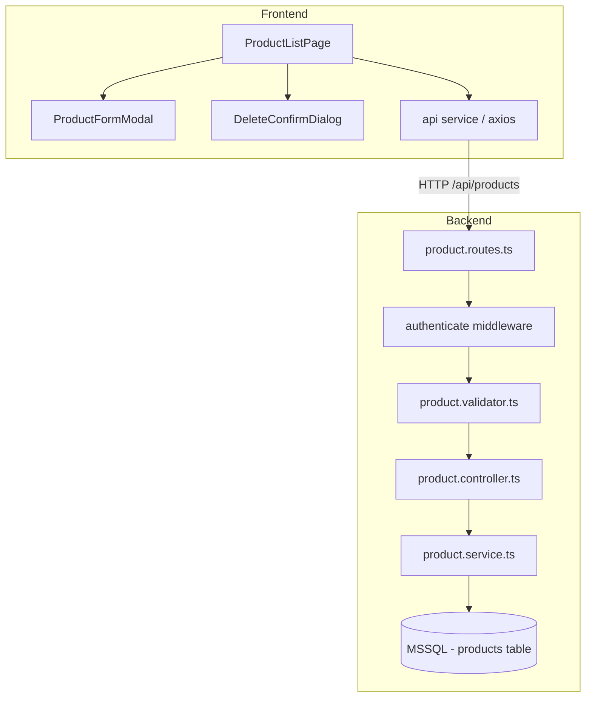

# Design Document: Warehouse Product CRUD

## Overview

ระบบจัดการข้อมูลสินค้า (Warehouse Product CRUD) เพิ่มความสามารถในการสร้าง ดู แก้ไข และลบข้อมูลสินค้าในระบบจัดการคลังสินค้า ระบบนี้สร้างบนโครงสร้างที่มีอยู่แล้ว (Express/TypeScript backend, React/TailwindCSS frontend) โดยใช้ JWT authentication middleware ที่มีอยู่เพื่อปกป้อง API endpoints

### Design Decisions

1. **ใช้โครงสร้าง Controller → Service → Database เดิม** — เพื่อให้ consistent กับ User CRUD ที่มีอยู่แล้ว
2. **ใช้ MSSQL เดิม** — database connection pool ที่มีอยู่รองรับได้
3. **Authenticated users ทุกคนเข้าถึงได้** — ต่างจาก User CRUD ที่ต้อง admin เท่านั้น, Product CRUD เปิดให้ user ที่ login แล้วทุกคนจัดการได้
4. **Soft delete vs Hard delete** — ตาม requirements ใช้ hard delete (permanent removal)
5. **SKU uniqueness** — enforce ที่ระดับ database (UNIQUE constraint) และ application level

## Architecture



### Request Flow

1. Frontend component เรียก `api.get/post/put/delete('/products/...')`
2. Express Router จับ request → `authenticate` middleware ตรวจ JWT
3. Validator (express-validator) ตรวจ input
4. Controller ดึง validated data, เรียก Service
5. Service ทำ business logic + database query
6. Response กลับ standard format `{ success, data?, message?, error? }`

## Components and Interfaces

### Backend Components

#### 1. Product Routes (`backend/src/routes/product.routes.ts`)

```typescript
// All routes require authentication (no admin requirement)
router.use(authenticate);

GET    /api/products        — list with pagination + search
GET    /api/products/:id    — get single product
POST   /api/products        — create new product
PUT    /api/products/:id    — update product (partial)
DELETE /api/products/:id    — delete product
```

#### 2. Product Validator (`backend/src/validators/product.validator.ts`)

Validation rules following express-validator pattern:
- **name**: required, 1-200 characters
- **sku**: required, 1-50 characters, matches `/^[a-zA-Z0-9_-]+$/`
- **category**: required, 1-100 characters
- **quantity**: required, integer, 0-999999
- **unit_price**: required, float, 0-999999999.99, max 2 decimal places
- **description**: optional, max 1000 characters
- **status**: optional on create (defaults 'active'), must be 'active' or 'inactive' on update

#### 3. Product Controller (`backend/src/controllers/product.controller.ts`)

Static methods mirroring UserController pattern:
- `findAll(req, res, next)` — paginated list
- `findById(req, res, next)` — single product
- `create(req, res, next)` — create product
- `update(req, res, next)` — partial update
- `delete(req, res, next)` — delete product

#### 4. Product Service (`backend/src/services/product.service.ts`)

Business logic layer:
- `findAll(query: ProductQueryDto): Promise<PaginatedResponse<ProductResponse>>`
- `findById(id: string): Promise<ProductResponse | null>`
- `create(data: CreateProductDto): Promise<ProductResponse>`
- `update(id: string, data: UpdateProductDto): Promise<ProductResponse>`
- `delete(id: string): Promise<void>`

#### 5. Product Service Interface (`backend/src/types/interfaces.ts`)

```typescript
export interface IProductService {
  findAll(query: ProductQueryDto): Promise<PaginatedResponse<ProductResponse>>;
  findById(id: string): Promise<ProductResponse | null>;
  create(data: CreateProductDto): Promise<ProductResponse>;
  update(id: string, data: UpdateProductDto): Promise<ProductResponse>;
  delete(id: string): Promise<void>;
}
```

### Frontend Components

#### 1. Product List Page (`frontend/src/pages/ProductListPage.tsx`)

Main page component with:
- Search input (debounced 300ms)
- Data table with columns: name, SKU, category, quantity, unit_price, status, created_at
- Pagination controls
- Create/Edit/Delete action buttons
- Loading indicator
- Empty state message

#### 2. Product Form Modal (`frontend/src/components/ProductFormModal.tsx`)

Reusable form for create/edit:
- Fields: name, sku, category, quantity, unit_price, description, status
- Client-side validation matching backend constraints
- Error display from API responses
- Loading state during submission

#### 3. Product Delete Confirm Dialog (`frontend/src/components/ProductDeleteConfirmDialog.tsx`)

Confirmation dialog showing product name before deletion.

#### 4. Product Types (`frontend/src/types/index.ts`)

```typescript
export interface Product {
  id: string;
  name: string;
  sku: string;
  category: string;
  quantity: number;
  unitPrice: number;
  description: string | null;
  status: 'active' | 'inactive';
  createdAt: string;
  updatedAt: string;
}
```

## Data Models

### Database Schema: `products` table

```sql
CREATE TABLE products (
    id UNIQUEIDENTIFIER PRIMARY KEY DEFAULT NEWID(),
    name NVARCHAR(200) NOT NULL,
    sku NVARCHAR(50) NOT NULL UNIQUE,
    category NVARCHAR(100) NOT NULL,
    quantity INT NOT NULL DEFAULT 0 CHECK (quantity >= 0 AND quantity <= 999999),
    unit_price DECIMAL(12, 2) NOT NULL DEFAULT 0 CHECK (unit_price >= 0 AND unit_price <= 999999999.99),
    description NVARCHAR(1000) NULL,
    status NVARCHAR(10) NOT NULL DEFAULT 'active' CHECK (status IN ('active', 'inactive')),
    created_at DATETIME2 NOT NULL DEFAULT GETUTCDATE(),
    updated_at DATETIME2 NOT NULL DEFAULT GETUTCDATE()
);

CREATE INDEX idx_products_sku ON products(sku);
CREATE INDEX idx_products_category ON products(category);
CREATE INDEX idx_products_status ON products(status);
CREATE INDEX idx_products_name ON products(name);
CREATE INDEX idx_products_created_at ON products(created_at DESC);
```

### DTOs

```typescript
// Create Product DTO
export interface CreateProductDto {
  name: string;        // 1-200 chars
  sku: string;         // 1-50 chars, alphanumeric + hyphens + underscores
  category: string;    // 1-100 chars
  quantity: number;    // integer, 0-999999
  unitPrice: number;   // decimal, 0-999999999.99, max 2 decimals
  description?: string; // 0-1000 chars
}

// Update Product DTO (all fields optional)
export interface UpdateProductDto {
  name?: string;
  sku?: string;
  category?: string;
  quantity?: number;
  unitPrice?: number;
  description?: string;
  status?: 'active' | 'inactive';
}

// Product Query DTO
export interface ProductQueryDto {
  page: number;       // default: 1, min: 1
  limit: number;      // default: 20, min: 1, max: 100
  search?: string;    // partial match on name, sku, category (1-200 chars)
}
```

### Product Response

```typescript
export interface ProductResponse {
  id: string;
  name: string;
  sku: string;
  category: string;
  quantity: number;
  unitPrice: number;
  description: string | null;
  status: 'active' | 'inactive';
  createdAt: Date;
  updatedAt: Date;
}
```

### Database Model (Internal)

```typescript
export interface ProductModel {
  id: string;
  name: string;
  sku: string;
  category: string;
  quantity: number;
  unit_price: number;
  description: string | null;
  status: 'active' | 'inactive';
  created_at: Date;
  updated_at: Date;
}
```


## Correctness Properties

*A property is a characteristic or behavior that should hold true across all valid executions of a system—essentially, a formal statement about what the system should do. Properties serve as the bridge between human-readable specifications and machine-verifiable correctness guarantees.*

### Property 1: Product creation round-trip

*For any* valid product data (name 1-200 chars, sku matching `^[a-zA-Z0-9_-]+$` 1-50 chars, category 1-100 chars, quantity integer 0-999999, unit_price decimal 0-999999999.99 with ≤2 decimal places, optional description 0-1000 chars), creating a product and then retrieving it by the returned ID SHALL yield the same field values, with status equal to 'active' and both created_at and updated_at set to approximately the current server time.

**Validates: Requirements 1.1, 1.6, 1.7, 3.1**

### Property 2: Validation rejects invalid product input

*For any* product input where at least one field violates its constraints (name empty or >200 chars, sku empty or >50 chars or containing invalid characters, category empty or >100 chars, quantity not integer or <0 or >999999, unit_price <0 or >999999999.99 or >2 decimal places, description >1000 chars, status not in ['active','inactive']), the Product_Service SHALL reject the input with a 400 status and the error response SHALL indicate which specific fields failed validation.

**Validates: Requirements 1.2, 1.4, 4.7**

### Property 3: SKU uniqueness enforcement

*For any* two product operations where the resulting SKU would duplicate an existing product's SKU (either creating a new product with an existing SKU, or updating a product's SKU to match another product's SKU), the Product_Service SHALL reject the operation with HTTP status 409.

**Validates: Requirements 1.3, 4.3**

### Property 4: Pagination metadata consistency

*For any* valid page (≥1) and limit (1-100) parameters, and any total count of products in the database, the pagination response SHALL satisfy: totalPages equals Math.ceil(total / limit), the returned items count is ≤ limit, the page field equals the requested page, and the results are ordered by created_at descending.

**Validates: Requirements 2.2, 2.4, 2.5**

### Property 5: Search filter correctness

*For any* non-empty search string (1-200 chars) and any set of products in the database, every product in the search results SHALL contain the search string as a case-insensitive substring in at least one of: name, sku, or category.

**Validates: Requirements 2.3**

### Property 6: Invalid pagination parameters rejected

*For any* pagination parameter that is non-numeric, or where page < 1, or where limit < 1 or limit > 100, the Product_API SHALL return HTTP status 400.

**Validates: Requirements 2.6**

### Property 7: Invalid ID format rejected

*For any* string that is not a valid UUID format, requesting GET, PUT, or DELETE on `/api/products/{id}` SHALL return HTTP status 400.

**Validates: Requirements 3.3, 5.3**

### Property 8: Partial update preserves unmodified fields

*For any* existing product and *for any* non-empty subset of updatable fields (name, sku, category, quantity, unit_price, description, status) with valid values, updating the product SHALL change only the specified fields and the updated_at timestamp, while all unspecified fields SHALL retain their original values.

**Validates: Requirements 4.1, 4.2, 4.5**

### Property 9: Delete removes product permanently

*For any* existing product, after successful deletion, retrieving that product by its ID SHALL return HTTP status 404.

**Validates: Requirements 5.1**

## Error Handling

### Backend Error Strategy

ใช้ `AppError` hierarchy ที่มีอยู่แล้ว:

| Error Type | HTTP Status | Code | Use Case |
|---|---|---|---|
| `ValidationError` | 400 | VALIDATION_ERROR | Invalid input fields, invalid ID format, invalid pagination params |
| `UnauthorizedError` | 401 | UNAUTHORIZED | Missing/invalid/expired JWT token |
| `NotFoundError` | 404 | NOT_FOUND | Product not found by ID |
| `ConflictError` | 409 | CONFLICT | Duplicate SKU |

### Error Response Format

```json
{
  "success": false,
  "error": {
    "code": "VALIDATION_ERROR",
    "message": "ข้อมูลไม่ถูกต้อง",
    "details": [{ "name": "ชื่อสินค้าต้องมีความยาว 1-200 ตัวอักษร" }]
  }
}
```

### Frontend Error Handling

- API errors → แสดง error message จาก response ใน form modal (ไม่ปิด modal)
- Network errors → แสดง generic error message
- 401 errors → redirect ไป login page (handled โดย axios interceptor)
- Loading states → แสดง loading indicator ระหว่าง fetch

### ID Format Validation

Product ID ใช้ UUID format (UNIQUEIDENTIFIER ของ MSSQL) — validate ด้วย regex ที่ controller level ก่อน query database:

```typescript
const UUID_REGEX = /^[0-9a-f]{8}-[0-9a-f]{4}-[0-9a-f]{4}-[0-9a-f]{4}-[0-9a-f]{12}$/i;
```

## Testing Strategy

### Unit Tests (Example-Based)

- **Authentication middleware integration**: Verify 401 responses for missing/invalid/expired tokens on product endpoints (Requirements 6.1-6.4)
- **Create product with valid data**: Verify complete response structure (example scenarios)
- **Get product by non-existent ID**: Verify 404 response (Requirement 3.2)
- **Delete non-existent product**: Verify 404 response (Requirement 5.2)
- **Update non-existent product**: Verify 404 response (Requirement 4.4)
- **Page exceeding total pages**: Verify empty array with correct metadata (Requirement 2.7)

### Property-Based Tests (fast-check)

The project already has `fast-check` as a dev dependency. Each property test runs minimum 100 iterations.

| Property | Test Target | Generator Strategy |
|---|---|---|
| Property 1: Creation round-trip | ProductService.create + findById | Generate random valid product DTOs |
| Property 2: Validation rejects invalid input | ProductValidator | Generate invalid product DTOs (one or more constraints violated) |
| Property 3: SKU uniqueness | ProductService.create / update | Generate pairs of products with same SKU |
| Property 4: Pagination metadata | ProductService.findAll | Generate random page/limit/total combinations |
| Property 5: Search filter | ProductService.findAll | Generate random search strings and product datasets |
| Property 6: Invalid pagination rejected | ProductValidator | Generate invalid page/limit values |
| Property 7: Invalid ID format rejected | ProductController | Generate non-UUID strings |
| Property 8: Partial update | ProductService.update | Generate random field subsets with valid values |
| Property 9: Delete permanence | ProductService.delete + findById | Generate random products, delete, verify gone |

### Test Configuration

- **Library**: `fast-check` (already in devDependencies)
- **Runner**: Jest (already configured)
- **Iterations**: Minimum 100 per property test
- **Tag format**: `Feature: warehouse-product-crud, Property {number}: {property_text}`

### Frontend Tests (Example-Based)

UI component tests ใช้ example-based testing:
- Render product table with mock data
- Search debounce behavior (300ms)
- Form validation feedback
- Modal open/close behavior
- Loading and empty states
- Error message display
